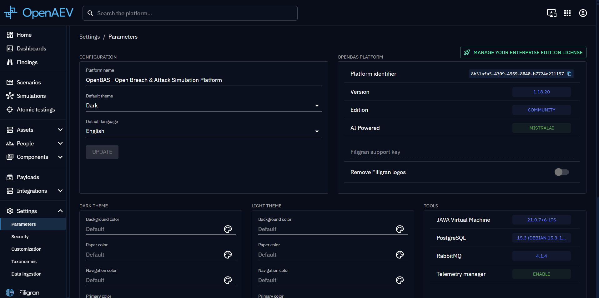

!!! tip "Filigran"

    [Filigran](https://filigran.io) is providing an [Enterprise Edition](https://filigran.io/offerings/openaev-enterprise-edition) of the platform, whether [on-premise](https://filigran.io/offerings/professional-support-packages) or in the [SaaS](https://filigran.io/offerings/software-as-a-service).

## What is OpenAEV EE?

OpenAEV Enterprise Edition is based on the open core concept. This means that the source code of OBAS EE remains open
source and included in the main GitHub repository of the platform but is published under a specific license. As
specified in the GitHub license file:

- The OpenAEV Community Edition is licensed under the Apache License, Version 2.0 (the “Apache License”).
- The OpenAEV Enterprise Edition is licensed under the OpenAEV Enterprise Edition License (the “Enterprise Edition
  Licensee”).

The source files in this repository have a header indicating which license they are under. If no such header is
provided, this means that the file belongs to the Community Edition under the Apache License, Version 2.0.

## EE Activation

Enterprise edition is easy to activate. You need to go the platform settings and click on the "Manage your Enterprise
Edition License" button.

Then you will need to put a valid OpenAEV EE license. If you don't have it, you
can [generate a trial license](https://filigran.io/enterprise-editions-trial/).

As a reminder:

- Filigran is the only company producing and providing OpenAEV Enterprise Edition license keys.
- Filigran can provide free-to-use OpenAEV Enterprise Edition licenses for development and research purposes (e.g. connector development purposes, integrations with technical partners, etc...) as well as for non-governmental charity organizations.
- OpenAEV Enterprise Edition licenses are automatically provided to all Filigran SaaS customers.
- **For all other usages including On-Premise deployments, OpenAEV Enterprise Edition is reserved to organizations that have signed a Filigran Enterprise agreement.**

## Available features

### Generative AI

Be able to use AI for content generation including emails, media pressure articles etc.

### CrowdStrike Falcon Agent

The CrowdStrike Falcon Agent can be leveraged to execute implants as detached processes that will then execute payloads
according to the [OpenAEV architecture](../deployment/platform/overview.md#architecture)

### Tanium Agent

The Tanium Agent can be leveraged to execute implants as detached processes that will then execute payloads
according to the [OpenAEV architecture](../deployment/platform/overview.md#architecture)

### SentinelOne Agent

The SentinelOne Agent can be leveraged to execute implants as detached processes that will then execute payloads
according to the [OpenAEV architecture](../deployment/platform/overview.md#architecture)

### Palo Alto Cortex Agent

The Palo Alto Cortex Agent can be leveraged to execute implants as detached processes that will then execute payloads
according to the [OpenAEV architecture](../deployment/platform/overview.md#architecture)

## Remediations in CVES

More detail: [CVES](taxonomies.md) and [Findings view](../usage/findings.md)
.

## Detection Remediation in Payloads and Injects

More detail: [Detection remediations in payloads](../usage/payloads/payloads.md)
and [Atomic testing remediations](../usage/atomic.md).

## More to come

More features will be available in OpenAEV in the future. Features like:

- Security posture automatic evaluation.
- Premium mitigations and recommendation for configuration changes.
