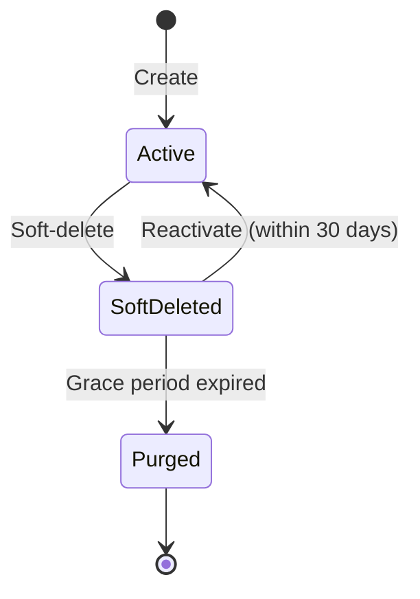

!!! tip "Enterprise Edition"

    Multi-tenancy is an [Enterprise Edition](enterprise.md) feature. You need a valid Enterprise Edition license to use it.

## Overview

Multi-tenancy allows a single OpenAEV platform instance to serve multiple isolated organizations (tenants). Each tenant has its own data scope, users, and settings, while sharing the same underlying infrastructure.

Key principles:

- **Data isolation**: All data is scoped to a tenant. API requests under `/api/tenants/{tenantId}/` automatically set the tenant context, ensuring queries only return data belonging to that tenant.
- **Shared users**: Users are not duplicated — they can be attached to multiple tenants and switch between them.
- **Independent settings**: Each tenant can configure its own dashboards and parameters.

## Managing tenants

### Creating a tenant

To create a new tenant, navigate to the **Administration > Tenants** section and click the **Create** button.

A tenant requires:

| Field         | Required | Description                        |
|---------------|----------|------------------------------------|
| **Name**      | Yes      | The display name of the tenant     |
| **Description** | No     | An optional description            |

When a tenant is created, all required dependencies (injectors, collectors, data packs, etc.) are automatically initialized in the correct order.

<!--  -->

### Updating a tenant

You can update a tenant's name and description at any time from the tenant detail page.

### Tenant list and switching

All available tenants are listed in the **Administration > Tenants** page. Users with access to multiple tenants can switch between them using the **Tenant Switcher** in the platform header.

<!--  -->

## User management

Users are managed per tenant. The key concepts are:

- **Attach**: Adding an existing user (identified by email) to a tenant. If the user does not exist yet, they are created first.
- **Detach**: Removing a user from a tenant. The user account is **not deleted** — it is simply unlinked from that tenant.
- A single user can belong to **multiple tenants** simultaneously.

To manage users for a specific tenant, navigate to the tenant and use the **Users** section.

## Tenant settings

Each tenant can have its own settings, independent from the platform-wide configuration. Currently, the following settings can be configured per tenant:

| Setting                    | Description                                      |
|----------------------------|--------------------------------------------------|
| **Home dashboard**         | The default dashboard displayed on the home page |
| **Scenario dashboard**     | The default dashboard for scenarios               |
| **Simulation dashboard**   | The default dashboard for simulations             |

These settings are accessible from the tenant's **Settings** page.

<!--  -->

## Deletion and lifecycle

Tenant deletion follows a safe, two-phase process to prevent accidental data loss.

### Soft-delete

When you delete a tenant, it is **soft-deleted**: the tenant is marked as deleted but all its data is preserved. A 30-day grace period starts from the moment of deletion.

During this period:

- The tenant appears as **deleted** in the tenant list.
- The tenant's data is **not accessible** to users.
- An administrator can **reactivate** the tenant.

### Reactivation

Within the 30-day grace period, an administrator can reactivate a soft-deleted tenant. This restores full access to the tenant and all its data.

!!! warning

    Reactivation is **not possible** after the 30-day grace period has expired.

### Permanent purge

After the 30-day grace period, a background job (`TenantPurgeJob`) automatically and permanently deletes:

- The tenant itself
- All associated dependencies and data

This operation is **irreversible**.

