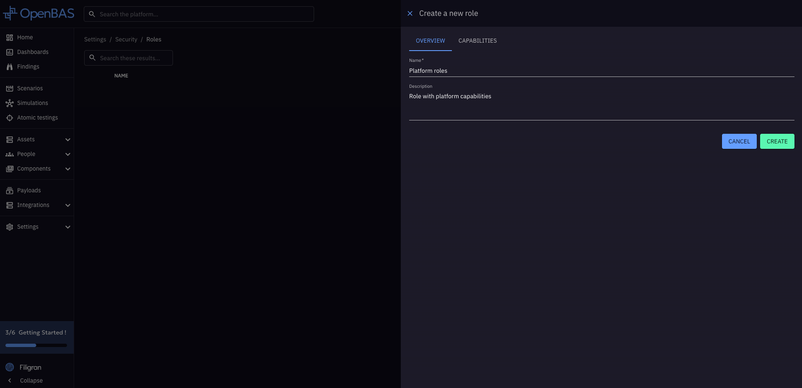
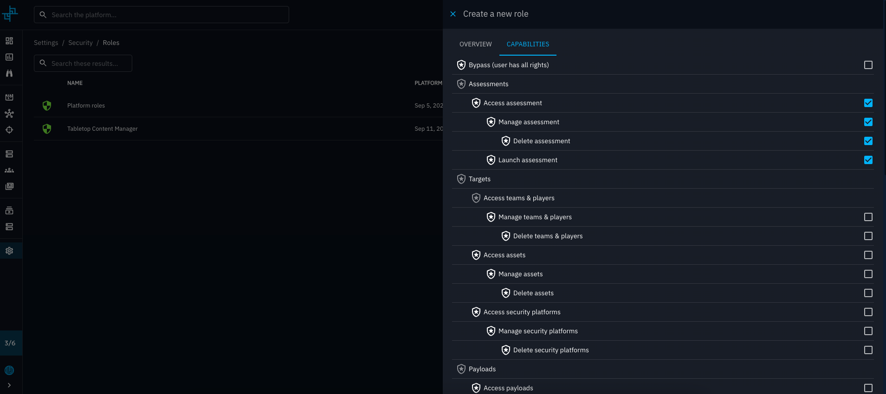
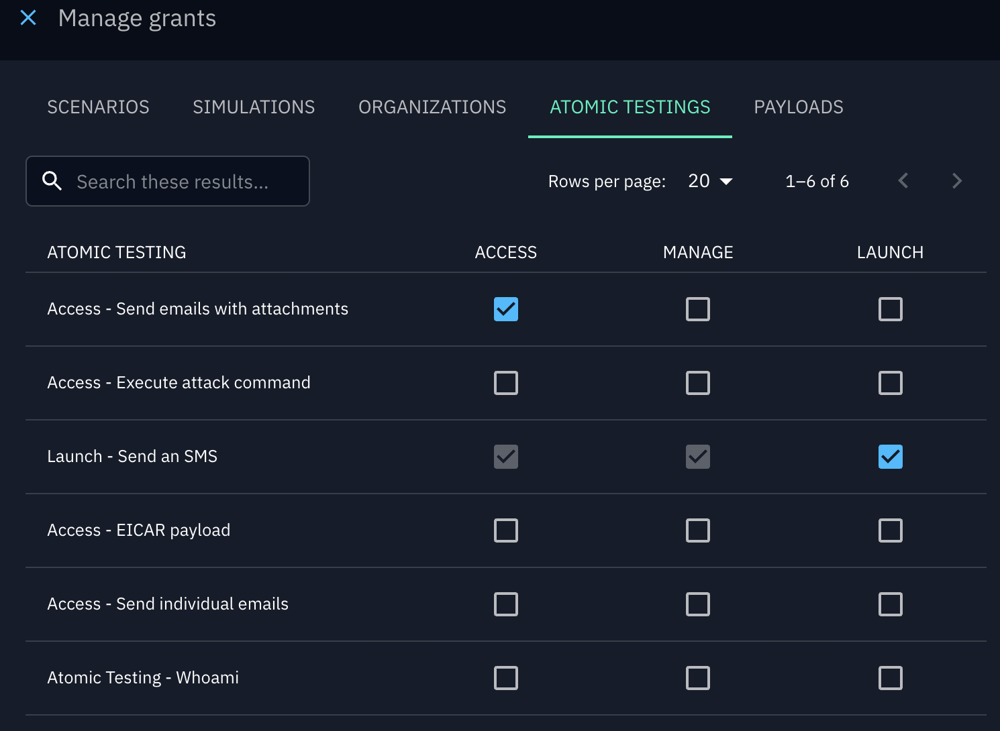
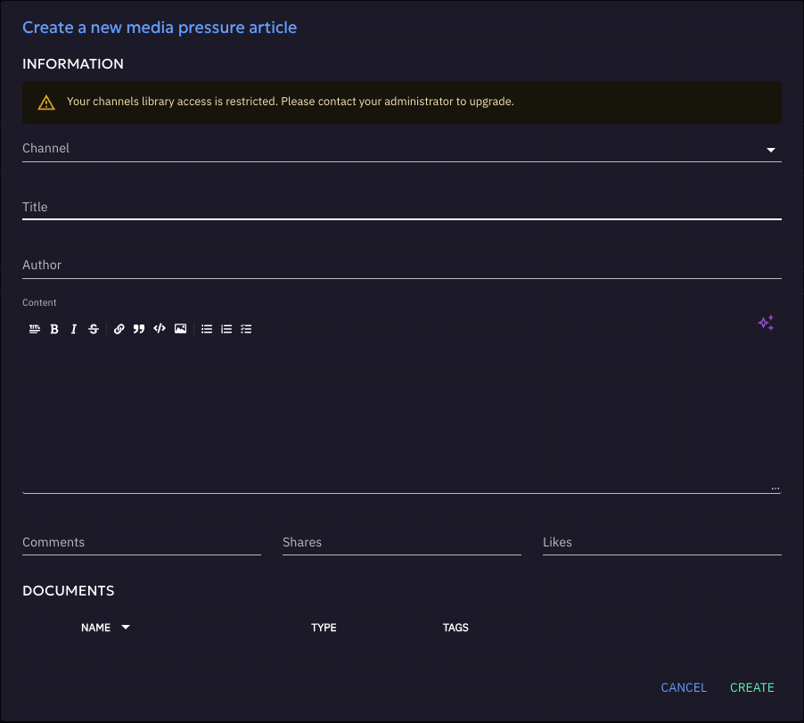

# User permissions 

## What is RBAC

Role-Based Access Control (RBAC) is the way OpenAEV manages who can do what inside the platform.  
Each user belongs to a group, and this group has one or more roles that define its **permissions**.

Permissions determine what features a user can access.  
If a user does not have the right permission, the option will simply not be available to them.

In addition to general permissions (called *capabilities*), OpenAEV also supports **grants**. Grants are more precise: they allow access to a specific resource, such as one particular simulation, without giving the user access to all simulations.

!!! warning "Default read access"
    
    Some elements in OpenAEV are always visible to all users, regardless of their assigned capabilities or grants.
    
    By default, the following features are open for everyone:
    - **Teams**
      - **Players**
      - **Taxonomies** (in the Settings)
    
    Users can view these elements without needing any specific capability, but additional rights are required if they want to manage them.

---

## How to create a role

To create a new role in OpenAEV:

1. Go to **Settings → Security → Roles**.
2. Click on **Create role**. Enter a **name** and an optional **description** for the role
3. Select the **capabilities** that should be included in this role, such as:
    - Access assets
    - Manage dashboards
    - Delete documents
    - ...
4. Save the role.

!!! info "Hierarchical permissions" 
    
    Permissions are organized hierarchically by indentation: selecting a permission further to the right (e.g., Delete) will automatically enable the less-indented ones that precede it (e.g., Manage and Access).


!!! tip "Bypass"
    
    If you want a user to automatically have all capabilities without restriction, you can enable the **Bypass** capability in their role.

Once the role is created, it can be assigned to a **group**. All users in that group will automatically inherit the role’s permissions.

### Example : Crisis content creator

!!! tip "Role : Crisis content creator"

**Context:** This user is in charge of designing crisis management content. Their role is to create **scenarios** that can later be reused by other teams to run exercises.  
For example, they might build an **“Earthquake Crisis Scenario”**.

**Capabilities:** 

   - **Security platforms** : Manage groups to assign them grants
   - **Assessment** : Create scenario

With this role, the user can design new scenarios, and configure everything needed to prepare exercises.  
For instance, they may create a **“Earthquake Crisis Template”**, which becomes the foundation for future simulations.




Then, the user will be able to create scenario, launch it and grant their team on this simulation. 

---

## Grants

### How to grant a simulation to a user

Beyond global **capabilities** defined in roles, OpenAEV also allows assigning more precise **grants**. Grants define permissions on specific resources (for example, one simulation), and they are always managed at the **group** level.

**To grant a simulation to a user:**

1. Go to **Settings → Security → Groups**.
2. Click on **Manage grants** in the group options.
3. A drawer will open with the available resources:
      - Simulations
      - Scenarios
      - Atomic testings
      - Payloads
4. Select the specific items you want the group to access and assign the appropriate grant level.
   
   

---

### Types of Grants

There are three levels of granularity:

| Grant   | Rights included                           |
|---------|-------------------------------------------|
| Access  | View only                                 |
| Manage  | View, edit, delete                        |
| Launch  | Manage rights + ability to launch tests   |

---

### Example : Local coordinator


!!! tip "Role : Local coordinator"
  

**Context:** This user is not a global content creator. Instead, they are trained locally to run a specific simulation designed by the content creator.  
They do not need all capabilities — only access to the resources explicitly granted to them.

**Grants assigned through their group:**

   - **Simulation** → *Launch* on the simulation based on the “Earthquake Crisis”

**Concrete workflow:**
     
   - The **Content Creator** travels to the **French Embassy** and trains a local coordinator.
   - This coordinator is granted launch to the simulation created from the *Earthquake Crisis Scenario*. 
   - The coordinator can now run and manage this simulation, but cannot see or modify other simulations or scenarios. 
   - Later, the same process is repeated at the **UK Embassy**, where another coordinator is granted launch only to the local simulation derived from the same scenario.

---

### Special Cases

!!! tip "Simulations, Scenarios, and Atomic Testing"
   
    A user can access these either through specific **grants**, or globally if the group has the **ASSESSMENT** capability (which overrides individual grants).

!!! tip "Payloads"

    Access is given either through specific **grants**, or globally if the group has the **PAYLOAD** capability.

    
---
## Capability Dependencies

In some cases, performing an action in OpenAEV requires more than one capability.  
If a required capability is missing, the action will be blocked and a warning message will explain which capability is missing.

### Example

- In **Scenarios**, when creating an article, the user also needs the capability to **access Channels**.
- If the user does not have this capability, the article cannot be created.
- A warning will be displayed, indicating that the necessary capability is missing.

  

This mechanism ensures consistency across the platform: actions that depend on other features cannot be performed without the proper access.

