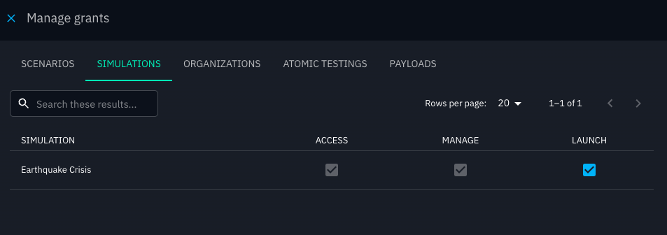

# User permissions 

## What is RBAC

Role-Based Access Control (RBAC) is the way OpenAEV manages who can do what inside the platform.  
Each user belongs to a group, and this group has one or more roles that define its **permissions**.

Permissions determine what features a user can access.  
If a user does not have the right permission, the option will simply not be available to them.

In addition to general permissions (called *capabilities*), OpenAEV also supports **grants**. Grants are more precise: they allow access to a specific resource, such as one particular simulation, without giving the user access to all simulations.

---

## How to create a role

To create a new role in OpenAEV:

1. Go to **Settings → Security → Roles**.
2. Click on **Create role**. Enter a **name** and an optional **description** for the role (e.g. "Platform role")
   
3. Select the **capabilities** that should be included in this role, such as:
    - Access assets
    - Manage dashboards
    - Delete documents
    - ...
   
   > **Note:** if you check a capability with **Delete**, the corresponding **Manage** and **Access** permissions will automatically be selected as well. This is because it is not possible to delete something without first being able to access and manage it.
   
   
4. Save the role.
> **Note:** If you want a user to automatically have all capabilities without restriction, you can enable the **Bypass** capability in their role.

Once the role is created, it can be assigned to a **group**. All users in that group will automatically inherit the role’s permissions.

---

## How to assign a role to a user

In OpenAEV, roles are not assigned directly to users. Instead, they are linked through **groups**.

1. Go to **Settings → Security → Groups**.
2. Create a group. 
3. In the group options, assign:
   - One or more **roles** (defining the capabilities for this group).
   - One or more **users** (who will inherit the group’s roles).
   

---

## Grants

### How to grant a simulation to a user

Beyond global **capabilities** defined in roles, OpenAEV also allows assigning more precise **grants**. Grants define permissions on specific resources (for example, one simulation), and they are always managed at the **group** level.

**To grant a simulation to a user:**

1. Go to **Settings → Security → Groups**.
2. Click on **Manage grants** in the group options.
3. A drawer will open with the available resources:
      - Simulations
      - Scenarios
      - Atomic testings
      - Payloads
4. Select the specific items you want the group to access and assign the appropriate grant level.
   
   

---

### Special Cases

- **Simulations, Scenarios, and Atomic Testing**
   - A user can access these either through specific **grants**, or globally if the group has the **ASSESSMENT** capability (which overrides individual grants).

- **Payloads**
   - Access is given either through specific **grants**, or globally if the group has the **PAYLOAD** capability.

---

### Types of Grants

There are three levels of granularity:

| Grant   | Rights included                           |
|---------|-------------------------------------------|
| Access  | View only                                 |
| Manage  | View, edit, delete                        |
| Launch  | Manage rights + ability to launch tests   |

---
## Default Read Access

Some elements in OpenAEV are always visible to all users, regardless of their assigned capabilities or grants.  

By default, the following features are open for everyone:
- **Teams**
- **Players**
- **Taxonomies** (in the Settings)

Users can view these elements without needing any specific capability, but additional rights are required if they want to manage them.

---
## Capability Dependencies

In some cases, performing an action in OpenAEV requires more than one capability.  
If a required capability is missing, the action will be blocked and a warning message will explain which capability is missing.

### Example

- In **Scenarios**, when creating an article, the user also needs the capability to **access Channels**.
- If the user does not have this capability, the article cannot be created.
- A warning will be displayed, indicating that the necessary capability is missing.

  

This mechanism ensures consistency across the platform: actions that depend on other features cannot be performed without the proper access.

