# Users

You can manage users in `Settings > Security > Users`. If you are using Single Sign-On (SSO), user accounts in OpenAEV are automatically created upon login.

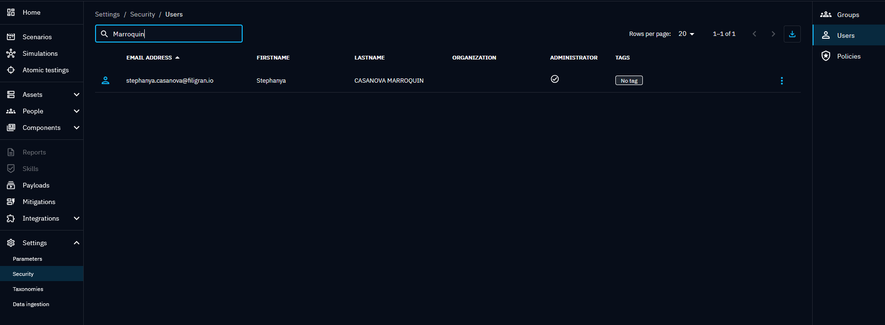

To create a user, just click on the `+` button :

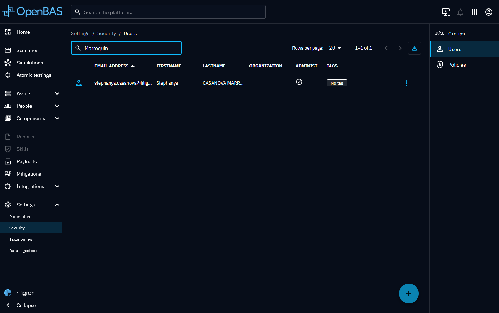
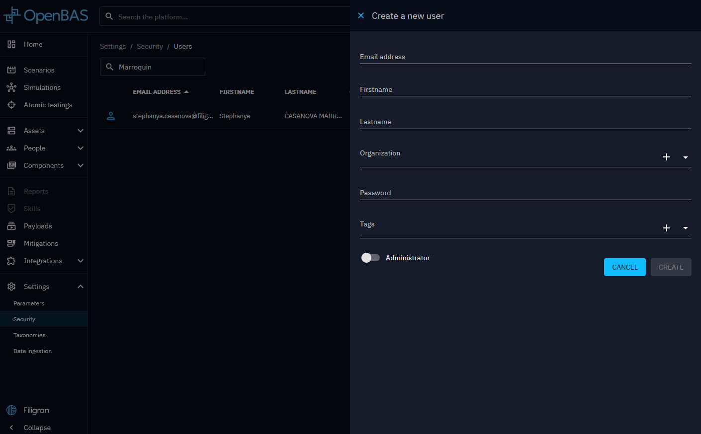

To update a user, click on the ellipsis menu (⋮) : 

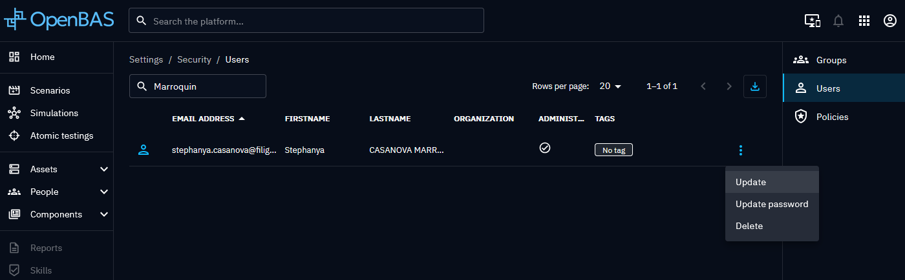

Here, you can modify parameters such as the organization, phone number, password, and even your GPG public key : 

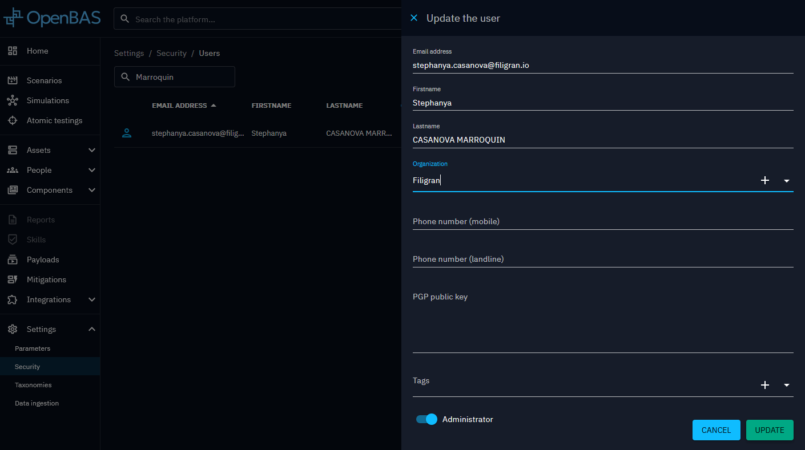
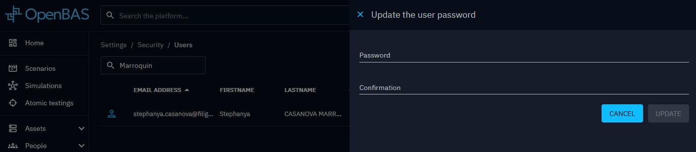

To delete a user : 

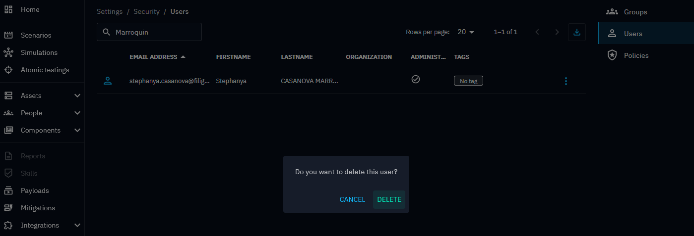

# User permissions

## What is RBAC

Role-Based Access Control (RBAC) is the way OpenAEV manages who can do what inside the platform.  
Each user belongs to a group, and this group has one or more roles that define its **capabilities**.

Capabilities determine what features a user can access.  
If a user does not have the right capability, the option will simply not be available to them.

In addition to general capabilities, OpenAEV also supports **grants**. Grants are more precise: they allow access to a specific resource, such as one particular simulation, without giving the user access to all simulations.

!!! warning "Default read access"

    Some elements in OpenAEV are always visible to all users, regardless of their assigned capabilities or grants.
    
    By default, the following features are open for everyone:
      
      - **Teams**
      - **Players**
      - **Taxonomies** (in the Settings)
    
    Users can view these elements without needing any specific capability, but additional rights are required if they want to manage them.

--- 

## How to create a role

To create a new role in OpenAEV:

1. Go to **Settings → Security → Roles**.
2. Click on **Create role**. Enter a **name** and an optional **description** for the role
3. Select the **capabilities** that should be included in this role.
4. Save the role.

### Capabilities

Capabilities in OpenAEV are organized hierarchically. A parent capability (e.g. `Access assessment`) must be granted before its children (e.g. `Manage assessment`, `Delete assessment`) can be assigned. Indentation below reflects this hierarchy.

Below is a full list of capabilities in OpenAEV

| Capability | Description |
|:-----------|:------------|
| `Bypass (user has all rights)` | Grants unconditional access to all platform features, bypassing every individual capability check and any data segregation enforcement. |
| **Assessments: Scenarios, simulations and atomic testings** | |
| `Access assessment` | Read-only access to assessments, including scenarios, simulations and atomic tests. |
| &nbsp;&nbsp;`Manage assessment` | Create and update assessments (scenarios, simulations, atomic tests). Requires *Access assessment*. |
| &nbsp;&nbsp;&nbsp;&nbsp;`Delete assessment` | Permanently delete assessments. Requires *Manage assessment*. |
| &nbsp;&nbsp;`Launch assessment` | Execute / run an assessment against defined targets. Requires *Access assessment*. |
| **Targets** | |
| `Access teams & players` | Read-only access to teams and player definitions used as assessment targets. |
| &nbsp;&nbsp;`Manage teams & players` | Create and update teams and players. Requires *Access teams & players*. |
| &nbsp;&nbsp;&nbsp;&nbsp;`Delete teams & players` | Permanently delete teams and players. Requires *Manage teams & players*. |
| `Access assets` | Read-only access to asset inventory (hosts, endpoints, and other infrastructure targets). |
| &nbsp;&nbsp;`Manage assets` | Create and update assets in the inventory. Requires *Access assets*. |
| &nbsp;&nbsp;&nbsp;&nbsp;`Delete assets` | Permanently delete assets from the inventory. Requires *Manage assets*. |
| `Access security platforms` | Read-only access to integrated security platform configurations (e.g. SIEM, EDR, firewall connectors). |
| &nbsp;&nbsp;`Manage security platforms` | Create and update security platform integrations. Requires *Access security platforms*. |
| &nbsp;&nbsp;&nbsp;&nbsp;`Delete security platforms` | Permanently delete security platform integrations. Requires *Manage security platforms*. |
| **Payloads** | |
| `Access payloads` | Read-only access to the payload library (attack scripts, tools, and techniques used in simulations). |
| &nbsp;&nbsp;`Manage payloads` | Create and update payloads in the library. Requires *Access payloads*. |
| &nbsp;&nbsp;&nbsp;&nbsp;`Delete payloads` | Permanently delete payloads from the library. Requires *Manage payloads*. |
| **Dashboards** | |
| `Access dashboards` | Read-only access to platform dashboards and their visualizations. |
| &nbsp;&nbsp;`Manage dashboards` | Create, update, and configure dashboards. Requires *Access dashboards*. |
| &nbsp;&nbsp;&nbsp;&nbsp;`Delete dashboards` | Permanently delete dashboards. Requires *Manage dashboards*. |
| **Findings** | |
| `Access findings` | Read-only access to assessment findings and results generated from simulations and atomic tests. |
| **Content** | |
| `Access documents` | Read-only access to documents stored in the platform (reports, attachments, playbooks). |
| &nbsp;&nbsp;`Manage documents` | Upload, create, and update documents. Requires *Access documents*. |
| &nbsp;&nbsp;&nbsp;&nbsp;`Delete documents` | Permanently delete documents. Requires *Manage documents*. |
| `Access channels` | Read-only access to communication channels used to deliver exercise injects to players. |
| &nbsp;&nbsp;`Manage channels` | Create and update channels. Requires *Access channels*. |
| &nbsp;&nbsp;&nbsp;&nbsp;`Delete channels` | Permanently delete channels. Requires *Manage channels*. |
| `Access challenges` | Read-only access to challenges (CTF-style tasks or objectives assigned to players during exercises). |
| &nbsp;&nbsp;`Manage challenges` | Create and update challenges. Requires *Access challenges*. |
| &nbsp;&nbsp;&nbsp;&nbsp;`Delete challenges` | Permanently delete challenges. Requires *Manage challenges*. |
| `Access lessons learned` | Read-only access to lessons learned records captured after assessments or exercises. |
| &nbsp;&nbsp;`Manage lessons learned` | Create and update lessons learned entries. Requires *Access lessons learned*. |
| &nbsp;&nbsp;&nbsp;&nbsp;`Delete lessons learned` | Permanently delete lessons learned entries. Requires *Manage lessons learned*. |
| **Platform Settings** | |
| `Access Platform Settings` | Read-only access to platform-wide configuration and administration settings. |
| &nbsp;&nbsp;`Manage platform settings` | Modify platform-wide settings including security configuration, integrations, and system parameters. Requires *Access Platform Settings*. |

!!! info "Hierarchical permissions"

    Permissions are organized hierarchically by indentation: selecting a permission further to the right (e.g., Delete) will automatically enable the less-indented ones that precede it (e.g., Manage and Access).

!!! tip "Bypass"

    If you want a user to automatically have all capabilities without restriction, you can enable the **Bypass** capability in their role.

!!! tip "Assessments"

    This capability combines scenarios, simulations and atomic testings. 

Once the role is created, it can be assigned to a **group**. All users in that group will automatically inherit the role’s permissions.

## Example : Creating a Crisis content creator role

> Role : Crisis content creator

**Context:** This user is in charge of designing crisis management content. Their role is to create **scenarios** that can later be reused by other teams to run simulations.  
For example, they might build an **“Earthquake Crisis Scenario”**.

**Capabilities:**

- **Platform settings** : Manage groups to assign them grants
- **Assessments** : Create scenario

With this role, the user can design new scenarios, and configure everything needed to prepare simulations.  
For instance, they may create a **“Earthquake Crisis Template”**, which becomes the foundation for future simulations.

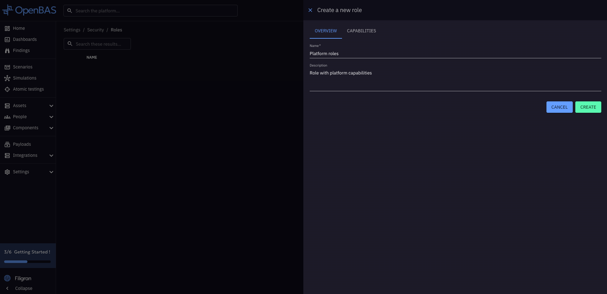
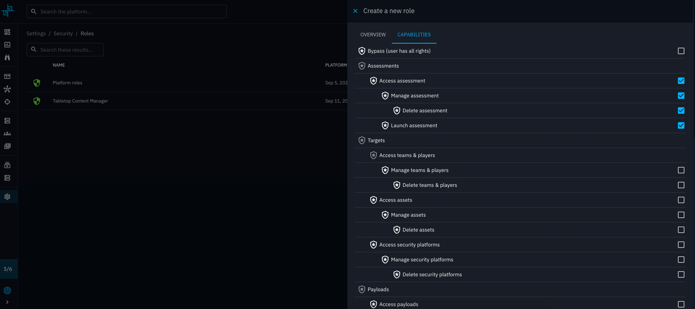

Then, the user will be able to create scenario, launch it and grant their team on this simulation.

---

## Grants

### How to grant a simulation to a user

Beyond global **capabilities** defined in roles, OpenAEV also allows assigning more precise **grants**. Grants define permissions on specific resources (for example, one simulation), and they are always managed at the **group** level.

**To grant a simulation to a user:**

1. Go to **Settings → Security → Groups**.
2. Click on **Manage grants** in the group options.
3. A drawer will open with the available resources:
    - Simulations
    - Scenarios
    - Organizations
    - Atomic testings
    - Payloads
4. Select the specific items you want the group to access and assign the appropriate grant level.

   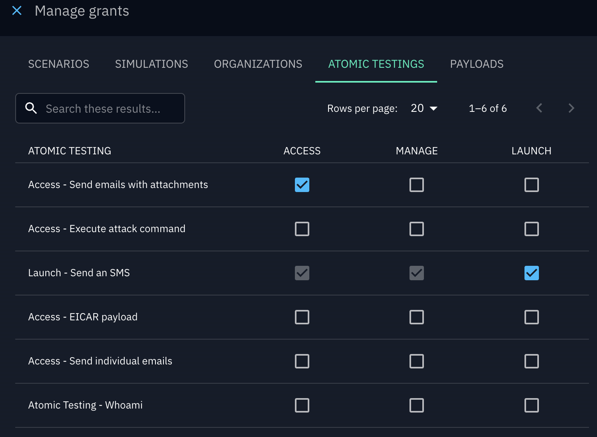

---

### Types of Grants

There are three levels of granularity:

| Grant   | Rights included                       |
|---------|---------------------------------------|
| Access  | View only                             |
| Manage  | Access + edit and delete              |
| Launch  | Manage + ability to launch tests      |

---

### Example : Local coordinator

> Role : Local coordinator

**Context:** This user is not a global content creator. Instead, they are trained locally to run a specific simulation designed by the content creator.  
They do not need all capabilities — only access to the resources explicitly granted to them.

**Grants assigned through their group:**

- **Simulation** → *Launch* on the simulation based on the “Earthquake Crisis”

**Concrete workflow:**

- The **Content Creator** travels to the **French Embassy** and trains a local coordinator.
- This coordinator is granted launch to the simulation created from the *Earthquake Crisis Scenario*.
- The coordinator can now run and manage this simulation, but cannot see or modify other simulations or scenarios.
- Later, the same process is repeated at the **UK Embassy**, where another coordinator is granted launch only to the local simulation derived from the same scenario.

---

### Special Cases

!!! tip "Simulations, Scenarios, and Atomic Testing"

    A user can access these either through specific **grants**, or globally if the group has the **ASSESSMENT** capability (which overrides individual grants).

!!! tip "Payloads"

    Access is given either through specific **grants**, or globally if the group has the **PAYLOAD** capability.

    
---
## Capability Dependencies

In some cases, performing an action in OpenAEV requires more than one capability.  
If a required capability is missing, the action will be blocked and a warning message will explain which capability is missing.

### Example

- In **Scenarios**, when creating an article, the user also needs the capability to **access Channels**.
- If the user does not have this capability, the article cannot be created.
- A warning will be displayed, indicating that the necessary capability is missing.

  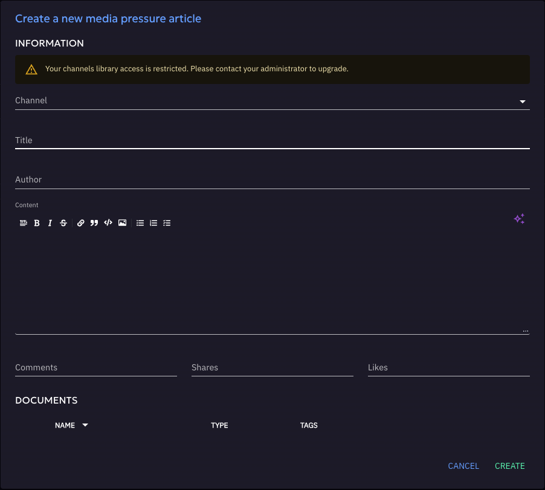

This mechanism ensures consistency across the platform: actions that depend on other features cannot be performed without the proper access.

