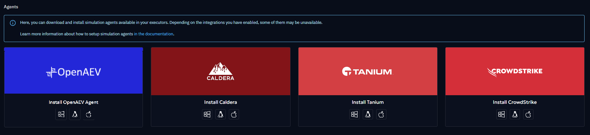
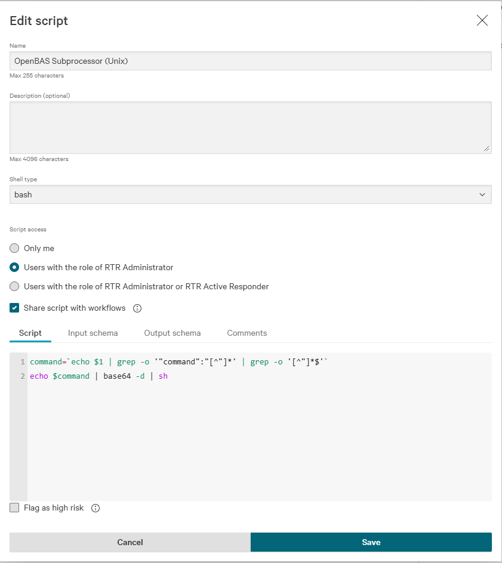
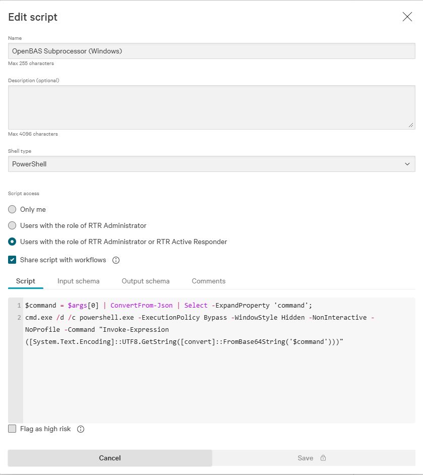
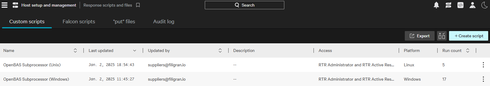
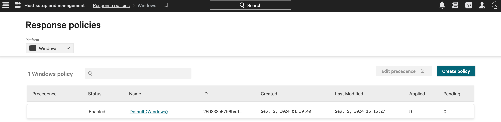
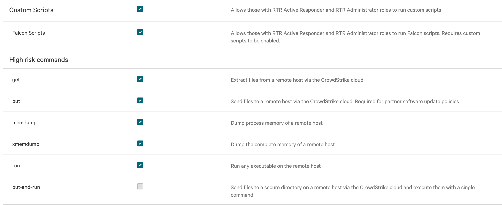
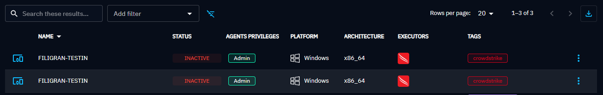

# Executors

## Introduction

To be able to use the power of the OpenAEV platform on endpoints, you need at least one **neutral executor** that will
be in charge of executing implants as detached processes. Implants will then execute payloads.

The platform manages different executors which can be installed on Windows, Linux and MacOS using x86_64 or arm64
architectures. This table below summarizes the information about each agent.

| Executor                           | Type          | Installation mode                                 | Installation type | Run As                                 | Payload execution                              | Multi agents for an endpoint                     |
|:-----------------------------------|:--------------|:--------------------------------------------------|:------------------|:---------------------------------------|:-----------------------------------------------|:-------------------------------------------------|
| **OpenAEV Agent (native/default)** | Open source   | As a user session, user service or system service | Script            | A standard or admin background process | As a user standard, user admin or system admin | Yes, depending on the user and installation mode |
| **Tanium Agent**                   | Under license | As a system service                               | Executable        | An admin background process            | As a system admin                              | No, always the same agent                        |                              
| **Crowdstrike Falcon Agent**       | Under license | As a system service                               | Executable        | An admin background process            | As a system admin                              | No, always the same agent                        |                              
| **SentinelOne Agent**              | Under license | As a system service                               | Executable        | An admin background process            | As a system admin                              | No, always the same agent                        |
| **Caldera Agent**                  | Open source   | As a user session                                 | Script            | An admin background process            | As a user admin                                | Yes, depending on the user                       |                      

## OpenAEV Agent

The OpenAEV agent is available for Windows, Linux and MacOS, it is the native / default way to execute implants and
payloads on endpoints.

[Learn More](../../usage/openaev-agent.md)

---
<a id="tanium-agent"></a>
## Tanium Agent

The Tanium agent can be leveraged to execute implants as detached processes that will then execute payloads, according
to the [OpenAEV architecture](https://docs.openaev.io/latest/deployment/overview).

The implants will be downloaded to these folders on the different assets:

* On Windows assets: `C:\Program Files (x86)\Filigran\OAEV Agent\runtimes\implant-XXXXX`
* On Linux or MacOS assets: `/opt/openaev-agent/runtimes/implant-XXXXX`

where XXXXX will be a completely random UUID, generated for each inject that will be executed.
This ensures that the implants are unique and will be deleted on assets' restart.

### Configure the Tanium Platform

We provide [two Tanium packages](https://github.com/OpenAEV-Platform/openaev/blob/master/openaev-api/src/main/java/io/openaev/executors/tanium/openaev-tanium-packages.json) to be imported into the Tanium platform.


!!! warning "Tanium package configuration"

    Because OpenAEV should run implants as detached processes, you must uncheck  
    **"Launch this package command in a process group"** in the package configuration:

    

!!! warning "Tanium Threat Response usage"

    If your environment uses **Tanium Threat Response (TTR)** together with the Tanium agent, you should rely on the **dedicated TTR package**.  
    This package technically works in all cases, but it is **only recommended** when OpenAEV runs on endpoints with TTR enabled.  
    Reason: this package performs more extensive operations on the machine and can generate **more noise and alerts**.  
    → If you do **not** use Tanium Threat Response, prefer the **standard Tanium package**.  

    📦 Packages to import:  
    - [OpenAEV Tanium Windows & Unix package (TTR)](https://github.com/OpenAEV-Platform/openaev/blob/master/openaev-api/src/main/java/io/openaev/executors/tanium/openaev-tanium-packages-TTR.json)  

    📜 Scripts to attach in the package configuration into files section:   
    - [Windows TTR script](https://github.com/OpenAEV-Platform/openaev/blob/master/openaev-api/src/main/java/io/openaev/executors/tanium/openaev-ttr.ps1)  

| Package type                | Recommended use case                  | Characteristics                                            |
|-----------------------------|---------------------------------------|------------------------------------------------------------|
| **Standard Tanium package** | Default use with Tanium agent only    | Lightweight, minimal impact, recommended in most scenarios |
| **TTR package**             | Tanium agent + Tanium Threat Response | Enables additional operations, may generate more noise     |

Once configured and imported, retrieve the package IDs from the URL:  
`ui/console/packages/XXXXX/preview`.

> ℹ️ Common group IDs in Tanium:
>
> - **Computer Group ID**: identifies which endpoints will be queried.
> - **Action Group ID**: identifies where actions (like package execution) are allowed.

### Configure the OpenAEV Platform

To use the Tanium executor, fill the following configuration:

| Parameter                                             | Environment variable                                  | Default value  | Description                                                                                                                                       |
|:------------------------------------------------------|:------------------------------------------------------|:---------------|:--------------------------------------------------------------------------------------------------------------------------------------------------|
| executor.tanium.enable                                | EXECUTOR_TANIUM_ENABLE                                | `false`        | Enable the Tanium executor                                                                                                                        |
| executor.tanium.url                                   | EXECUTOR_TANIUM_URL                                   |                | Tanium API URL                                                                                                                                    |
| executor.tanium.api-key                               | EXECUTOR_TANIUM_API-KEY                               |                | Tanium API key                                                                                                                                    |
| executor.tanium.api-register-interval                 | EXECUTOR_TANIUM_API_REGISTER_INTERVAL                 | 1200           | Tanium API interval to register/update the computer groups/endpoints in OpenAEV (in seconds)                                                      | 
| executor.tanium.api-batch-execution-action-pagination | EXECUTOR_TANIUM_API_BATCH_EXECUTION_ACTION_PAGINATION | 100            | Tanium API pagination per 5 seconds to set for endpoints batch executions (number of endpoints sent per 5 seconds to Tanium to execute a payload) | 
| executor.tanium.clean-implant-interval                | EXECUTOR_TANIUM_CLEAN_IMPLANT_INTERVAL                | 8              | Tanium clean old implant interval (in hours)                                                                                                      | 
| executor.tanium.computer-group-id                     | EXECUTOR_TANIUM_COMPUTER_GROUP_ID                     | `1`            | Tanium Computer Group or Computer Groups to be used in simulations separated with commas                                                          |
| executor.tanium.action-group-id                       | EXECUTOR_TANIUM_ACTION_GROUP_ID                       | `4`            | Tanium Action Group to apply actions to                                                                                                           |
| executor.tanium.windows-package-id                    | EXECUTOR_TANIUM_WINDOWS_PACKAGE_ID                    |                | ID of the OpenAEV Tanium Windows package                                                                                                          |
| executor.tanium.unix-package-id                       | EXECUTOR_TANIUM_UNIX_PACKAGE_ID                       |                | ID of the OpenAEV Tanium Unix package                                                                                                             |

!!! note "Tanium API Key"

    The Tanium API key must have permissions to:  
    - Retrieve the endpoint list from the Tanium GraphQL API  
    - Launch packages on endpoints  

---

### Checks

Once enabled, you should see **Tanium** available in the `Install agents` section:



Endpoints from the selected computer groups should now appear in the **OpenAEV Endpoints** section:


!!! note "Agent uniqueness"

    An endpoint can only have **one Tanium agent** registered due to MAC address uniqueness.  
    Installing a new agent will overwrite the existing one, and you will always see a single endpoint in the OpenAEV console.

!!! success "Installation done"

    You are now ready to leverage your Tanium platform to run OpenAEV payloads!

---
<a id="crowdstrike-falcon-agent"></a>
## CrowdStrike Falcon Agent

The CrowdStrike Falcon agent can be leveraged to execute implants as detached processes that will then execute payloads
according to the [OpenAEV architecture](https://docs.openaev.io/latest/deployment/overview).

The implants will be downloaded to these folders on the different assets:

* On Windows assets: `C:\Program Files (x86)\Filigran\OAEV Agent\runtimes\implant-XXXXX`
* On Linux or MacOS assets: `/opt/openaev-agent/runtimes/implant-XXXXX`

where XXXXX will be a completely random UUID, generated for each inject that will be executed.
This ensures that the implants are unique and will be deleted on assets' restart.

### Configure the CrowdStrike Platform

#### Upload OpenAEV scripts

First of all, you need to create two custom scripts, one for Windows and one for Unix, covering both Linux and MacOS
systems.

To create it, go to `Host setup and management` > `Response and containment` > `Response scripts and files`. The names
of the scripts can be changed if necessary, they will be put in the OpenAEV configuration.

*Unix Script*

| Attribute             | Value                                                            |
|:----------------------|:-----------------------------------------------------------------|
| name                  | OpenAEV Subprocessor (Unix)                                      |
| shell type            | bash                                                             |
| script access         | Users with the role of RTR Administrator or RTR Active Responder |
| shared with workflows | yes                                                              |

Put the following script:

```bash
command=`echo $1 | grep -o '"command":"[^"]*' | grep -o '[^"]*$'`
echo $command | base64 -d | sh
```

Put the following Input schema:

```json
{
  "$schema": "https://json-schema.org/draft/2020-12/schema",
  "properties": {
    "command": {
      "type": "string"
    }
  },
  "required": [
    "command"
  ],
  "type": "object",
  "description": "This generated schema may need tweaking. In particular format fields are attempts at matching workflow field types but may not be correct."
}
```



*Windows script*

| Attribute             | Value                                                            |
|:----------------------|:-----------------------------------------------------------------|
| name                  | OpenAEV Subprocessor (Windows)                                   |
| shell type            | PowerShell                                                       |
| script access         | Users with the role of RTR Administrator or RTR Active Responder |
| shared with workflows | yes                                                              |

Put the following script:

```PowerShell
$command = $args[0] | ConvertFrom-Json | Select -ExpandProperty 'command';
cmd.exe /d /c powershell.exe -ExecutionPolicy Bypass -WindowStyle Hidden -NonInteractive -NoProfile -encodedCommand $command
```

Put the following Input schema:

```json
{
  "$schema": "https://json-schema.org/draft/2020-12/schema",
  "properties": {
    "command": {
      "type": "string"
    }
  },
  "required": [
    "command"
  ],
  "type": "object",
  "description": "This generated schema may need tweaking. In particular format fields are attempts at matching workflow field types but may not be correct."
}
```



Once created, your RTR scripts should have something like this:



#### Create a host group with your targeted assets

To create a host group, go to `Host setup and management` > `Host groups`.

#### Create/Update response policies for your targeted platforms

As OpenAEV will ask CrowdStrike to create implants in order to execute payloads as scripts, you need to allow the
execution of custom scripts on your assets. To do so, you need to create a new response policy or update an existing one
for your assets' platforms.

To create or update a response policy, go to `Host setup and management` > `Response policies`.

There, choose a platform in the top left selector, then click on `Create policy` or click on the name of an existing
one.


The CrowdStrike UI should present you with a screen like this:


On this screen, click to allow `Custom Scripts` execution.
If an option named `Falcon Scripts` exists, allow it as well.
For the other options, you can choose to allow or deny them according to your security policy and what you want to test.
Click on `Save` to save your changes.

Finally, click on the `Assigned host groups` tab to add your previously created group to this policy.
Once done, the policy may take a few minutes to be applied to your assets.
You can go back to the policies list screen and check that there is a 0 in the `Pending` column to know that it has been
applied.

### Configure the OpenAEV platform

!!! warning "CrowdStrike API Key"

    Please note that the CrowdStrike API key should have the following permissions: API integrations, Hosts, Host groups, Real time response.

To use the CrowdStrike executor, just fill the following configuration.

| Parameter                                                  | Environment variable                                        | Default value                      | Description                                                                                                                                         |
|:-----------------------------------------------------------|:------------------------------------------------------------|:-----------------------------------|:----------------------------------------------------------------------------------------------------------------------------------------------------|
| executor.crowdstrike.enable                                | EXECUTOR_CROWDSTRIKE_ENABLE                                 | `false`                            | Enable the Crowdstrike executor                                                                                                                     |
| executor.crowdstrike.api-url                               | EXECUTOR_CROWDSTRIKE_API_URL                                | `https://api.us-2.crowdstrike.com` | Crowdstrike API url                                                                                                                                 |
| executor.crowdstrike.api-register-interval                 | EXECUTOR_CROWDSTRIKE_API_REGISTER_INTERVAL                  | 1200                               | Crowdstrike API interval to register/update the host groups/hosts/agents in OpenAEV (in seconds)                                                    | 
| executor.crowdstrike.api-batch-execution-action-pagination | EXECUTOR_CROWDSTRIKE_API_BATCH_EXECUTION_ACTION_PAGINATION  | 2500                               | Crowdstrike API pagination per 5 seconds to set for hosts batch executions (number of hosts sent per 5 seconds to Crowdstrike to execute a payload) | 
| executor.crowdstrike.clean-implant-interval                | EXECUTOR_CROWDSTRIKE_CLEAN_IMPLANT_INTERVAL                 | 8                                  | Crowdstrike clean old implant interval (in hours)                                                                                                   | 
| executor.crowdstrike.client-id                             | EXECUTOR_CROWDSTRIKE_CLIENT_ID                              |                                    | Crowdstrike client id                                                                                                                               |
| executor.crowdstrike.client-secret                         | EXECUTOR_CROWDSTRIKE_CLIENT_SECRET                          |                                    | Crowdstrike client secret                                                                                                                           |
| executor.crowdstrike.host-group                            | EXECUTOR_CROWDSTRIKE_HOST_GROUP                             |                                    | Crowdstrike host group id or hosts groups ids separated with commas                                                                                 |
| executor.crowdstrike.windows-script-name                   | EXECUTOR_CROWDSTRIKE_WINDOWS_SCRIPT_NAME                    | `OpenAEV Subprocessor (Windows)`   | Name of the OpenAEV Crowdstrike windows script                                                                                                      |
| executor.crowdstrike.unix-script-name                      | EXECUTOR_CROWDSTRIKE_UNIX_SCRIPT_NAME                       | `OpenAEV Subprocessor (Unix)`      | Name of the OpenAEV Crowdstrike unix script                                                                                                         |

### Checks

Once enabled, you should see CrowdStrike available in your `Install agents` section


Also, the assets and the asset groups in the selected computer groups should now be available in the endpoints and asset
groups sections in OpenAEV:



NB : An Asset can only have one CrowdStrike agent installed due to the uniqueness of the MAC address parameters. If you
try to install again a CrowdStrike agent on a platform, it will overwrite the actual one and you will always see one
Endpoint on the OpenAEV endpoint page.

!!! success "Installation done"

    You are now ready to leverage your CrowdStrike platform to run OpenAEV payloads!

---
<a id="sentinelone-agent"></a>
## SentinelOne Agent

The SentinelOne agent can be leveraged to execute implants as detached processes that will then execute payloads
according to the [OpenAEV architecture](https://docs.openaev.io/latest/deployment/overview).

The implants will be downloaded to these folders on the different assets:

* On Windows assets: `C:\Program Files (x86)\Filigran\OAEV Agent\runtimes\implant-XXXXX`
* On Linux or MacOS assets: `/opt/openaev-agent/runtimes/implant-XXXXX`

where XXXXX will be a completely random UUID, generated for each inject that will be executed.
This ensures that the implants are unique and will be deleted on assets' restart.

!!! warning "SentinelOne"

    Please note that the SentinelOne license with add-on “remote script orchestration” is required to launch SentinelOne scripts with OpenAEV → see in SentinelOne/Settings/Configuration/Add-ons


### Configure the SentinelOne Platform

#### Upload OpenAEV scripts

First of all, you need to create two custom scripts, one for Windows and one for Unix, covering both Linux and MacOS
systems.

To create it, go to `Automation` > `Remote Ops` > `Create new`. The names
of the scripts can be changed if necessary, the ids will be put in the OpenAEV configuration.

*Unix Script*

Upload the following script (encoded for Unix):

[Download](../assets/openaev_subprocessor_unix.sh)

Put the following Input schema:


*Windows script*

Upload the following script (encoded for Windows):

[Download](../assets/openaev_subprocessor_windows.ps1)

Put the following Input schema:


Once created, your Remote Ops scripts should have something like this:


#### Create a wrapper with your targeted assets

To create a wrapper (account/site/group), go to `Settings` > `Accounts/Sites`.

### Configure the OpenAEV platform

!!! warning "SentinelOne API Key"

    Please note that the SentinelOne API key created in "Settings/Users/Service Users" should have the following minimum role: “IR Team”. The API key and the scripts must be created for and with the same user and the required account/site.

To use the SentinelOne executor, just fill the following configuration.

| Parameter                                                  | Environment variable                                       | Default value | Description                                                                                                                                           |
|:-----------------------------------------------------------|:-----------------------------------------------------------|:--------------|:------------------------------------------------------------------------------------------------------------------------------------------------------|
| executor.sentinelone.enable                                | EXECUTOR_SENTINELONE_ENABLE                                | `false`       | Enable the SentinelOne executor                                                                                                                       |
| executor.sentinelone.url                                   | EXECUTOR_SENTINELONE_URL                                   |               | SentinelOne URL, the API version used is the 2.1                                                                                                      |
| executor.sentinelone.api-register-interval                 | EXECUTOR_SENTINELONE_API_REGISTER_INTERVAL                 | 1200          | SentinelOne API interval to register/update the accounts/sites/groups/agents in OpenAEV (in seconds)                                                  | 
| executor.sentinelone.api-batch-execution-action-pagination | EXECUTOR_SENTINELONE_API_BATCH_EXECUTION_ACTION_PAGINATION | 2500          | SentinelOne API pagination per 5 seconds to set for agents batch executions (number of agents sent per 5 seconds to SentinelOne to execute a payload) | 
| executor.sentinelone.clean-implant-interval                | EXECUTOR_SENTINELONE_CLEAN_IMPLANT_INTERVAL                | 8             | SentinelOne clean old implant interval (in hours)                                                                                                     | 
| executor.sentinelone.api-key                               | EXECUTOR_SENTINELONE_API_KEY                               |               | SentinelOne API key                                                                                                                                   |
| executor.sentinelone.account-id                            | EXECUTOR_SENTINELONE_ACCOUNT_ID                            |               | SentinelOne account id or accounts ids separated with commas (optional if site or group is filled)                                                    |
| executor.sentinelone.site-id                               | EXECUTOR_SENTINELONE_SITE_ID                               |               | SentinelOne site id or sites ids separated with commas (optional if account or group is filled)                                                       |
| executor.sentinelone.group-id                              | EXECUTOR_SENTINELONE_GROUP_ID                              |               | SentinelOne group id or groups ids separated with commas (optional if site or account is filled)                                                      |
| executor.sentinelone.windows-script-id                     | EXECUTOR_SENTINELONE_WINDOWS_SCRIPT_ID                     |               | Id of the OpenAEV SentinelOne Windows script                                                                                                          |
| executor.sentinelone.unix-script-id                        | EXECUTOR_SENTINELONE_UNIX_SCRIPT_ID                        |               | Id of the OpenAEV SentinelOne Unix script                                                                                                             |

### Checks

Once enabled, you should see SentinelOne available in your `Install agents` section


Also, the assets and the asset groups in the selected accounts/sites/groups should now be available in the endpoints and asset
groups sections in OpenAEV:


NB : An Asset can only have one SentinelOne agent installed due to the uniqueness of the MAC address parameters. If you
try to install again a SentinelOne agent on a platform, it will overwrite the actual one and you will always see one
Endpoint on the OpenAEV endpoint page.

!!! success "Installation done"

    You are now ready to leverage your SentinelOne platform to run OpenAEV payloads!

---
## Caldera Agent

The Caldera agent can be leveraged to execute implants as detached processes that will the execute payloads according to
the [OpenAEV architecture](https://docs.openaev.io/latest/deployment/overview/#architecture).

!!! note "Caldera already installed"

    If you already have a working Caldera installation, just go directly to [OpenAEV configuration section](#openaev-configuration).

### Deploy Caldera

To deploy Caldera, you can just add Caldera to the OpenAEV stack, we advise you to modify your `docker-compose.yml` and
add a [Caldera service](https://github.com/OpenAEV-Platform/caldera/blob/filigran/docker/docker-compose.yml):

```
services:
  caldera:
    image: openaev/caldera-server:5.1.0
    restart: always
    ports:
      - "8888:8888"
    environment:
      CALDERA_URL: http://localhost:8888
    volumes:
      - type: bind
        source: caldera.yml
        target: /usr/src/app/conf/local.yml
```

As you can see in the configuration, you will also need a configuration
file [caldera.yml](https://github.com/OpenAEV-Platform/caldera/blob/filigran/docker/caldera.yml) because Caldera does
not support well environment variables for configuration.

Download [caldera.yml](https://github.com/OpenAEV-Platform/caldera/blob/filigran/docker/caldera.yml) and put it
alongside your `docker-compose.yml` file. This file must be modified prior launching, only change what is marked as *
*Change this**, listed below.

```yaml
users:
  red:
    red: ChangeMe                                                                     # Change this
  blue:
    blue: ChangeMe                                                                    # Change this
api_key_red: ChangeMe                                                                 # Change this
api_key_blue: ChangeMe                                                                # Change this
api_key: ChangeMe                                                                     # Change this
crypt_salt: ChangeMe                                                                  # Change this
encryption_key: ChangeMe                                                              # Change this
app.contact.http: http://caldera.myopenaev.myorganization.com:8888                    # Change this
app.contact.tunnel.ssh.user_password: ChangeMe                                        # Change this
```

Just update your stack and check Caldera is running:

```bash
docker compose up -d
```

### OpenAEV configuration

Then, just change the OpenAEV configuration as follow:

| Parameter                   | Environment variable        | Default value | Description                                                                                  |
|:----------------------------|:----------------------------|:--------------|:---------------------------------------------------------------------------------------------|
| executor.caldera.enable     | EXECUTOR_CALDERA_ENABLE     | `false`       | Enable the Caldera executor           						                                                 |
| executor.caldera.url        | EXECUTOR_CALDERA_URL        |               | Caldera URL                           													                                          |
| executor.caldera.public-url | EXECUTOR_CALDERA_PUBLIC-URL |               | Caldera URL accessible from endpoints (ex: http://caldera.myopenaev.myorganization.com:8888) |
| executor.caldera.api-key    | EXECUTOR_CALDERA_API-KEY    |               | Caldera API key                                                                              |

### Agents

#### Deploy agents

Once enabled, you should see Caldera available in your `Install agents` section:

OpenAEV has built-in instruction if you want command line examples to deploy the agent on one endpoint.


!!! warning "Caldera AV detection"

    By default, the Caldera agent "Sandcat" is detected and blocked by antivirus. Here, we are using Caldera as a neutral executor that will execute implants that will execute payloads, so you need to add the proper AV exclusions as instructed in the OpenAEV screen.

    

#### Checks

All assets with a proper Caldera agent installed using the OpenAEV provided command line (then persistent) should now be
available in the OpenAEV endpoints list.


#### Uninstallation

Run the following commands with an administrator Powershell in order to uninstall your Caldera agent:<br/>
`schtasks /delete /tn OpenAEVCaldera`<br/>
`Stop-Process -Name oaev-agent-caldera`<br/>
`rm -force -Recurse "C:\Program Files (x86)\Filigran\OAEV Caldera"`
