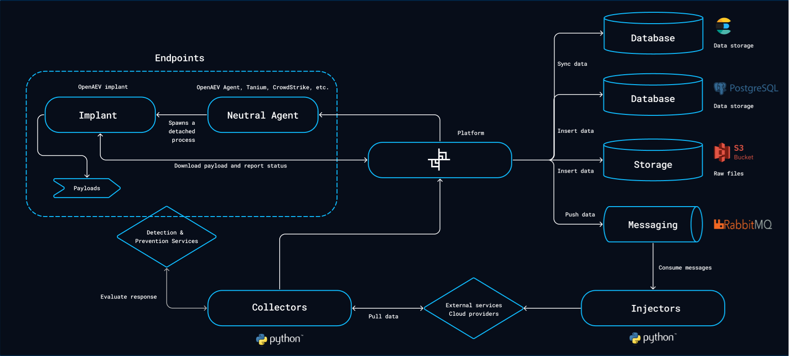

# Overview

Before starting the installation, let's discover how OpenAEV is working, which dependencies are needed and what are the
minimal requirements to deploy it in production.

## Architecture

The OpenAEV platform relies on several external databases and services in order to work.

### Platform

Platform is the central component, allowing users to configure scenarios, simulations, atomic testings and all other
components used in the context of security validations.

### Neutral agents / executors

Executors are responsible to launch simulated attacks on endpoints.

We developed our own XTM agent and also support third-party agents, with more being added over time.

!!! tip "Tips"

      If you want to learn more about how to deploy executors, you can have more info [here](../ecosystem/executors.md).

### Injectors

Injectors are used to interact with third-party applications or services (including execution on the endpoints through
executors) in the context of a simulation or an atomic testing. A few injectors are built-in but most of them are
standalone Python processes.

!!! tip "Tips"

      If you want to learn more about how to deploy injectors, you can have more info [here](../ecosystem/injectors.md).

### Collectors

Collectors are used to connect to all security systems such as SIEMs, XDRs, EDRs, firewalls, mail gateways etc. to check
if an inject (execution, emails, etc.) has been detected or prevented and fill the security posture.

!!! tip "Tips"

      If you want to learn more about how to deploy collectors, you can have more info [here](../ecosystem/collectors.md).

## Infrastructure requirements

### Dependencies

| Component     | Recommended version             | CPU     | RAM     | Disk type | Disk space |
|:--------------|:--------------------------------|:--------|:--------|:----------|:-----------|
| PostgreSQL    | ≥ 17.0                          | 2 cores | ≥ 8GB   | SSD       | ≥ 16GB     |
| ElasticSearch | ≥ 8.19                          | 2 cores | ≥ 8GB   | SSD       | ≥ 16GB     |
| RabbitMQ      | >= 4.1                          | 1 core  | ≥ 512MB | Standard  | ≥ 2GB      |
| S3 / MinIO    | ≥ RELEASE.2025-06-13T11-33-47Z  | 1 core  | ≥ 128MB | SSD       | ≥ 16GB     |

Please note that while the versions of these dependencies are the recommended ones, OpenAEV may still function with
earlier versions. However, we will not provide support for versions prior to the recommended ones.

### Platform

| Component     | CPU     | RAM     | Disk type        | Disk space |
|:--------------|:--------|:--------|:-----------------|:-----------|
| OpenAEV  Core | 2 cores | ≥ 8GB   | None (stateless) | -          |
| Injector(s)   | 1 core  | ≥ 128MB | None (stateless) | -          |
| Collector(s)  | 1 core  | ≥ 128MB | None (stateless) | -          |
