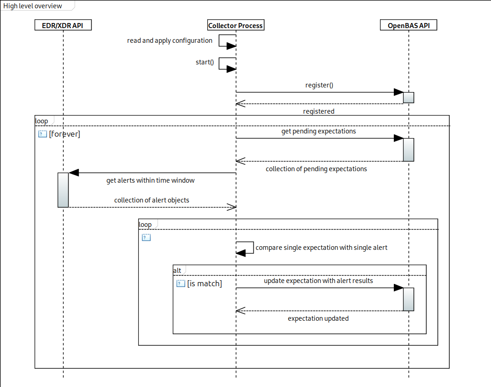
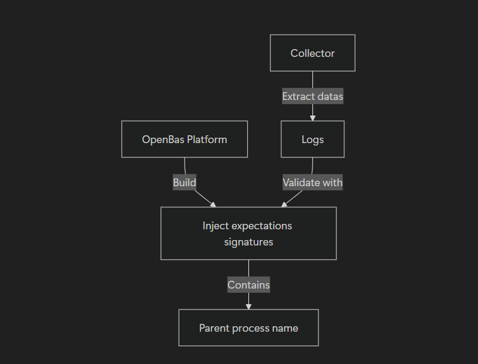

# Collector development

## Detection & Prevention (SIEM, XDR, EDR, NDR)

### Introduction

This guide explains how to implement an **OpenBAS collector for a EDR/XDR**, to retrieve security events and compare
them against injected expectations in OpenBAS.

### Prerequisites

!!! tip "Not just Python"

    Note that while this guide puts an emphasis on the Python language, a collector may be implemented in any language
    because it communicates with the OpenBAS server via its REST API. However, Filigran provides an official implementation
    of a REST client for the OpenBAS API, in python: PyOBAS.

In this guide, we will use PyOBAS, the official OpenBAS API client for Python. The guide requires a basic understanding
of the Python language, and a working Python install on the development machine.

### High level overview

Let's consider this diagram for understanding the basic, generic process involved to retrieve alerts and match them with
expectations from within the OpenBAS system.



This would translate to this partially-pseudo code, using PyOBAS (some functions omitted for brevity):
```python
from pyobas.daemons import CollectorDaemon
from pyobas.configuration import Configuration

# this is where the whole of the collector logic needs
# to be implemented.
def main_loop(collector: CollectorDaemon):
    # get some expectations from OpenBAS
    # if there are any waiting for results
    expectations = collector.api.inject_expectation.expectations_models_for_source(collector.get_id())
    if any(expectations):
        # fetch some alerts from the security platform
        security_platform_alerts = security_platform_api.fetch_alerts();

        if any(alerts):
            # usually we want to preprocess raw alerts so that they match
            # an expected format for comparison with the expectations
            # in order to determine whether an alert is relevant to an
            # expectation
            processed_alerts = process_alerts(security_platform_alerts)
            for expectation in expectations:
                for processed_alert in processed_alerts:
                    # if we find that an alert's data is relevant
                    # to an expectation, update the latter with the result
                    # whether it was successful or not
                    if match(processed_alert, expectation):
                        # first update the object's data
                        expectation.update(
                            success=alert.get_outcome(),
                            sender_id=collector.get_id(),
                            metadata={}
                        )
                        # update the object through the API
                        collector.api.inject_expectation.update(
                            inject_expectation_id=expectation.inject_expectation_id,
                            inject_expectation=expectation
                        )

if __name__ == "__main__":
    # this might look a bit verbose
    # it defines where and how to specify various config keys
    config = Configuration(config_hints={
            # OpenBAS API
            "openbas_url": {"env": "OPENBAS_URL"},
            "openbas_token": {"env": "OPENBAS_TOKEN"},
            # Collector configuration
            "collector_id": {"env": "COLLECTOR_ID"},
            "collector_name": {"env": "COLLECTOR_NAME"},
            "collector_type": {
                "env": "COLLECTOR_TYPE",
                # a discrete, unique string; like a secondary id
                "default": "my_collector_type",
            },
            "collector_platform": {
                "env": "COLLECTOR_PLATFORM",
                "default": "EDR"
            },
            # Security platform specific
            "platform_client_id": {"env": "PLATFORM_CLIENT_ID"},
            "platform_client_secret": {"env": "PLATFORM_CLIENT_SECRET"},
            "platform_api_base_url": {
                "env": "PLATFORM_API_BASE_URL",
                "default": "https://api.securityplatform.example",
            },
        },
    )

    # instantiate the long-running daemon object
    collector = CollectorDaemon(configuration=config)
    # set the method that needs to run every period (default 60s)
    collector.set_callback(main_loop)
    # starts the daemon process
    collector.start()
```

### In-depth step-by-step decomposition
#### 1. Retrieving Expectations

The first step involves fetching all expectations that have not yet been fulfilled by your collector. These expectations
should be validated within a short timeframe to assess the responsiveness of your EDR/XDR (for example 45 minutes). If this
period is exceeded, the expectations should be updated to be marked as failed by the collector.

#### 2. Retrieving Alerts

This step focuses on collecting alerts from your service tiers. There are two key aspects to define:

- How to extract relevant information from an alert to match OpenBAS signatures.
- How to determine whether the alert successfully prevented or detected the attack based on the expectations.

Definition: a signature is a way to find an attack in an alert, for example the presence of a specific process name
in the process tree of the subject of the alert:

| Signature           | Description                                                                                                                 |
|---------------------|-----------------------------------------------------------------------------------------------------------------------------|
| PARENT_PROCESS_NAME | The parent process name of the attack, which corresponds to the implant<br/>name created with openbas-implant-INJECT_ID.exe |

#### 3. Matching Expectations

The final step involves aligning retrieved expectations with logs and signatures from your service tiers to ensure
proper validation.



### Use it

Now, you can launch your collector by connecting it with OpenBAS.
Your collector will register to OpenBAS and you can view in Integrations > Collectors.


## Learn more

You may find reference implementations in the OpenBAS Collectors repository:
* [Crowdstrike Falcon EDR](https://github.com/OpenBAS-Platform/collectors/tree/main/crowdstrike)
* [Microsoft Defender](https://github.com/OpenBAS-Platform/collectors/tree/main/microsoft-defender)
* [Microsoft Sentinel](https://github.com/OpenBAS-Platform/collectors/tree/main/microsoft-sentinel)

You might find them useful to find inspiration on how to implement a matching logic against your EDR or SIEM
of choice, using PyOBAS.