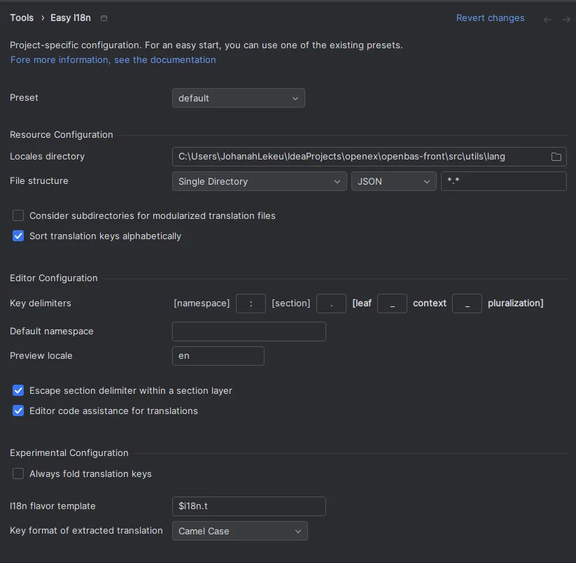
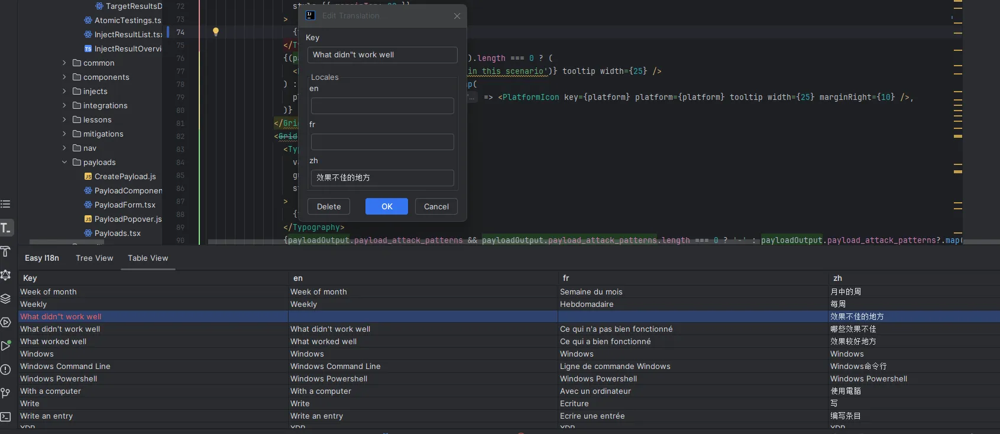

# Adding translations

### Introduction
This guide explains how to add translations when developing with OpenBAS. We have 3 files to support the app’s languages: en.json (the reference file - for english), fr.json (for french) and zh.json (for chinese). We have set up some elements to streamline the translation process.

#### 1. Using scripts
You can find translations management scripts in the package.json file.

- extract-translation : will fetch all the files and add new translations keys in en.json 
- auto-translation:fr : will translate all the elements of the en.json in french and add them in the fr.json
- auto-translation:cn : will translate all the elements of the en.json in chinese and add them in the zh.json
- auto-translation: all : will translate all the elements of the en.json in all the app's supoorted languages and add them in the respective files
- sort-translation : will sort the translation files

You can generate your subscription key on Deepl and add it in the configurations of your scripts in your IDE. You need to add the subscription key for auto-translation:all, auto-translation:fr and auto-translation:cn.

#### 2. Using IntelliJ plugins
- i18n ally : allows to manage the regex, check missing translations and extract keys
  
  

- Easy i18n : allows to add, edit, delete, sort and check translations
  
  