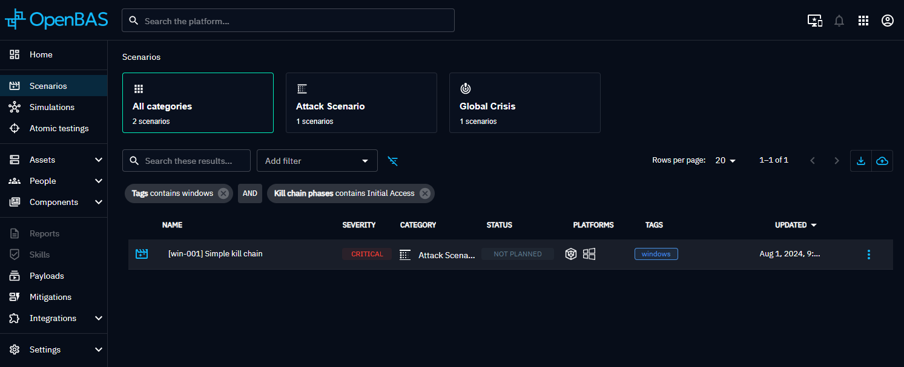
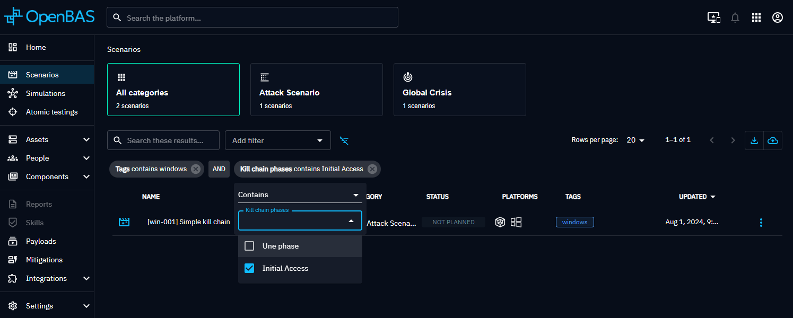
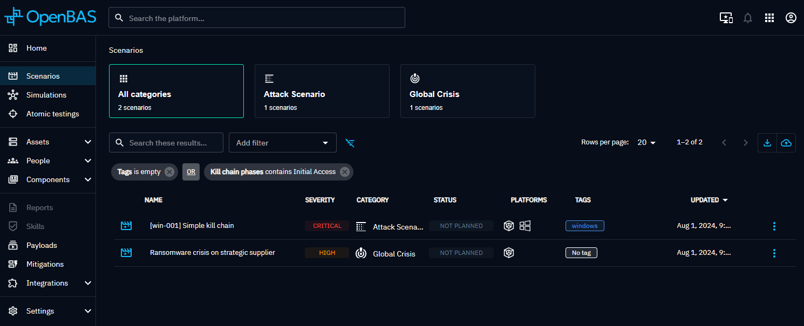

# Filter knowledge

In OpenBAS, you can filter data to focus on or display information with specific attributes.

## Filters usages

### Dynamic filters

Dynamic filters allow you to filter the UI view based on the attributes present in the data, such as the list of
scenarios or simulations.

These filters are not stored in the database. However, they remain persistent on the frontend of the platform. Your web
browser saves the filters you set in different areas of the platform in local storage, allowing you to retrieve them
when you return to the same view. This way, you can continue working from where you left off.

Additionally, the filters applied in a view are saved as URL parameters, enabling you to save and share links to these
filtered views.



## Create a filter

To create a filter, add every key you need using the 'Add filter' select box. It will give you the possible attributes
on which you can filter in the current view.

A grey box appears and allows to select:

1. the operator to use, and
2. the values to compare (if the operator is not "empty" or "not empty").

You can add as many filters as you need.



The boolean modes (and/or) are **global** (between every attribute filters) and can be switched with a single
click, changing the logic of your filtering.



## Filters format

The OpenBAS platform uses a filter format called `FilterGroup`. The `FilterGroup` model enables
to do complex filters imbrication with different boolean operators, which extends greatly the filtering capabilities in
every part of the platform.

### Structure

The format can be described as below:

```json
{
  "filterGroup": {
    "mode": "and",
    // or "or"
    "filters": [
      {
        "key": "name",
        "mode": "or",
        // or "and"
        "values": [
          "value1",
          "value2"
        ],
        "operator": "contains"
        // or "not_contains", "eq", "not_eq", "starts_with", "not_starts_with",
        // "empty", "not_empty"
      }
    ]
  }
}
```

#### Properties

In a given filter group, the `mode` (`and` or `or`) represents the boolean operation between the different `filters`
and `filterGroups` arrays. The `filters` and `filterGroups` arrays are composed of objects of type Filter and
FilterGroup.

The `Filter` has 4 properties:

- a `key`, representing the kind of data we want to target (example: `tags` to filter on tags or `name` to
  filter on the data's name),
- an array of `values`, representing the values we want to compare to,
- an `operator` representing the operation we want to apply between the `key` and the `values`,
- a `mode` (`and` or `or`) to apply between the values if there are several ones.

#### Operators

The available operators are:

| Value           | Meaning               |
|-----------------|-----------------------|
| contains        | contains              |
| not_contains    | not contains          |
| eq              | equal                 |
| not_eq          | different             |
| empty           | empty / no value      |
| not_empty       | non-empty / any value |

In addition, there are operators:

- `starts_with` / `not_starts_with`, available for searching in short string fields (name, value, title, etc.),
