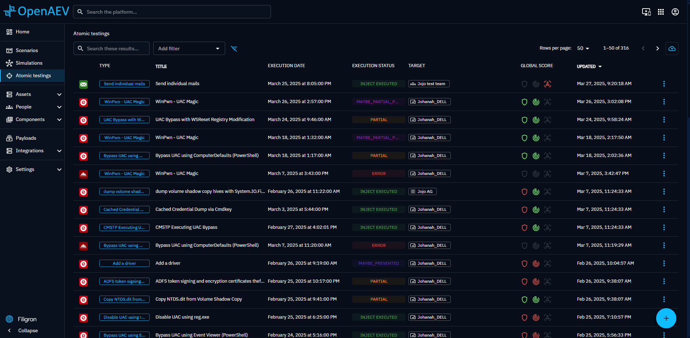
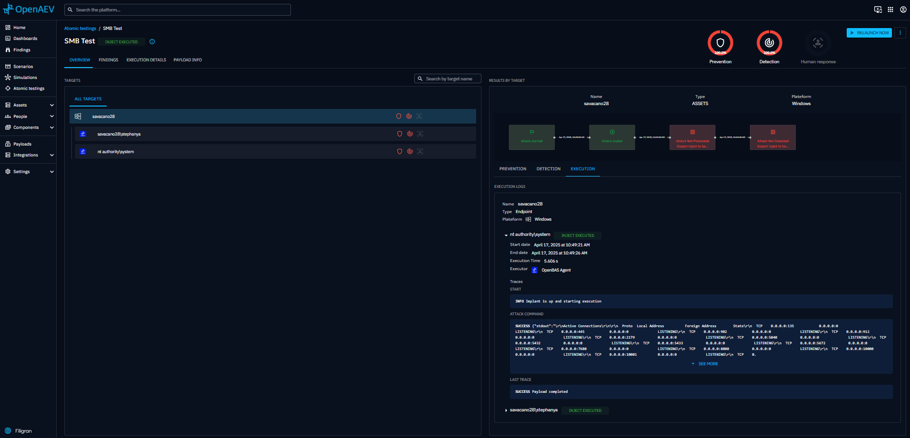
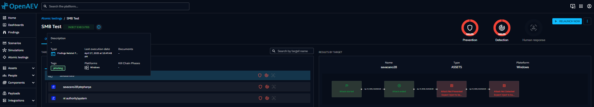

# Atomic testing

When clicking on Atomic testing in the left menu, you access to the list of all atomic testings ever launched in the
platform.

Atomic testing is a great way to simulate a singular attack technique you are particulary interested in, and test
immediately your capability to prevent and detect it.

The presented list allows you to easily see global scores of all your recent atomic testings.

## Search the list
- [Injects: Search and Filters](inject-result-list.md/#executed-injects-search-and-filters)

## Create an Atomic testing

An atomic testing is essentially the simulation of a single inject, against a selection of targets (Players, Teams,
Assets, Assets Group) with assorted expectations.

By clicking on the + button at the bottom right of the screen, you enter the atomic testing creation workflow.

On the left of the creation screen is the list of all available Inject you can play for atomic testing. Logos on the
left of each line indicates which Injector is associated with each inject.

Depending on your integrations, this list can be long. You can filter the list by kill chain phase, injector, compatible
platforms or Mitre Att&ck tactics.By clicking on the "Att&CK" logo near the search bar, you can also filter by selecting
a precise Mitre Att&ck techniques.

When selecting an inject on the left, the form on the right populates itself with a by-default title and propose you to
define when the inject should be played after the launch of the atomic testing. You can keep it to 0.

By clicking on Inject content, you can define now or later the targeted assets or players, needed configurations, and
the assorted expectations.

The "available variables" button helps you to use already defined variables into compatible fields.

## Atomic testing screens

Details of an Atomic testing is composed of three parts:

- A header with the title, a tooltip showing details about the inject (status, tags, and description), pie charts
  summarizing the results, and actions like launch, update, delete, and export.
- An overview screen that gives a quick summary of test results across all targets.
- An execution details screen that shows test expectations and detailed execution traces.

- [Overview](inject-result.md/#overview)
- [Findings](inject-result.md/#findings)
- [Inject execution details](inject-result.md/#execution-details)
- [Payload info](inject-result.md/#payload-info)
- [Remediation](inject-result.md/#remediations-ee)