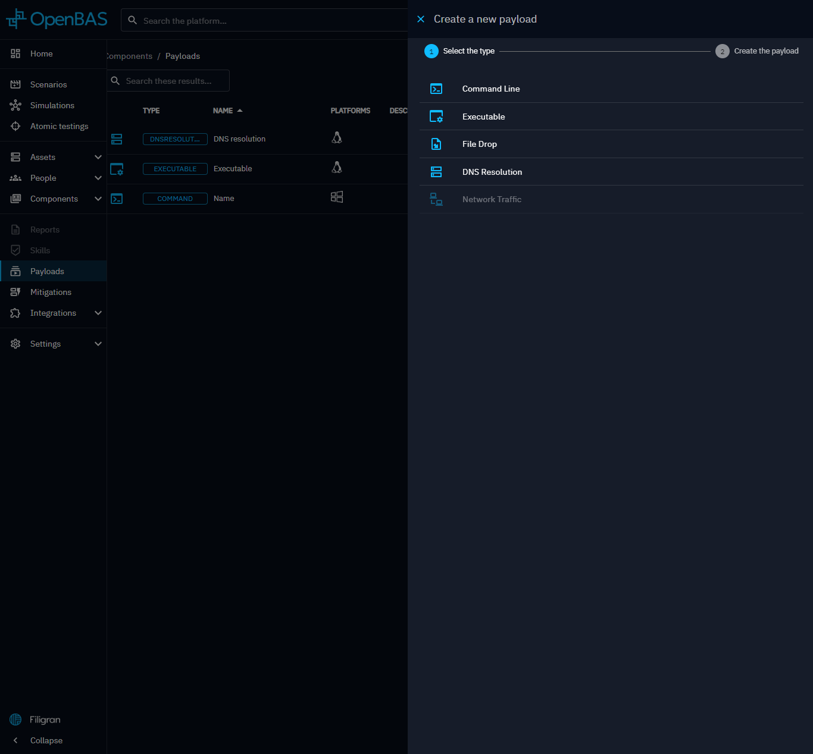
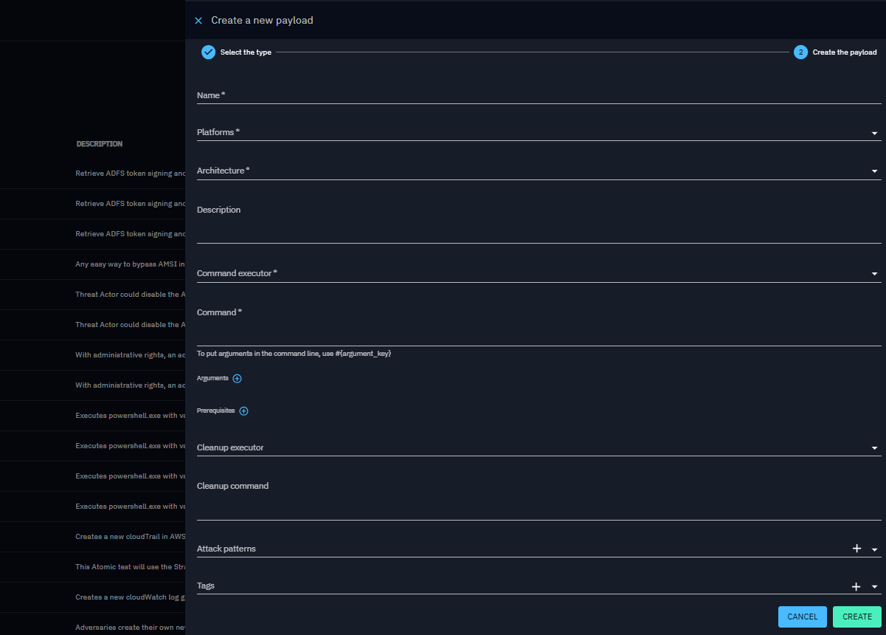

# Payloads

!!! tip "Under construction"

    We are doing our best to complete this page. If you want to participate, don't hesitate to join the [Filigran Community on Slack](https://community.filigran.io) or submit your pull request on the [Github doc repository](https://github.com/OpenBAS-Platform/docs).

In OpenBAS, you can create custom payloads based on different types to create new injects.

Payloads enhance the platform, allowing you to further customize your scenarios.

## Create a Payload

To create a new payload, follow these steps:

1. Click the "+" button at the bottom right corner of the screen.
2. Choose a type based on your needs:
    - **Command Line**: To execute a command using an executor (e.g., PowerShell, Bash, etc.)
    - **Executable**: To run an executable file on an asset
    - **File Drop**: To drop a file onto an asset
    - **DNS Resolution**: To resolve a hostname into IP addresses
3. Assign a name to your new payload and specify the platform where it should be executed.
4. Provide additional details for executing your payload, such as arguments and prerequisites.
5. Specify a cleanup executor and a cleanup command to remove any remnants from your execution on the asset.

Once completed, your new payload will appear in the payload list.

## Use a Payload

After creation, a new inject type will automatically appear in the inject types list if the implant you're using
supports it (the OpenBAS Implant does).

