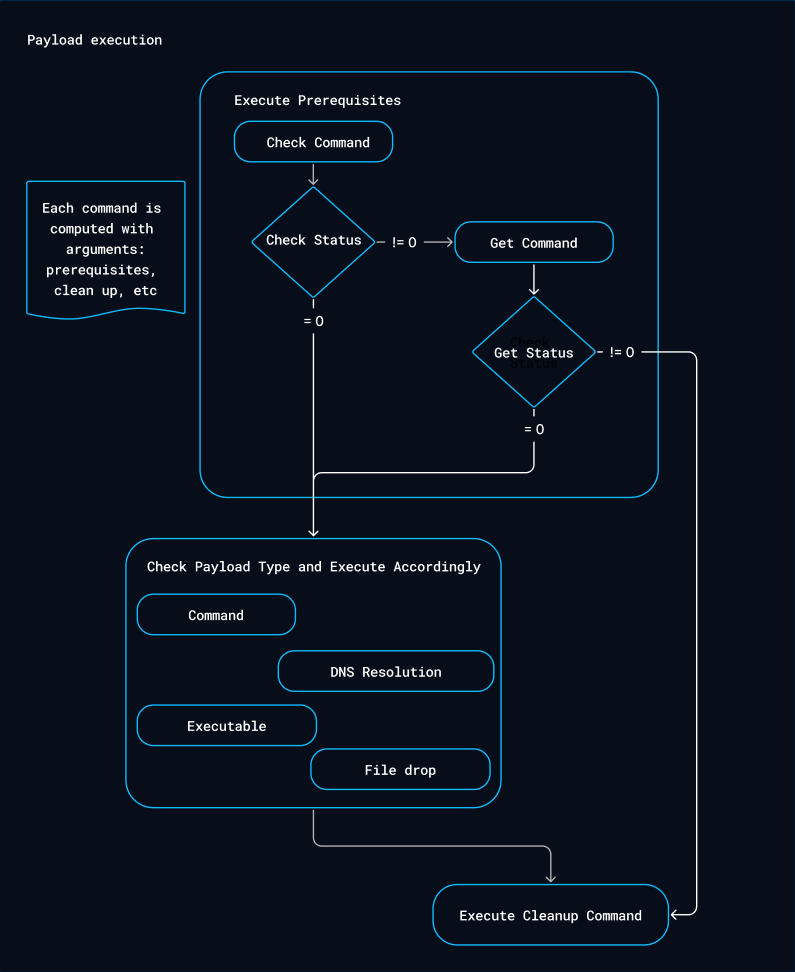
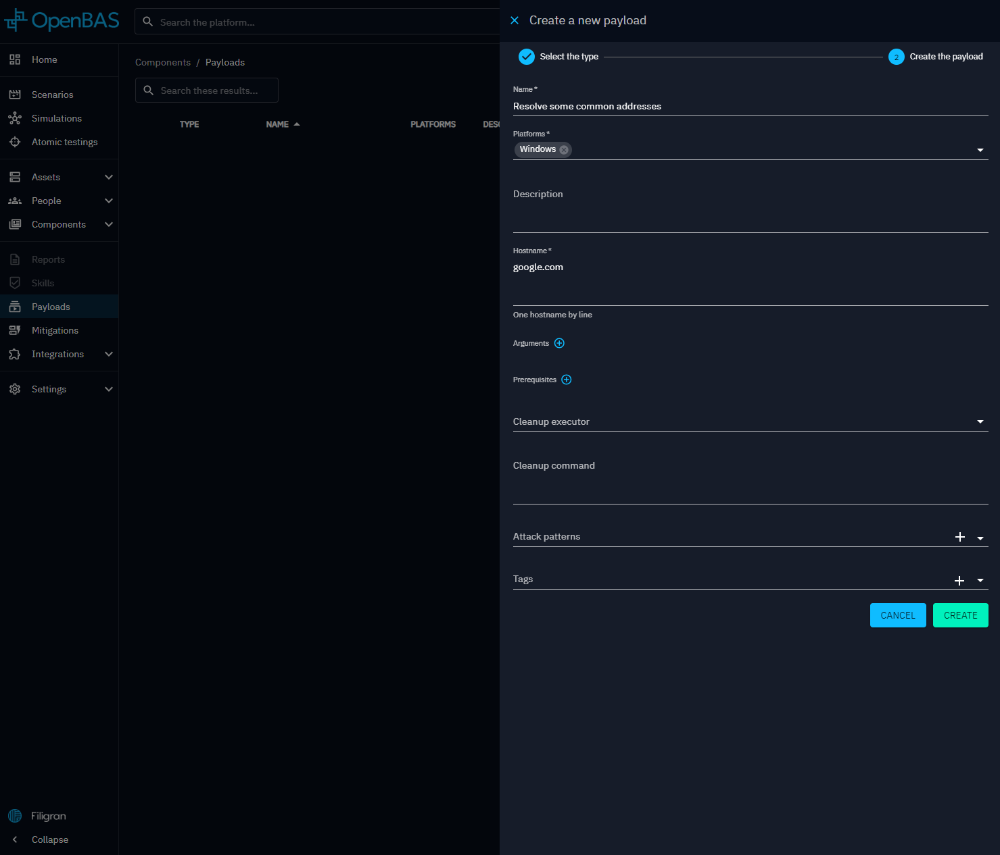
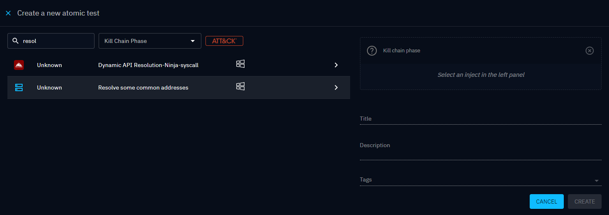

# Payloads

!!! tip "Under construction"

    We are doing our best to complete this page. If you want to participate, don't hesitate to join the [Filigran Community on Slack](https://community.filigran.io) or submit your pull request on the [Github doc repository](https://github.com/OpenBAS-Platform/docs).

In OpenBAS, you can create custom payloads based on different types to create new injects.

Payloads enhance the platform, allowing you to further customize your scenarios.

## Create a Payload

To create a new payload, follow these steps:

1. Click the "+" button at the bottom right corner of the screen.
2. Choose a type based on your needs:
    - **Command Line**: To execute a command using an executor (e.g., PowerShell, Bash, etc.)
    - **Executable**: To run an executable file on an asset
    - **File Drop**: To drop a file onto an asset
    - **DNS Resolution**: To resolve a hostname into IP addresses
3. Assign a name to your new payload and specify the platform where it should be executed.
4. Provide additional details for executing your payload, such as arguments and prerequisites.
5. Specify a cleanup executor and a cleanup command to remove any remnants from your execution on the asset.

Once completed, your new payload will appear in the payload list.

### Common Payload properties

| Property         | Description                                                         |
|------------------|---------------------------------------------------------------------|
| Name             | Payload name                                                        |
| Platforms        | Compatible platforms (ex. Windows, Linux, MacOS)                    |
| Description      | Payload description                                                 |
| Prerequisites    | Prerequisites required to execute the command                       |
| Cleanup executor | Executor for cleaning commands                                      |
| Cleanup command  | Cleanup command to remove or reset changes made                     |
| Attack patterns  | Command-related attack patterns                                     |
| Tags             | Tags                                                                |
| Arguments        | Arguments for the cleanup, prerequisites and potential command line |

#### Prerequisites in depth

| Property         | Description                                      |
|------------------|--------------------------------------------------|
| Command executor | Executor for prerequisite                        |
| Check command    | Verifies if specific condition are met           |
| Get command      | Run command if check command failed              |

### Additional Payload properties by type

#### Command Line

This payload type executes commands directly on the command line interface (CLI) of the target system 
(e.g., Windows Command Prompt, PowerShell, Linux Shell). 

Command Line payloads are used for remote command execution to simulate common attacker actions like privilege 
escalation or data exfiltration.

| Property         | Description                                      |
|------------------|--------------------------------------------------|
| Command executor | Executor for command to execute                  |
| Command          | Command to execute                               |

#### Executable

An Executable payload involves delivering a binary file (such as .exe on Windows or ELF on Linux) that the system runs 
as an independent process.

Executables can perform a variety of functions, from establishing a backdoor to running complex scripts (mimic malware).

| Property         | Description                                      |
|------------------|--------------------------------------------------|
| Architecture     | Compatible architecture (ex. x86_64, arm64)      |
| Executable file  | File to execute                                  |

#### File Drop

File Drop payloads are designed to deliver files (e.g., scripts, documents, binaries) to the target system without 
immediately executing them.

The goal is typically to simulate scenarios where attackers place files in specific locations for later use, either 
manually or by another process.

| Property         | Description                                      |
|------------------|--------------------------------------------------|
| File to drop     | File to drop                                     |

#### DNS Resolution

DNS resolution payloads attempts to resolve hostnames to associated IP address(es).

The goal of DNS resolution is to test if specific hostnames resolve to IP addresses correctly, helping assess network 
accessibility, detect issues, and simulate potential attacker behavior.

| Property         | Description                                      |
|------------------|--------------------------------------------------|
| Hostnames        | Hostname list to resolve                         |

### Payload execution workflow

## Use a Payload

After creation, a new inject type will automatically appear in the inject types list if the implant you're using
supports it (the OpenBAS Implant does).

