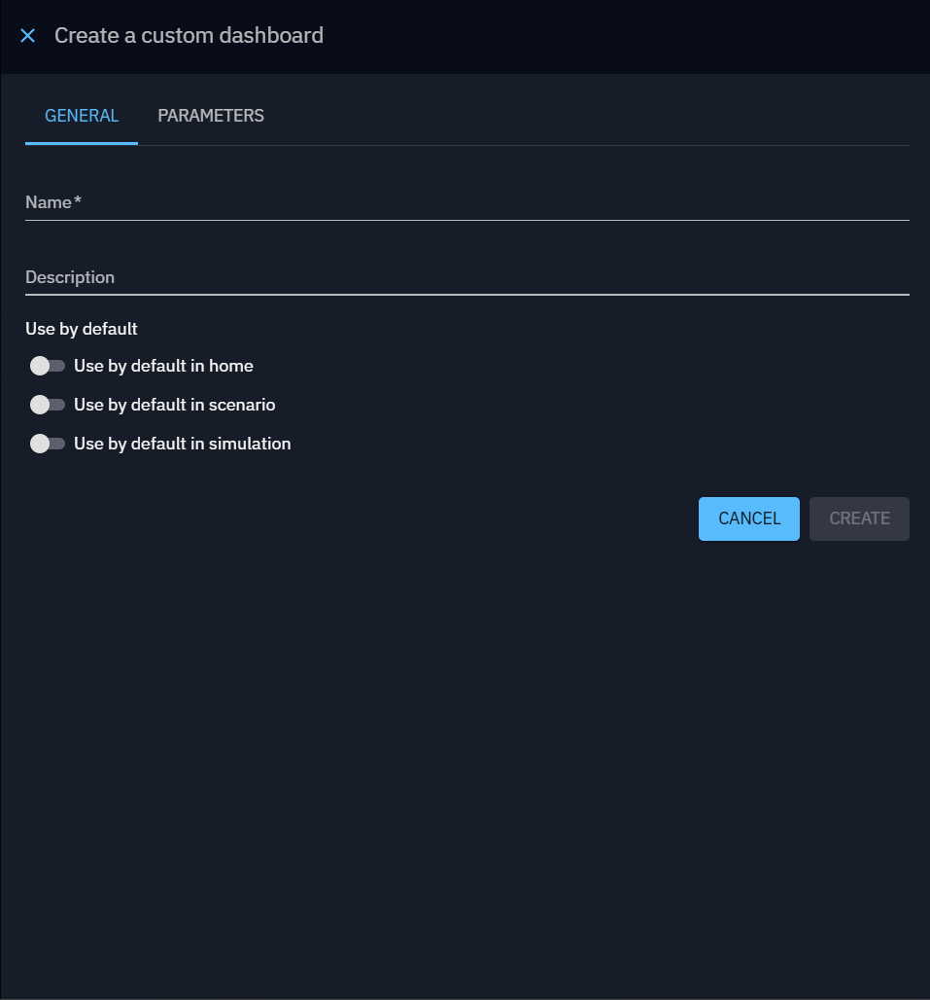
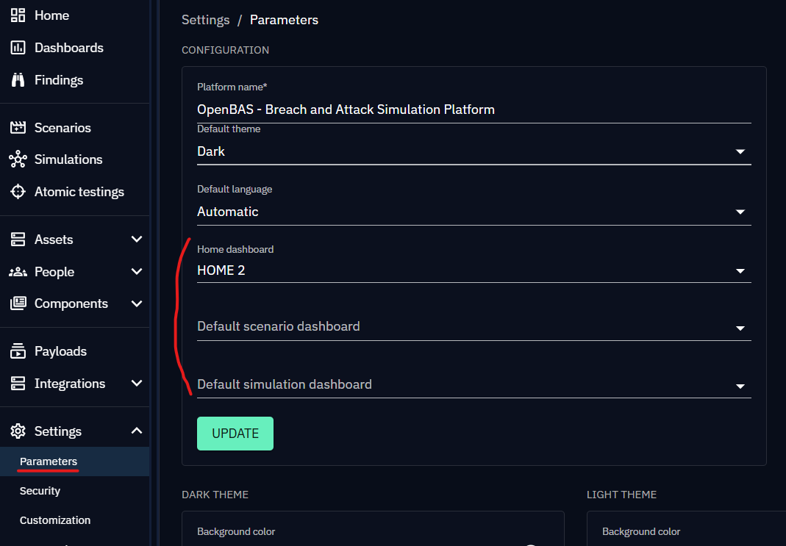
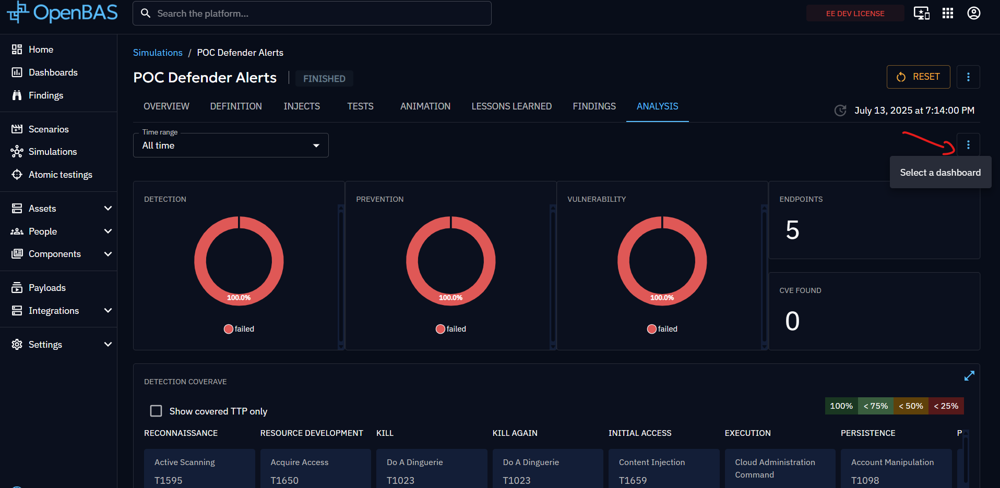

# Custom dashboards

OpenAEV provides an adaptable and entirely customizable dashboard functionality. The flexibility of OpenAEV's dashboard
ensures a tailored and insightful visualization of data, fostering a comprehensive understanding of the platform's
live activity.

## List of custom dashboards

From the left menu, you can choose the custom dashboards option to see all the custom dashboards you have created.

**Actions panel**

You can realise actions on a dashboard using the button located at the end of each line:

- update
- delete

With the "+" button on the bottom right corner, you can create a custom dashboard.

In the General tab, you can set the name and description, and choose to use this dashboard as the default for the home page, scenarios, or simulations.
To learn more about default custom dashboards, see [default custom dashboard](custom-dashboards.md#default-custom-dashboard).

The tab "Parameters" is used for adding a dynamic parameter for the widgets. For now, only the param "simulation" is implemented.
It means that if you add this parameter to your dashboard, you can choose this parameter in your widget and the widget will be calculated according to the simulation you will have selected.
See [widgets](../widgets/widgets.md) or [simulations](../../simulation.md) for more details.

## Dashboard overview

You have the flexibility to tailor the arrangement of [widgets](../widgets/widgets.md) on your dashboard.
Widgets can be intuitively placed to highlight key information. Additionally, you can resize widgets from the bottom
right corner based on the importance of the information, enabling adaptation to specific analytical needs. This
technical flexibility ensures a fluid, visually optimized user experience.

## Default custom dashboard
**Setting Default Custom Dashboards**:     

You can set a custom dashboard as the default for the home page, scenarios, or simulations in two ways:   

- Check the corresponding box when creating or updating a custom dashboard   
- Configure it from the Parameters page   

**How Default Dashboards Work**:   

- Home Page: Replaces the standard home page when you click "Home" in the left menu   
- Scenarios: Becomes the default Analysis tab for all newly created scenarios   
- Simulations: Becomes the default Analysis tab for all newly created simulations  

**Important Notes**:   
For scenarios and simulations, this only sets the initial default. You can change the dashboard for each individual scenario or simulation after creation (with proper permissions) from the analysis tab.   
   

You cannot delete a custom dashboard that is currently set as the default home dashboard

## Time filters

In order to have dashboards as accurate as possible, we offer the possibility to filter on time ranges. The values for 
the time range are: all time, custom range, last 24 hours, last 7 days, last month, last 3 months, last 6 months and 
last year. The default value for this parameter is **last three months**.

!!! note

    When the **All time** time range is set, datas are displayed without any time limit. When the **Custom range** is set,
    two more pickers are displayed, allowing the user to choose a start date and an end date.
