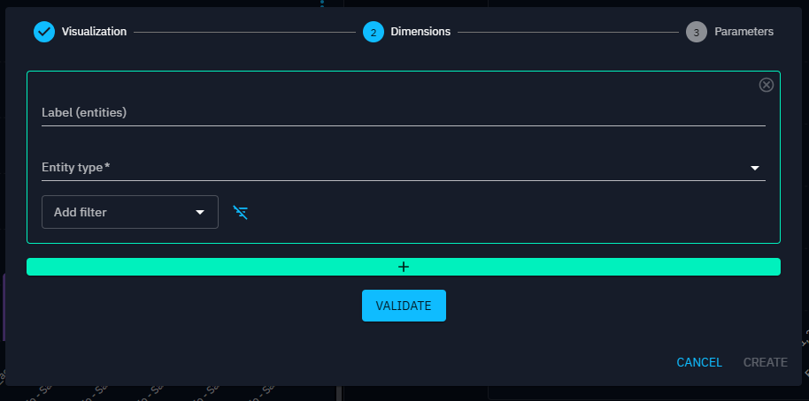
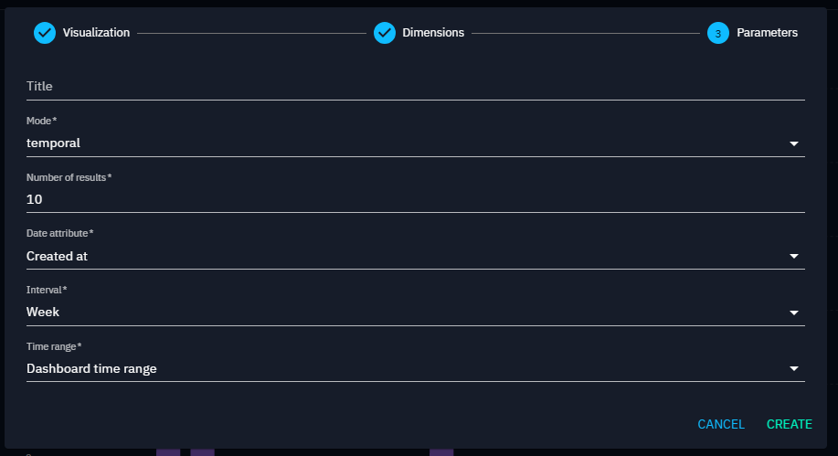

# Widget creation

Creating widgets on the [dashboard](../custom-dashboards/custom-dashboards.md) involves a four-step configuration
process. By navigating through these configuration steps, users can design widgets that meet their specific
requirements.

## Widget configuration

#### 1. Visualization

Start by selecting a visualization type that best represents the data you want to display. The visualization choice
determines which dimensions and parameters are available, so it’s important to pick one that aligns with the insights
you're aiming to uncover.

#### 2. Dimensions

Dimensions are determined by the selected perspective and define the dataset used by the widget. You can also apply
filters to refine the data and focus the analysis on specific subsets.

#### 3. Parameters

Parameters allow further customization of your widget. Based on the selected visualization, you can:

- Set the widget title
- Choose which elements to display from the filtered dataset
- Select the data reference date
- Configure additional settings specific to each visualization type

Two mode are available:

- Structural: projects your data based on a structural property
  

- Temporal: projects your data based on a temporal property
  
