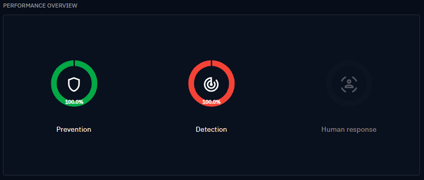
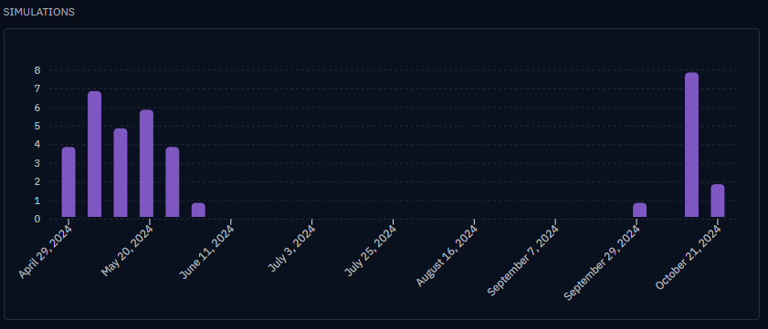
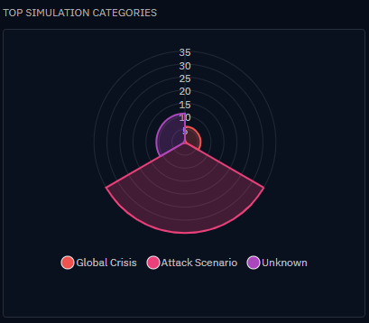
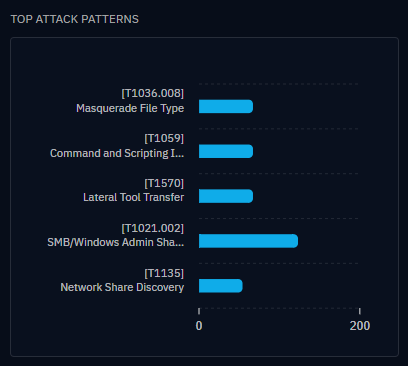
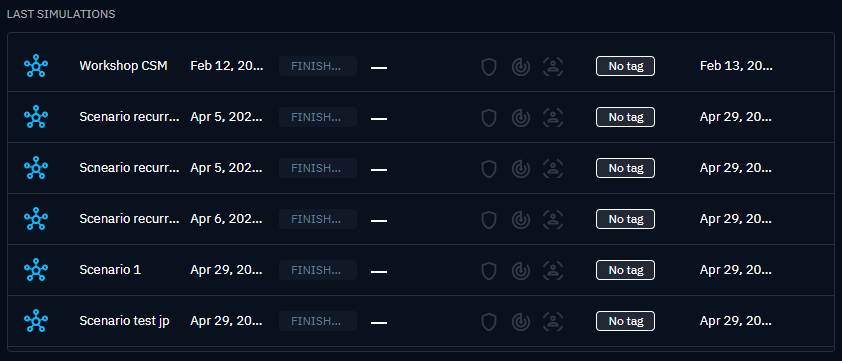

# Overview

!!! tip "Under construction"

    We are doing our best to complete this page. If you want to participate, don't hesitate to join the [Filigran Community on Slack](https://community.filigran.io) or submit your pull request on the [Github doc repository](https://github.com/OpenBAS-Platform/docs).

The Home screen provides visitors of the OpenBAS platform with an overview of the platform's live activity and a
snapshot of your global security posture. Below is a breakdown of the various widgets available on this page.

## Metric cards

This section displays the count of different components within the platform, shown in two metrics:

- The first big metric inside a card represents the number of objects created over the last 180 days.
- The second small metric inside a card reflects the number of objects created in the last 30 days.

!!! note

    From here, the data is based on simulations created and launched within the last 180 days.

## Performance overview

This section highlights the results of your simulation inject expectations, categorized in three types: prevention,
detection, and human response.

## Simulations

This bar chart represents simulations grouped by week, based on their start date.

## Top simulation categories

This polar chart aggregates all simulations by category, giving you a visual breakdown of the top categories.

## Top attack patterns

This horizontal bar chart displays the top attack patterns identified in your simulations, based on the number of
injects associated with each attack pattern.

## Last simulations

Here, we display the six most recent simulations, sorted in descending order by their start date.

## MITRE ATT&CK Coverage

This section presents the MITRE ATT&CK matrix, based on the results of your simulation inject expectations. It provides
an overview of which tactics and techniques have been covered in your simulations.
