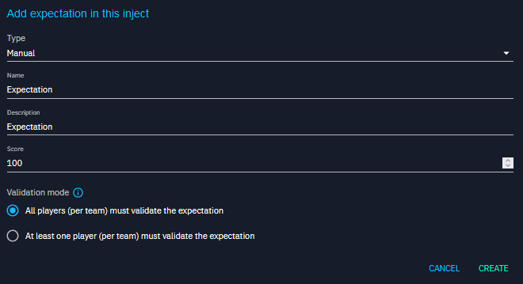
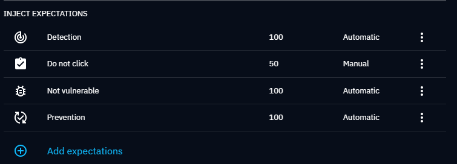
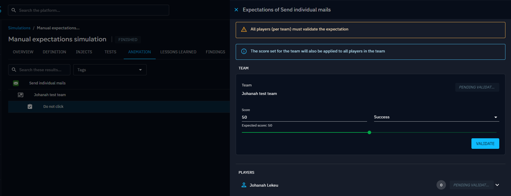
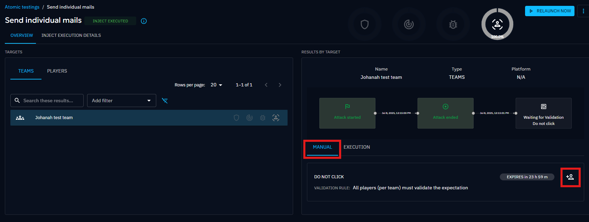
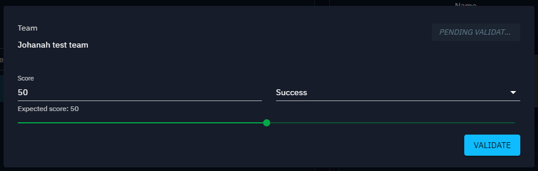
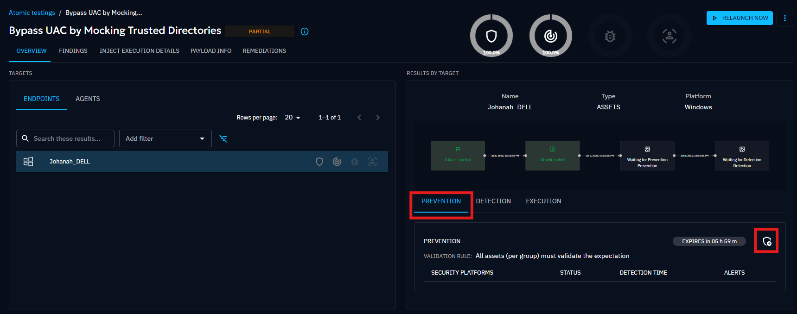
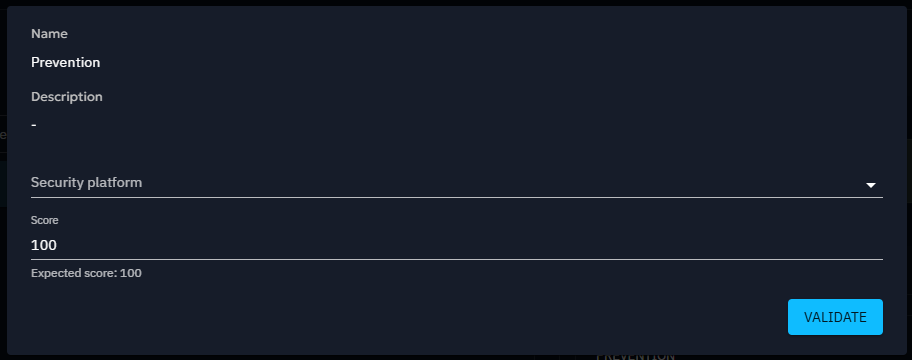
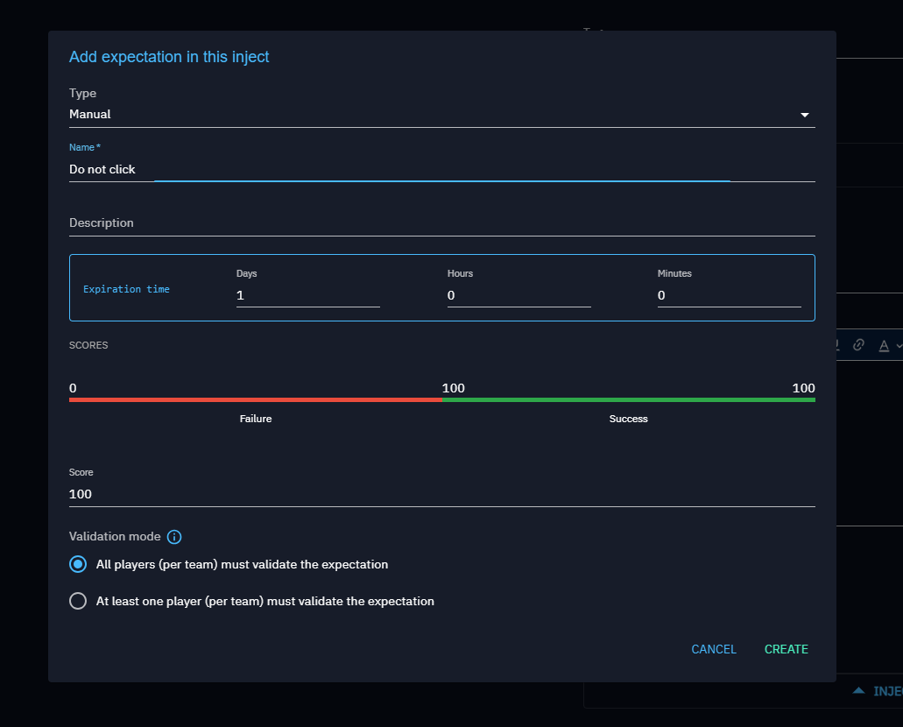

# Expectations

Expectations define what is expected from an [Asset (endpoint)](assets.md) or
a [Players](people.md#players) when facing an [Inject](inject-overview.md) in terms of
security posture. Each expectation has a score representing how well it has been met by the target.

## Expectation types

Expectations can be categorized as either Manual or Automatic, depending on how they are validated.

### Manual expectations

Manual expectations require validation by the **exercise organizer** (animation team).  
They are simple, customizable, and **user-controlled**.

Examples:

- **Team response validation**  
  Check whether the **incident response team** correctly acknowledges and escalates a phishing inject during the exercise.

- **Player task validation**  
  Ensure that an **analyst player** correctly follows the playbook and reports an incident in the ticketing system.

### Automatic expectations

Automatic expectations are validated automatically under specific conditions.

- `Prevention`: automatically validated by security integrations (e.g., quarantine event).
- `Detection`: automatically validated by security integrations (e.g., incident alert).
- `Vulnerability`: automatically validated based on the presence of CVEs.
- `Expect targets to read the article(s)`: automatically validated once targets have read the injected article.

## Validation Mode

There are two modes for validating an expectation :

### All targets (per group) must validate the expectation

- The result depends on **every member's performance**.
- If one target fails, the entire group fails.
- Final score = **100** if all succeed, otherwise **0**.

Example: 3 players succeed, 1 fails → Group score = **0 (Failed)**.  
Example: 4 players succeed → Group score = **100 (Success)**.

### At least one target (per group) must validate the expectation

- Success depends on **at least one target succeeding**.
- The group is considered successful if one target validates.
- Final score = **100** if ≥1 succeeds, otherwise **0**.

Example: 3 players fail, 1 succeeds → Group score = **100 (Success)**.  
Example: 4 players fail → Group score = **0 (Failed)**.

## Expectation manipulation

### Add an expectation to an Inject

1. Navigate to the inject's content and click **Add expectations**.
2. Select the type of expectation you want to add.
3. Define its score and validation mode.

You can add multiple expectations to a single inject.

### Validate a manual expectation

- During a simulation, go to the **Animation tab → Validation screen** to manually validate expectations.

- For atomic testing with manual injects, validation can be done directly in the **Overview tab**.

### Validate technical injects

- Users can manually add detection/prevention results for their custom security platforms.
- Automatic validation will also occur when connected to compatible collectors.

### Update Rules

Expectation statuses propagate between entities as follows:

| Action             | Behavior                                                               |
|--------------------|------------------------------------------------------------------------|
| Update Agent       | Update its status (0 = fail, 100 = success).                           |
| Update Asset       | Asset becomes **valid (100)** only if **all its agents are valid**.    |
| Update Asset Group | Compute status depending on validation mode:                           |
|                    | - **All assets must validate** → 100 only if all assets succeed.       |
|                    | - **At least one asset must validate** → 100 if at least one succeeds. |
| Update Player      | Compute status for the team depending on validation mode.              |
| Update Team        | Propagate status to players.                                           |

### Customize expectations

#### Default score

Each expectation has a **default score value** at creation, configurable via environment variables:

| Parameter                                      | Environment variable                           | Default value | Description                                |
|:-----------------------------------------------|:-----------------------------------------------|:--------------|:-------------------------------------------|
| openaev.expectation.manual.default-score-value | OPENAEV_EXPECTATION_MANUAL_DEFAULT-SCORE-VALUE | 50            | Default score value for manual expectation |

#### Expiration time

Expectations must be validated within a time limit. Defaults are set in the system but can be overridden:

- Manual Response: By default if not manual expectations are set the expiration will done after 24 hours
- Detection/Prevention: By default if no expectations are set the expiration will done after 6 hour

| Parameter                                      | Environment variable                           | Default value | Description                                                         |
|:-----------------------------------------------|:-----------------------------------------------|:--------------|:--------------------------------------------------------------------|
| openaev.expectation.technical.expiration-time  | OPENAEV_EXPECTATION_TECHNICAL_EXPIRATION-TIME  | 21600         | Expiration time for Technical expectation (detection & prevention)  |
| openaev.expectation.detection.expiration-time  | OPENAEV_EXPECTATION_DETECTION_EXPIRATION-TIME  | 21600         | Expiration time for detection expectation                           |
| openaev.expectation.prevention.expiration-time | OPENAEV_EXPECTATION_PREVENTION_EXPIRATION-TIME | 21600         | Expiration time for prevention expectation                          |
| openaev.expectation.human.expiration-time      | OPENAEV_EXPECTATION_HUMAN_EXPIRATION-TIME      | 86400         | Expiration time for human expectation (manual, challenge & article) |
| openaev.expectation.challenge.expiration-time  | OPENAEV_EXPECTATION_CHALLENGE_EXPIRATION-TIME  | 86400         | Expiration time for challenge expectation                           |
| openaev.expectation.article.expiration-time    | OPENAEV_EXPECTATION_ARTICLE_EXPIRATION-TIME    | 86400         | Expiration time for article expectation                             |
| openaev.expectation.manual.expiration-time     | OPENAEV_EXPECTATION_MANUAL_EXPIRATION-TIME     | 86400         | Expiration time for manual expectation                              |

A default expiration time is set for technical and human expectations. Users can override them for each type of
expectations.

- In the UI

When creating an expectation, users can set an expiration time. The system's default times are set on the form and users
decide to override it.

Once the expiration time will be reached, the Expectation Expiration Manager will fail the expectation and will show the
result as `Not Detected` or `Not Prevented` depending on the expectation's type.

## When is a Simulation Finished?

A simulation is considered **finished** once all defined expectations are resolved:

- **Technical expectations** → validated through **Detection, Prevention, Vulnerability checks**.
- **Human expectations** → validated manually by the organizer.  
