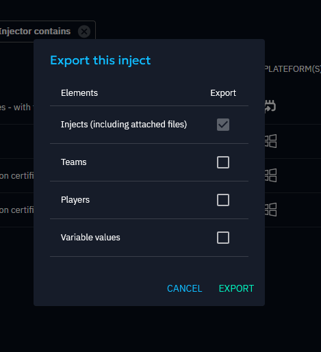
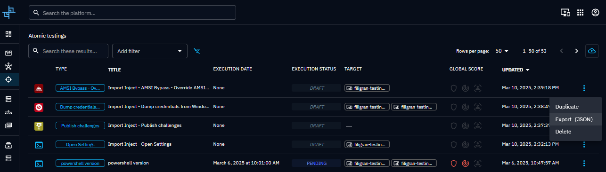
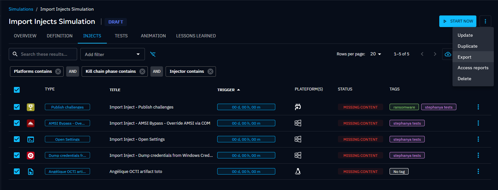
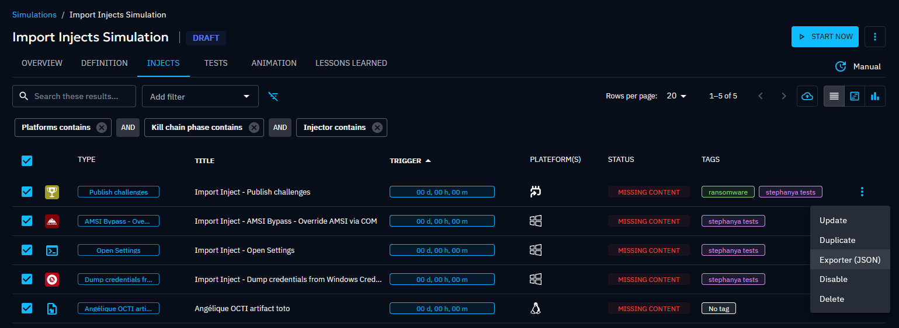
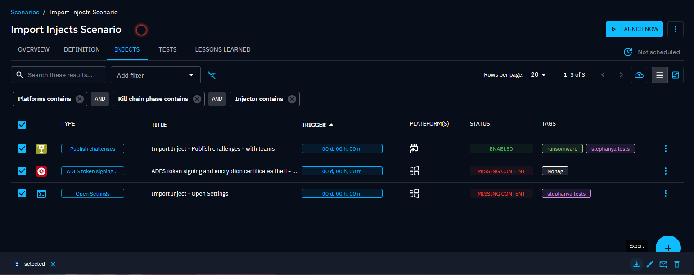
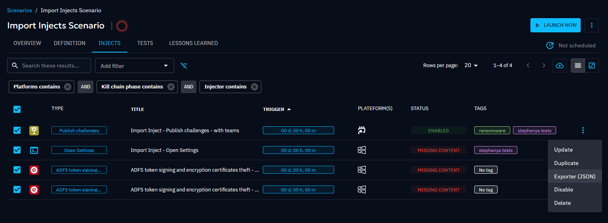
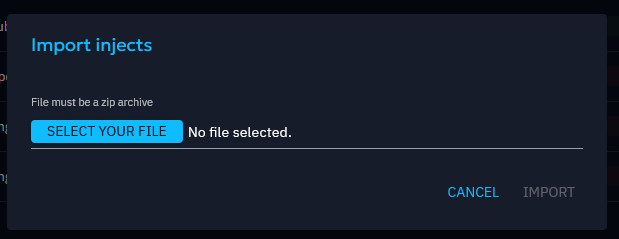
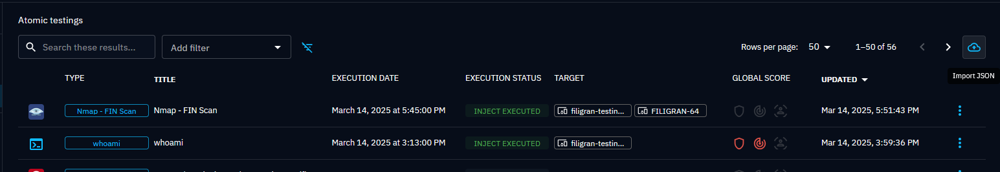
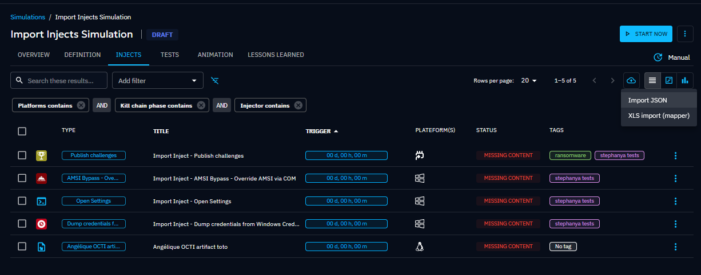
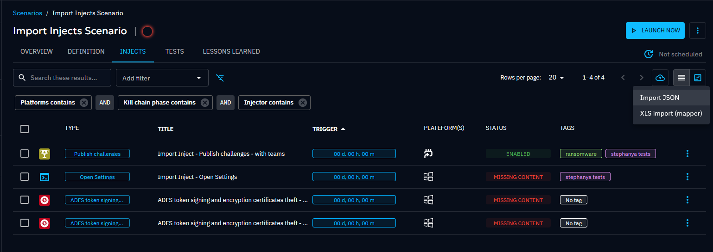

# Inject chaining and transfer

This page covers two features that help you organize Injects beyond simple one-shot execution: **conditional chaining**
to model multi-stage attacks, and **export/import** to reuse Injects across Scenarios and instances.

## Conditional execution

Conditional execution (also called **logical chaining**) lets you link Injects together so that a child Inject only
runs if specific conditions on its parent are met at execution time. Conditions can be based on Expectation results
(prevention, detection) or execution success/failure.

### Why chain Injects?

- **Model real attack chains**: execute lateral movement only if initial access succeeded.
- **Reduce noise**: skip follow-up Injects when a prerequisite was blocked.
- **Test decision trees**: simulate branching attacker behavior depending on defensive outcomes.

### Option 1: from the Inject update form

1. Open an Inject and go to the **Logical Chains** tab.
2. Assign a **Parent**. The current Inject will only execute if the Parent's conditions are met.
3. Assign **Children**. They will execute only if the current Inject's conditions are satisfied.
4. Select the conditions: choose the relevant Expectation and toggle **Success** or **Fail**.
5. Toggle the **AND / OR** operator to control whether all conditions must be met or just one.

!!! note

    The AND/OR setting applies globally to all conditions of the Inject. You cannot mix operators.

### Option 2: from the timeline

1. Switch to the **timeline view** of the Injects list.
2. Hover over the connection point (small dot) on the left or right of an Inject.
3. Drag and drop a link to another Inject.

Links created this way default to the condition **"Execution is Success"**. Edit them via the Inject update form to set
more specific conditions. You can reposition or remove links by dragging them to an empty area.

### In practice

You are simulating a multi-stage attack:

1. **Inject 1**: phishing email with a malicious attachment.
2. **Inject 2**: Payload execution on the endpoint (child of Inject 1, condition: *Prevention expectation = Fail*).
3. **Inject 3**: lateral movement (child of Inject 2, condition: *Execution = Success*).

If the EDR blocks the attachment (Prevention = Success), Inject 2 and 3 are automatically skipped.

---

## Export and import

The export/import feature transfers Injects, along with their configuration (arguments, content, tags, Expectations),
between Simulations, Scenarios, and Atomic tests, even across different OpenAEV instances.

### Why export/import?

- **Reuse proven Injects**: export a well-tuned phishing Inject and import it into a new Scenario.
- **Share across teams**: distribute standardized Injects to other operators.
- **Migrate between environments**: move Injects from a lab instance to production.

### Export

1. Navigate to the Injects list in your Simulation, Scenario, or Atomic test.
2. Select the Injects to export (or use the contextual menu for a single Inject).
3. Choose whether to include **Teams/Players** in the export.
4. Download the export file.

| Rule | Detail |
|------|--------|
| Multiple Injects | Supported for Scenarios and Simulations |
| Atomic testing | Only **one** Inject per export |
| Teams/Players | Optional, opt in during export |
| Assets | **Never** exported |
| Permissions | Read access on the source Scenario/Simulation; Admin for Atomic tests |

### Import

1. Navigate to the Injects list in the destination Simulation, Scenario, or Atomic test.
2. Click the **import** action.
3. Select the export file. Injects are created with their original configuration.

| Rule | Detail |
|------|--------|
| Cross-type import | Import from any source type into any destination type |
| Permissions | Write access on the destination Scenario/Simulation; Admin for Atomic tests |

### In practice

Your red team built a set of credential-dumping Injects in a lab Scenario:

1. **Export** the Injects from the lab Scenario (include Teams).
2. **Import** them into the production Simulation targeting the finance department.
3. Adjust target Assets and timing. The rest of the configuration carries over.

## Go further

- Build complete attack chains with [Scenarios](scenario.md).
- Import Injects from threat intelligence using [Scenario generation from OpenCTI](scenario/security-coverage.md).
- Understand [Inject statuses](inject-status.md) to interpret execution results.

