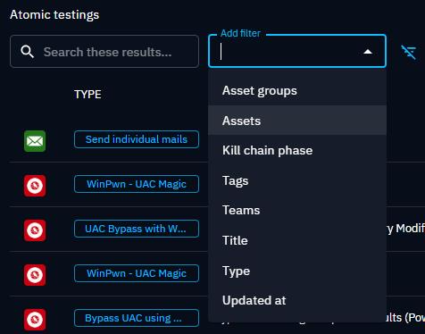
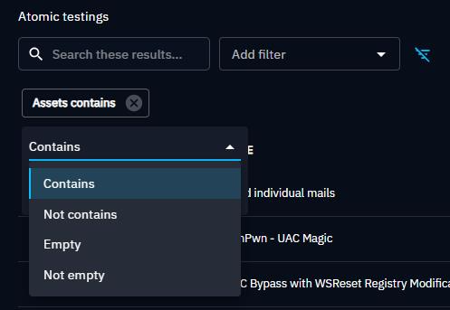
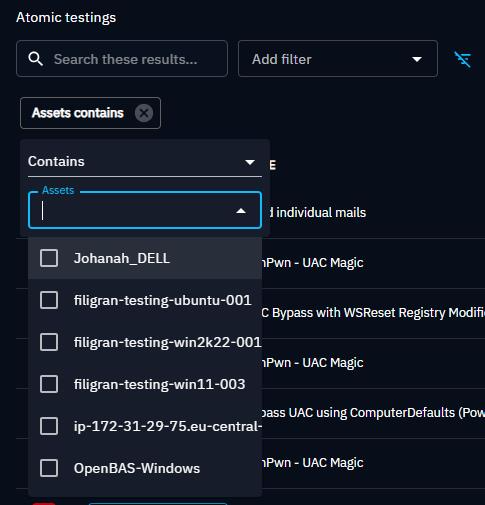
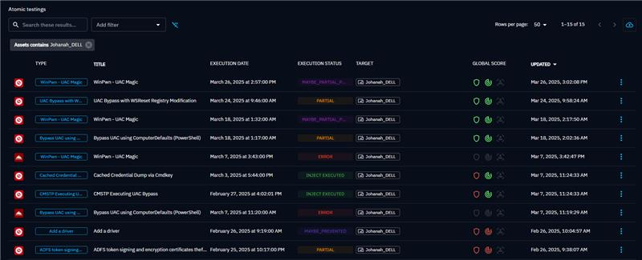

## Executed Injects: Search and Filters

You can search the list using the name or one the filters. Here are the available filters for this list.

Once you choose the attribute you want to apply a filter on, you can choose the operator.

Then you have the list of values for the attributes you choose.

Here is the list once you apply the filter.

