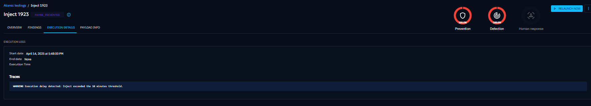
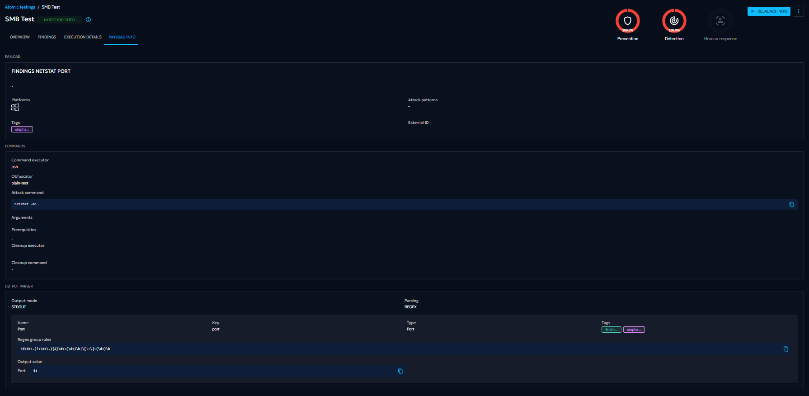
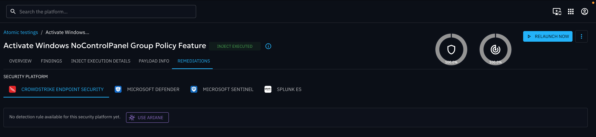

# Inject result

### Overview

The first screen displayed when you click on a specific inject executed (Atomic testing or Simulation)  is a breakdown of your security
posture against this test.

Results are broken down into:

- Prevention: the ability of your security posture to prevent the inject
- Detection: the ability of your security posture to detect the inject
- Human response: the ability of your security teams to react as intented facing the inject
- Vulnerability: the ability of your security posture to detect common vulnerabilities and exposures (CVEs)

At the top, big metrics summarize how all targets performed. On the left, a list of targets lets you quickly check
results for each one. When you select a target, the right side shows a timeline of the test and its results, including
execution logs.

### Findings

The Findings screen displays what was detected during the inject, based on the output parser in the payload. You can
filter findings by name, type, creation date, target, value, or tag.

### Execution details

This screen shows the full trace of the inject’s execution, including logs and status information.

### Payload info

This screen is available for technical injects only. You can see the details of the payload related to the test.

### Remediations (EE)

This screen is available for technical injects only. It displays remediation content related to the executed payload,
specifically focused on detection logic. You will see one Remediation tab per collector available in the platform.

Ariane can generate AI‑based rules from an executed inject with the following:

- Payload types: Command, DnsResolution
- Collectors: Splunk, CrowdStrike

Remediation statuses:
- No remediation:
  

- No remediation and Ariane not available:
  

- Remediation written by a human:
  

- Remediation generate with Ariane
  

- Remediation outdated
  
