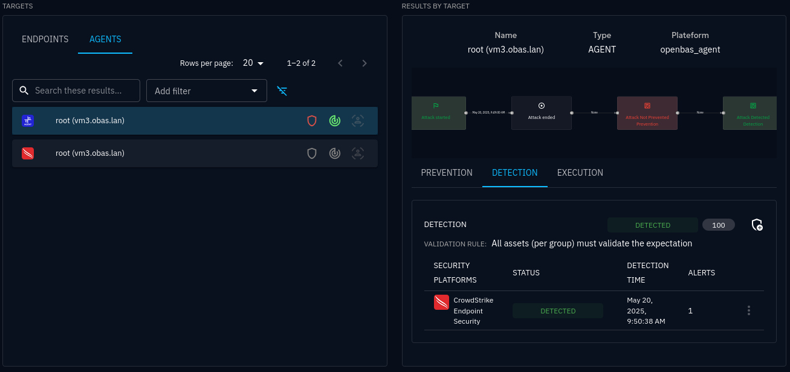
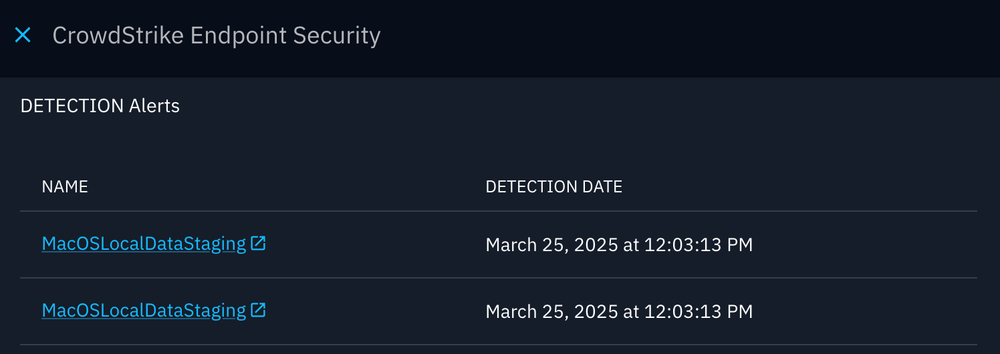
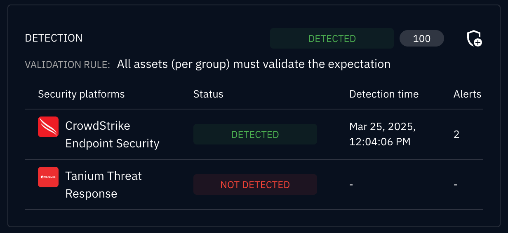
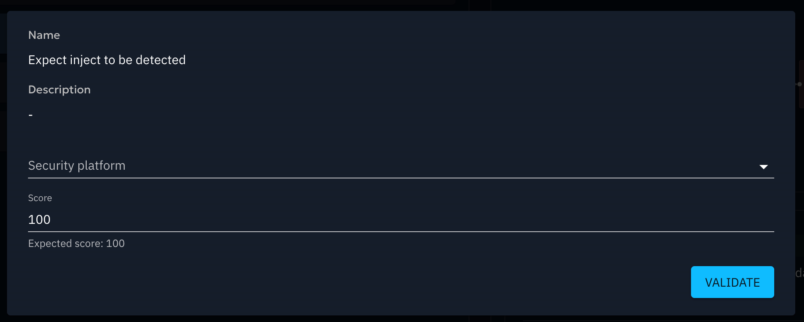

# Inject status

Every Inject execution produces a **status** that tells you the outcome at a glance: success, failure, or partial
completion. Statuses are computed automatically from the execution traces reported by
[OpenAEV Agents](openaev-agent.md).

**⚠️ IMPORTANT: Execution Status vs. Expectation Results**
> The **Execution Status** strictly reflects the *operational state* of the action (e.g., did the command run, crash, or time out); It exists **only to give the user visibility into the technical execution** of the injector.
> 
> Execution Status **DOES NOT** represent your security posture. To evaluate if an attack was actually detected or prevented by your security controls, you must refer to **Expectation Results**, which gather data directly from OpenAEV Collectors.

## Why it matters

- **Diagnose at a glance**: know immediately whether an Inject worked, failed, or was blocked.
- **Prioritize investigation**: focus on `ERROR` or `PARTIAL` results instead of reviewing every trace manually.

## Execution traces

When an Inject targets [Endpoints](assets.md), each installed Agent reports its progress to the OAEV Server as
**execution traces**, structured log entries for each step of the process:

| Step | Description |
|------|-------------|
| **Prerequisite check** | Validates required conditions before execution |
| **Prerequisite retrieval** | Installs missing prerequisites (only if the check fails) |
| **Attack command** | Executes the actual Payload |
| **Cleanup** | Removes artifacts left by the attack |

!!! Note

    If a prerequisite check succeeds, the retrieval step is skipped. The UI always marks prerequisite checks as "SUCCESS". Inspect the stderr logs to verify actual execution results.

### Where to find traces

| Location | Content |
|----------|---------|
| **Execution details** tab (Inject result page) | Traces for the overall Inject execution |
| **Execution** tab (Inject overview page) | Per-target traces, including Endpoints and individual Agents |

The **Targets** panel (left side) lists every target organized by type (Asset group, Endpoint, Agent, Team, Player).
Only tabs with at least one active target appear. Use pagination and filters to navigate large lists.

## Trace statuses reference

Every execution step reports a **trace status**. Below is the complete list of actionable execution statuses, divided into logical categories to help operators troubleshoot technical issues.

### ✅ Successful Executions

| Status                      | Description | Details |
|-----------------------------|-------------|---------|
| `EXECUTED`                   | Command executed to completion without system errors | *Note: This only means the command ran, not that it bypassed defenses* |
| `EXECUTED WITH CLEANUP FAIL` | | Main command succeeded, but cleanup failed | Check if the action locked the file or if permissions changed during execution |
| `WARNING`                   | Command completed but produced stderr output | Review stderr logs for potential non-blocking issues |
| `ACCESS DENIED`             | Command denied by the OS due to insufficient privileges | Check if the agent is running with the required rights (e.g., Admin/Root) |

### ❌  Error statuses

| Status                       | Description | Details |
|------------------------------|-------------|---------|
| `ERROR`                      | General, unclassified execution failure | Check the agent logs for detailed stack traces |
| `COMMAND NOT FOUND`          | Executable or binary missing on the target system | Ensure dependencies (e.g., `curl`, `powershell`) are installed in the `PATH` |
| `COMMAND CANNOT BE EXECUTED` | Command exists but cannot run | Check file execute permissions (`chmod +x`) or architecture compatibility. |
| `PREREQUISITE FAILED`        | A prerequisite check failed before the main command | Review prerequisite dependencies and ensure they are met on the target |
| `INVALID USAGE`              | Incorrect arguments or syntax | The command was invoked with incorrect arguments or syntax Verify the inject parameters and command |
| `TIMEOUT`                    | Execution exceeded time threshold | The agent did not complete execution within the allowed time threshold. Consider investigating target performance |
| `INTERRUPTED`                | Inject interrupted before completion | This may be caused by a system signal, user intervention, or resource constraint |

### ℹ️  Informational statuses (excluded from status computation)

| Status            | Description | Details |
|-------------------|-------------|---------|
| `AGENT INACTIVE`  | Agent was not active during Inject execution | This agent was not active during the inject execution. Check your asset connectivity. |
| `ASSET AGENTLESS` | Asset has no Agent installed | Install an OpenAEV agent on the target asset |
| `INFO`            | Informational trace (e.g., Agent spawn notification) | |

!!! note "Deprecated statuses"

    `MAYBE PREVENTED` and `MAYBE PARTIAL PREVENTED` are deprecated.

## Status computation hierarchy

In OpenAEV, the execution status is not a simple average of agents. The platform computes the final status by bubbling up the results through the architectural hierarchy:

1. **Agent level:** The atomic execution result on a specific endpoint (e.g., `SUCCESS` or `BLOCKED_BY_EDR`).
2. **Asset level:** Aggregates the status of all agents running on that specific asset.
3. **Asset Group level:** Aggregates the status of all assets within the targeted group.
4. **Inject level:** The final global status displayed in the UI, aggregating all targeted asset groups and direct assets.

### Agent status computation

The server evaluates all traces for a single Agent with the following priority rules:

| Priority | Condition | Resulting status                                                    |
|----------|-----------|---------------------------------------------------------------------|
| 1 | Any non-cleanup, non-prerequisite trace is an error | That specific error status (or `ERROR` if multiple distinct errors) |
| 2 | A prerequisite failed | `PREREQUISITE FAILED`                                               |
| 3 | Execution succeeded but cleanup failed | `EXECUTED WITH CLEANUP FAIL`                                         |
| 4 | All traces succeeded | `EXECUTED`                                                           |

### Inject status computation

The server computes the Inject-level status from per-Agent COMPLETE traces, **excluding `AGENT INACTIVE` Agents**:

| Condition | Inject status |
|-----------|--------------|
| All active Agents succeeded | **EXECUTED** |
| All active Agents errored | **ERROR** |
| Mix of success and error | **PARTIAL** |
| No active Agents | **ERROR** |

## In practice

You run an Inject targeting three Endpoints, each with one OpenAEV Agent:

| Agent | What happened | Agent status                |
|-------|--------------|-----------------------------|
| **Agent A** | Attack command succeeds, cleanup fails | `SUCCESS WITH CLEANUP FAIL` |
| **Agent B** | Attack command blocked by EDR | `ACCESS DENIED`             |
| **Agent C** | Agent was offline | `AGENT INACTIVE` (excluded) |

One success + one error among active Agents →  The status are mixed, so the final Inject status is **PARTIAL**

## Alert details

After execution, OpenAEV retrieves alert data from connected security platforms (SIEM, EDR) so you can correlate Inject
activity with real detections.

Select an Agent in the **Targets** panel to view its detection traces. Click the Agent name to expand traces. If a
detection was identified on an external platform, click the alert name to open it directly in that platform.

!!! warning

    Detection data can take several minutes to appear in OpenAEV after Inject execution.

## Adding manual results

When automated result retrieval is not possible (e.g., non-technical Injects), record results manually:

1. Open the Inject result page.
2. Click the **shield** icon labeled **Add a result**.
3. Fill in the result form and save.

## Go further

- Define [Expectations](expectations/overview.md) to set success criteria for your Injects.
- Explore [Findings](findings.md) to see what was detected during execution.
- Review [Inject results](inject-result.md) for a full breakdown of your security posture against a test.

