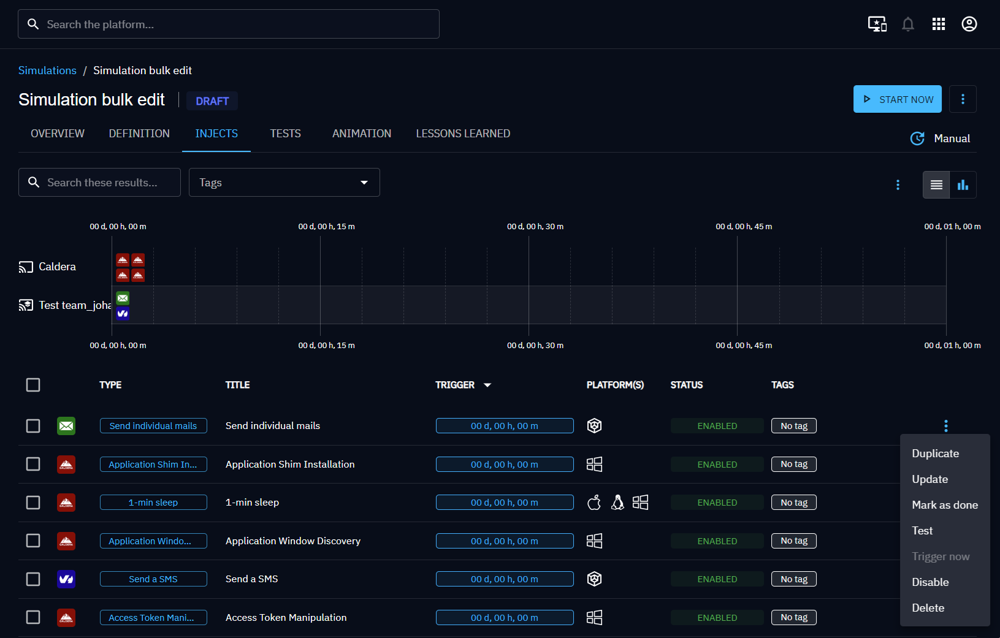
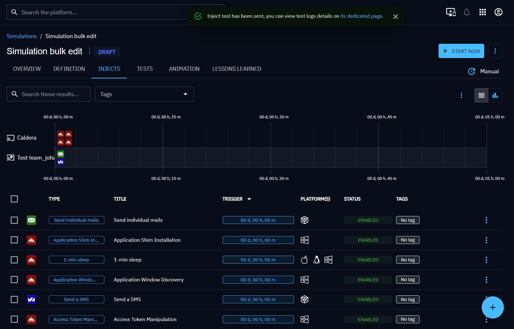
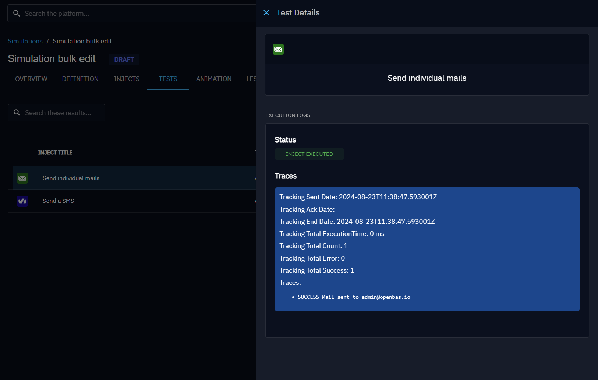
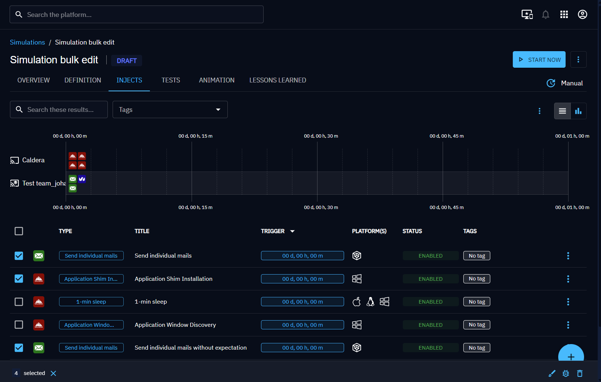
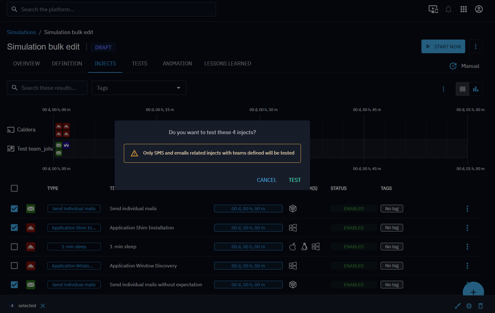

# Inject tests

Inject tests let you **dry-run** direct-contact Injects (email, SMS) before launching a real Simulation. OpenAEV sends
the Inject to the current user so you can verify content, formatting, and delivery without impacting participants.

## Why test first?

- **Catch errors early**: spot typos, broken links, or wrong variables before the Simulation starts.
- **Validate delivery**: confirm that emails and SMS actually arrive.
- **Iterate quickly**: replay tests until the content is right.

!!! warning

    Only **email** and **SMS** Injects support testing. The test option is disabled if the Inject has no assigned Teams.

!!! note

    Only the latest test result is displayed for each Inject.

## Single test

1. In the Injects list of your Simulation or Scenario, open the contextual menu of an email or SMS Inject.
2. Click **Test** and confirm.
3. An alert appears at the top of the page. Click the **dedicated page** link to view execution details.

## Bulk test

1. Select the Injects you want to test.
2. Click the **bug** icon in the toolbar and confirm.
3. OpenAEV sends all eligible email/SMS Injects to the current user and redirects you to the tests list.

## Replay

Each test in the list has a contextual menu to **replay** or **delete** it. You can also replay all tests at once using
the replay icon at the top of the list.

## In practice

You are preparing a phishing awareness Simulation with a custom email template:

1. Create the email Inject with your template and variables.
2. Run a single test. You receive the email in your own inbox.
3. Notice a broken `{{redirectUrl}}` variable, fix it in the Inject.
4. Replay the test. The email now renders correctly.
5. Launch the Simulation with confidence.

## Go further

- Set up [Expectations](expectations/overview.md) to define what a successful test looks like.
- Explore [Notifications](notifications.md) to understand how OpenAEV alerts participants.
- Understand [Inject statuses](inject-status.md) to interpret execution results.

=