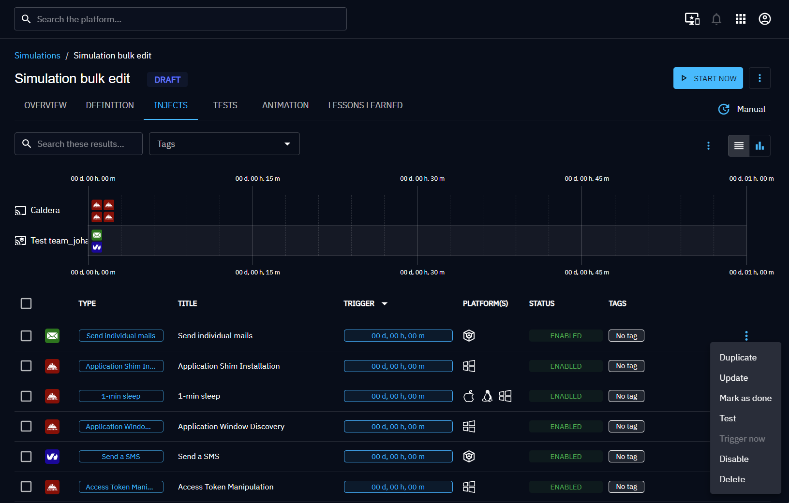
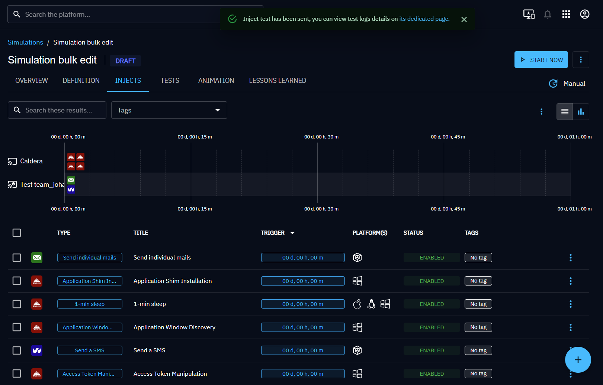
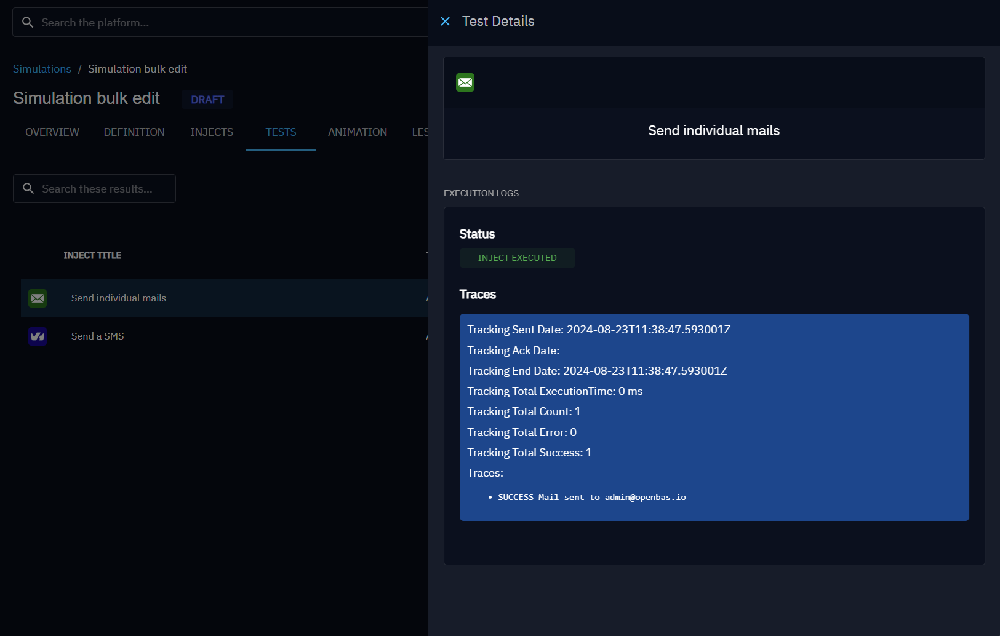
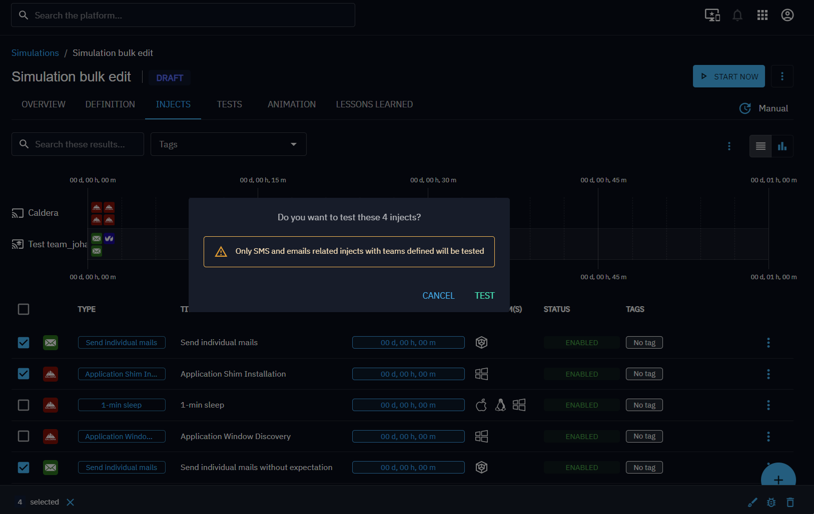
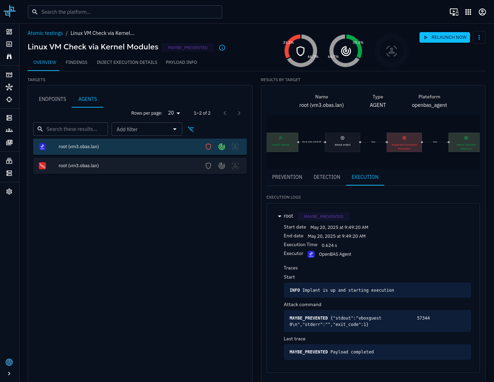
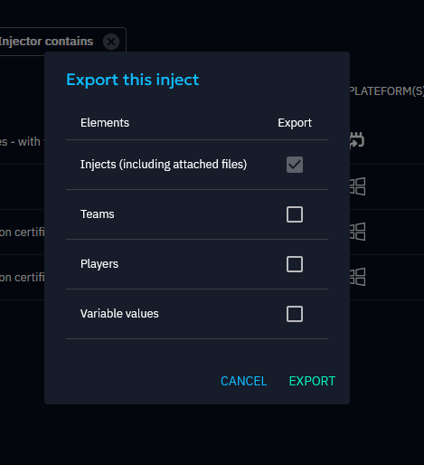
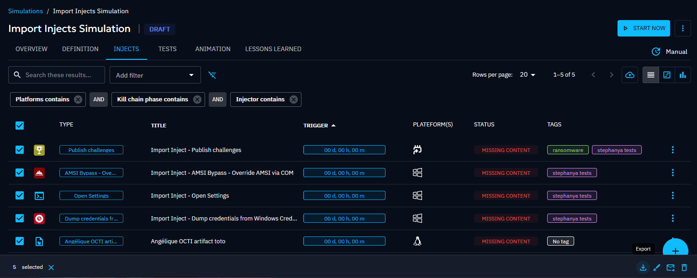
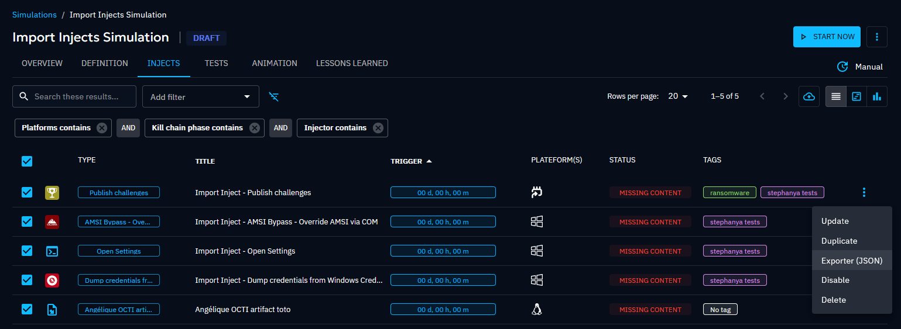
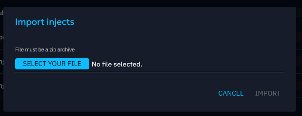
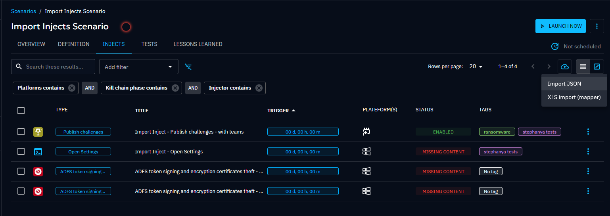

# Injects

Injects are fundamental elements of simulations within OpenBAS, each representing a discrete action to be executed during a Scenario. Managed and facilitated by various [injectors](injectors.md), each inject type serves a distinct purpose, contributing to the comprehensive evaluation of defenses.

## Create a Inject

Whether intended for [Atomic testing](atomic.md) or for a [Simulation](simulation.md), the process for creating injects remains consistent within OpenBAS.

### For Atomic testing

To create an inject for atomic testing, navigate to the "Atomic testing" section located in the left-hand banner. Click on the "+" icon in the bottom right corner to initiate the inject creation process.

### For Scenarios and Simulations

For injects intended for use within simulations, access the desired Scenario or Simulation and navigate to the "Injects" tab. Click on the "+" icon in the bottom right corner of the screen to open the inject creation panel.

Note that an inject defined in a Scenario will be used in all the scenario's subsequent simulations. An Inject defined at the simulation level will not be replicated into the Scenario itself, thus it will not be replicated in future scenario's simulations.

### Inject creation process

Once the inject creation panel is open, you can proceed to configure the inject according to your requirements. Key steps in the creation process include:

#### 1. Choose the type of inject

You first need to select an inject in the list of available ones (on the left of the creation screen). Logos on the left of each line indicates which Injector is associated with each [inject](injects.md). Depending on your integrations, this list can be long.

To facilitate the selection into this possibly very long list, you can search injects by name and filter the list by selecting a precise MITRE ATT&CK techniques for instance.

#### 2. Set inject parameters

When selecting an inject on the left, the form on the right populates itself with a by-default title and propose you to define:

- Descriptive information: Fill in details such as the title, description, and relevant tags to categorize the inject effectively.
- Execution timing: If you are creating your inject in the context of a scenario or simulation, you have to set the timing for when the inject should be executed within the simulation timeline, ensuring it aligns with the overall scenario progression.

By clicking on "Inject content", you can define now or later:

- [Inject targets](targets.md): Specify the targets for the inject, which may include [players and teams](teams_and_players_and_organizations.md) or [assets and assets groups](assets.md) depending on the inject chosen. 
- [Expectations](expectations.md): Define the expected outcomes or responses to the inject, outlining the desired actions or behaviors by players. 
- Attachments: Attach any relevant documents or resources to provide additional context or information related to the inject. 
- Additional fields: Depending on the type of Inject selected, you may have access to additional fields specific to that inject type. These fields may include the subject and body of an email, channel pressure settings for public communications, obfuscation options, and more.

The "available variables" button helps you to use already defined variables into compatible fields.

By following these steps and providing the necessary information, you can create injects tailored to your specific testing or simulation objectives.

## Inject types

There are different types of injector in OpenBAS.

### Manual action reminders

Manual action reminders are injects designed to prompt animation team to perform specific actions manually. It allows to place in the timeline a stimulus to be produced manually, outside the platform (e.g. simulated a call from a journalist on the switchboard telephone). These reminders ensure that critical tasks are completed as part of the simulation, enhancing the accuracy and realism of the exercise.

The inject associated with this type is referred to as `Manual`. To be able to log events not directly related to an email or a sms, you can attach manual expectation to this events (see [Manual Expectations](https://docs.openbas.io/latest/usage/expectations/?h=manual#manual-expectations)). 

#### Example of a manual inject:

- "A crisis cell has been put together"

#### Manual expectations:

- "The team responded to the journalist's inquiry."
- "Analyze the situation and identify the key issues."
- "Anticipate future developments."
- "Determine the necessary actions to take."
- "Coordinate and communicate with both internal and external stakeholders."
- "Provide regular updates on the ongoing situation."

### Direct contact

Injects for direct contact allow sending emails or SMS messages to players. These injects assess the organization's response to communication-based threats, such as phishing attempts, social engineering attacks, or emergency notifications. They can also assess crisis management, including responses to internal information requests or management pressure.

Here's the list of injects linked to this category:

- `Send a SMS`: enables sending SMS messages.
- `Send individual mails`: enables sending emails to individuals separately.
- `Send multi-recipients mail`: enables sending emails to a group of people (each recipient can see the other recipients).

### Media pressure

Injects simulating public communications involve the publication of articles, social media posts, or other fake announcements. These injects replicate scenarios where public disclosure of information or events affects an organization's reputation or operational continuity.

The inject associated with this type is referred to as `Publish channel pressure`.

### Challenges

Challenge injects are set to test participants' skills and response capabilities by publishing challenges. These injects present scenarios or tasks that require active participation and problem-solving, allowing administrators to evaluate players.

The inject associated with this type is referred to as `Publish challenges`.

### HTTP requests

HTTP request injects are used to forge HTTP requests to a third party services in order to perform actions outside the platform (e.g. API call to an EDR). These injects enable the platform to communicate with external services, gather information, or trigger specific actions via HTTP protocols.

HTTP requests GET, POST, and PUT, can be sent. The corresponding injects are named `HTTP Request - \<request type>`.

### Integrations with Agents and CyberRanges

Injects executed on remote systems are facilitated by Injectors like [Caldera](inject-caldera.md) or Airbus CyberRange. These actions simulate real-world attack techniques, allowing administrators to gauge the effectiveness of their security posture in response to various technical actions attackers may take.

There are over 1,700 such injects covering all the TTPs in the MITRE ATT&CK matrix.

## Inject tests
You can test direct contact injects in simulations and scenarios.

!!! warning

    For now, only email and sms inject are concerned by this feature.

### Unit test
You can test injects one at a time.

In the injects list of your simulation/scenario, open the contextual menu of an email or sms inject. Click on "Test". A confirmation dialog appears, you can confirm the test or cancel it.

After launching the test, an alert appears at the top of the page. You can click on the "dedicated page" link. You are redirected to the tests list, a drawer with the execution details of the test opens.

!!! warning

    The option is disabled if your inject doesn't have any teams.

### Bulk test
You can test injects in bulk.

Select the injects you want to test then click on the bug icon. A confirmation dialog appears, you can cancel or confirm the launch of the test.

As mentioned in the dialog, only sms and emails injects will be tested. The emails/sms are sent to the current user. 

After the launch of the test, you are redirected to the tests list page.

### Tests list

A "Tests" tab is available in simulations and scenarios. The list of all the tests done on the injects of the simulation/scenario are displayed. Clicking on one of the lines opens the drawer with the execution details of the tests.

!!! note 

    Only the latest test is displayed for each inject.

### Replay tests
Each test in the list has a menu allowing users to delete or replay the test.

After confirming the replay of the test, the details are updated.

The user can also replay all the tests in the list. An icon similar to the one in the injects toolbar is available at the top of the list. After clicking on it, the user confirms the tests launch and the details are updated.

## Inject status

### Inject status using OBAS agent 

#### Viewing Execution Traces
When you create a technical Inject, you assign it to endpoints, each of which may have one or multiple agents. As the inject executes, agents communicate their progress to the OBAS Server, which logs detailed execution traces.

In the "Execution Details" tab, traces are organized by agent, and agents are grouped by endpoint. This allows you to easily track execution progress at both the agent and endpoint levels.   
Each agent generates multiple traces corresponding to different execution steps, including:  

- Prerequisite checks (validation before execution)
- Prerequisite retrieval (only if the check fails)
- Attack command
- Cleanup commands

!!! warning

    If a prerequisite check succeeds, the prerequisite retrieval step is skipped. However, the UI always marks prerequisite checks as "SUCCESS"—to verify execution results, you must inspect the stderr logs.

**Trace Statuses**

Each execution step reports a status: 

- ✅ SUCCESS – Command executed successfully  
- ⚠️ WARNING – Executed with minor issues  
- ❓MAYBE_PREVENTED – A generic error occurred, possibly due to firewall restrictions  
- 🚫 COMMAND_CANNOT_BE_EXECUTED – Found but couldn't execute (e.g., permission issues)  
- ❌COMMAND_NOT_FOUND – Executor couldn’t find the command  
- 🛑 ERROR – General failure  

All execution logs are stored on the OBAS Server, which later processes them to determine agent and inject statuses.

**Agent Status Computation**

When an agent completes execution, the server retrieves all traces and computes an agent status based on the following rules:  

- All traces SUCCESS → Agent status = INJECT EXECUTED
- All traces ERROR → Agent status = ERROR  
- All traces MAYBE_PREVENTED → Agent status = MAYBE_PREVENTED
- At least one SUCCESS trace → Agent status = PARTIAL
- Otherwise → Agent status = MAYBE_PARTIAL_PREVENTED  

**Inject Status Computation** 

After all agents have completed their execution, the system calculates the Inject status using the same logic applied to compute the agent status.

## Conditional execution of injects

You can add conditions to an inject, ensuring it is triggered at a specific time only if the specified conditions are met. These conditions typically relate to whether an expectation is fulfilled or not, but they can also pertain to the success or failure of an execution. There are several methods to achieve this.

### Using the update form

You can set conditions when updating an inject. In the inject update form, there is a tab "Logical Chains" for that.

As you can see, you can assign a Parent and multiple Children. A Parent indicates that the current inject will only execute if the conditions set on the Parent are met at the time of execution. Similarly, a Child will execute at the specified time only if the conditions set on the current inject are satisfied. 

The conditions you can set include the expectations for the inject and whether its execution was successful or not. You can select the desired expectation and Success/Fail status by clicking on them.

You can also toggle whether all conditions must be met or just one by clicking on the small OR/AND cards. Note that these settings are interconnected, so you cannot assign different values to them

### Using the timeline

You also have the possibility to quickly create conditions between injects. To do that, you can go to the timeline view of injects and place your cursor on the small point on the left and right of each injects. You can then drag and drop a link from a point to another.

The links created in this way will default to an expectation of "Execution is Success" and must be updated using the injects' update form. Additionally, you can reposition links between injects or remove them entirely by dragging them to an empty space.

## Export & Import Injects

The Export & Import functionality allows users to transfer injects between **simulations, scenarios, and atomic testings**. Injects are exported along with their configuration details and can be imported across different instances.
 
### Export Injects
Users can export injects from **simulations, scenarios, or atomic tests**. The exported injects will retain their configuration details, which include:
- **Arguments**
- **Content**
- **Tags**
- **Expectations**

### **Export Rules**
- **Multiple injects** can be exported at once for **scenarios and simulations**.
- **Atomic testing restriction**: Only **one atomic test** can be exported at a time.
- **Teams/Players** can be optionally included in the export.
- **Assets** are **never** exported.
- **Permissions Required**: Read privileges are required on the **Scenario** or **Simulation** to perform an export.

### **Import Injects**
Users can import injects into **simulations, scenarios, or atomic tests**, regardless of the instance from which they were originally exported.

### **Import Rules**
- Injects from any source (atomic testing, scenarios, or simulations) can be imported into any other instance (scenarios, simulations, or atomic testing).
- **Permissions Required**: Write privileges are required on the **destination object** (Scenario or Simulation) to perform an import.

This feature enables seamless sharing of injects across different environments, ensuring flexibility and efficiency in exercises.

