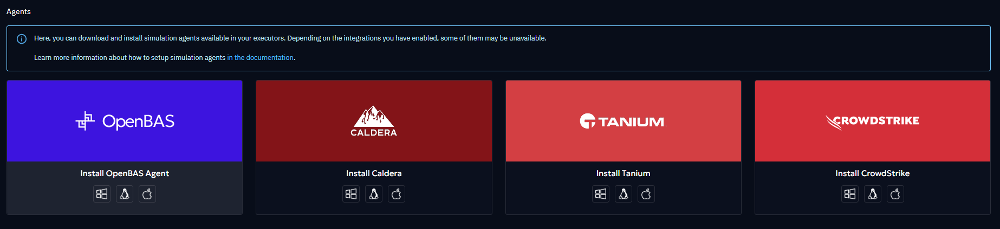
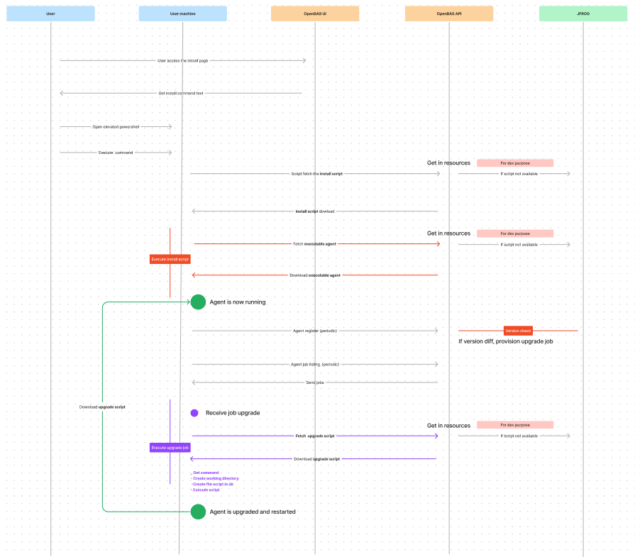
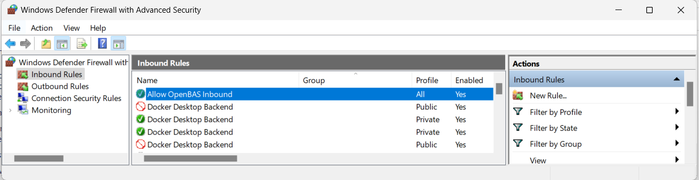
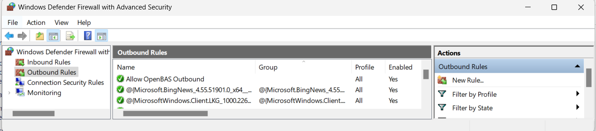

# OpenAEV Agent

## Introduction

The OpenAEV Agent is an application whose primary role is to enroll an Asset on the OpenAEV platform, retrieve jobs or
scripts to be executed, and transmit this information to Implants (subject to come) for execution on the host Asset.

The Agent does **not perform direct actions** on the Asset itself, in order to remain neutral with respect to antivirus
solutions and ensure the full execution of simulations.

The OpenAEV Agent is compatible with multiple operating systems (Windows, Linux, macOS) and is developed in **Rust**.

---

## Installation

Depending on the operating system, several installation modes are available.
You can access them from OpenAEV by clicking the blue icon in the top-right corner:

!!! note

    Since release **1.14**, multiple OpenAEV Agents can be installed on the same machine in order to test different execution contexts and privilege levels.
    
    Examples:

    - Install two agents using the **standard installation** with different privileges (standard user vs administrator).
    - If an agent was previously installed using the **advanced system installation** (pre-1.14 behavior), a standard installation can be added to compare behaviors such as filesystem access, environment variables, and privileges.
    
    **See the OS-specific sections below for details.**

!!! warning

    Antivirus exclusions described in this documentation are **mandatory** for OpenAEV to function correctly.
    
    Exclusions must apply **only** to the `runtimes` subfolder.  
    Payloads are intentionally stored elsewhere so that detection and blocking remain possible when relevant.

---

### Quick Compatibility Check

Before installing the OpenAEV Agent, ensure that **all** the following conditions are met:

* Supported CPU architecture: **x64 or ARM64 only**

* Supported service manager:

    * Windows: **Service Control Manager**
    * Linux: **systemd**
    * macOS: **launchd**

* Security requirements:
    * **TLS 1.2 or higher**
    * Administrative privileges (Administrator / root / sudo)

* Network access:
    * Outbound connectivity to the OpenAEV instance

If any of these requirements are not met, installation **will fail or behave unpredictably**.

#### Best Effort Support

“Best effort” support means that the OpenAEV Agent **may work**, but:

* the environment is not officially validated,
* stability and long-term support are not guaranteed,
* additional configuration may be required,
* environment-specific issues may not be prioritized.

### Windows

#### Operating system & architecture

| Architecture  | Support level     |
|---------------|-------------------|
| **x64**       | ✅ Supported       |
| **ARM64**     | ✅ Supported       |
| x86 (32-bit)  | ❌ Not supported   |
| ARM32         | ❌ Not supported   |

| Operating system              | Support level        | Notes               |
|-------------------------------|----------------------|---------------------|
| **Windows 10**                | ✅ Supported          |                     |
| **Windows 11**                | ✅ Supported          |                     |
| **Windows Server 2019**       | ✅ Supported          |                     |
| **Windows Server 2022**       | ✅ Supported          |                     |
| Windows 8 / 8.1               | ⚠️ Best effort       | No guaranteed fixes |
| Windows Server 2016           | ⚠️ Best effort       | No guaranteed fixes |
| Windows Server 2012 R2        | ⚠️ Best effort       | No guaranteed fixes |
| Windows 7 and earlier         | ❌ Not supported      |                     |
| Windows Server 2008 / 2008 R2 | ❌ Not supported      |                     |

#### Runtime & tooling

!!! note

    If the installation fails, try using PowerShell 7 or higher.

* TLS 1.2 or higher must be available
* The system `Path` environment variable must include: `%SYSTEMROOT%\System32\` and `%SYSTEMROOT%\System32\WindowsPowerShell\v1.0\`

#### Privileges & security

* Installation and execution require **local administrator privileges**
* For **Advanced installation as User (service)**:

    * The target user must have the **“Log on as a service”** policy enabled
    * See:
      [https://learn.microsoft.com/en-us/system-center/scsm/enable-service-log-on-sm](https://learn.microsoft.com/en-us/system-center/scsm/enable-service-log-on-sm)

#### Antivirus

* Antivirus exclusions are mandatory and must apply **only** to the `runtimes` directory

!!! note

    Microsoft Defender (Windows)
    Since late January 2026, Microsoft Defender may detect the OpenAEV Agent binary itself using static signatures.
    In this case, excluding only the `runtimes` folder may not be sufficient.
    If issues occur (agent blocked, quarantined, or alerts), additional Defender exclusions such as the full agent folder
    or the agent process may be required.

#### Installation Mode

*[UserSanitized] in the table below means username without special character like "\", "/",...*

| Installation mode                             | Installation                                                                                                                                                                                                                 | Installation type                                                                                                                   | Execution agent and payload                                                                                    | Verification/Start/Stop agent                                                                                                                                                                                                                                                | Folder path                                                                                                                    | AV exclusions                                                                                                                                    | Uninstallation                                                                                       |
|:----------------------------------------------|:-----------------------------------------------------------------------------------------------------------------------------------------------------------------------------------------------------------------------------|:------------------------------------------------------------------------------------------------------------------------------------|:---------------------------------------------------------------------------------------------------------------|:-----------------------------------------------------------------------------------------------------------------------------------------------------------------------------------------------------------------------------------------------------------------------------|:-------------------------------------------------------------------------------------------------------------------------------|:-------------------------------------------------------------------------------------------------------------------------------------------------|:-----------------------------------------------------------------------------------------------------|
| **Standard installation (session)**           | Asset with GUI and terminal with standard privileges or admin privileges for the logged-in user                                                                                                                              | User session (standard privileges): start up app `WriteRegStr` OR User session (admin privileges): start up task `schtasks` | Background, only when user is logged in, with the user privilege from the powershell elevation and environment | `Get-Process openaev-agent \| Where-Object { $_.Path -eq "[FOLDER_PATH]\openaev-agent.exe" }` `Get-Process openaev-agent \| Where-Object { $_.Path -eq "[FOLDER_PATH]\openaev-agent.exe" } \| Stop-Process -Force` `Start-Process "[FOLDER_PATH]\openaev-agent.exe"` | `$HOME\.openaev\OAEVAgent-Session-[UserSanitized]` OR `$HOME\.openaev\OAEVAgent-Session-Administrator-[UserSanitized]` | `$HOME\.openaev\OAEVAgent-Session-[UserSanitized]\runtimes` OR `$HOME\.openaev\OAEVAgent-Session-Administrator-[UserSanitized]\runtimes` | Stop the agent in background and "uninstall.exe" from the path folder                                |
| **Advanced installation as User (service)**   | Enable the "Service Logon" policy (see above) Terminal with admin privileges, replace params [USER] and [PASSWORD] in the bash snippet and in the following commands by the username with domain and password wanted | Service: `sc` (with user and password in service conf)                                                                              | Background, as soon as the machine powers on, with the user privilege and environment                          | `Get-Service -Name "OAEVAgent-Service-[UserSanitized]"` `Start-Service -Name "OAEVAgent-Service-[UserSanitized]"` `Stop-Service -Name "OAEVAgent-Service-[UserSanitized]"`                                                                                           | `$HOME\.openaev\OAEVAgent-Service-[UserSanitized]`                                                                             | `$HOME\.openaev\OAEVAgent-Service-[UserSanitized]\runtimes`                                                                                      | "uninstall.exe" from the path folder Disable the "Service Logon" policy for the user (see above) |                             
| **Advanced installation as System (service)** | Terminal with admin privileges for the authority system user                                                                                                                                                                 | Service: `sc`                                                                                                                       | Background, as soon as the machine powers on, with the root privilege and environment                          | `Get-Service -Name "OAEVAgentService"` `Start-Service -Name "OAEVAgentService"` `Stop-Service -Name "OAEVAgentService"`                                                                                                                                              | `C:\Program Files (x86)\Filigran\OAEV Agent`                                                                                   | `C:\Program Files (x86)\Filigran\OAEV Agent\runtimes`                                                                                            | "uninstall.exe" from the path folder                                                                 |

### Linux

#### Operating system & architecture

| Architecture            | Support level      | Notes   |
|-------------------------|--------------------|---------|
| **x86_64**              | ✅ Supported        |         |
| **ARM64**               | ✅ Supported        |         |
| 32-bit architectures    | ❌ Not supported    |         |
| Other CPU architectures | ❌ Not supported    |         |

| Distribution type                                      | Support level     | Notes                       |
|--------------------------------------------------------|-------------------|-----------------------------|
| **systemd-based distributions** (Debian, Ubuntu, etc.) | ✅ Supported       | systemd required            |
| Non-systemd distributions                              | ❌ Not supported   | Installer relies on systemd |

#### Runtime & tooling

* **systemd must be installed and running**
* **curl** must be available
* TLS support must be enabled

#### Privileges & security

* Installation and execution require **root or sudo privileges**
* User-based services require permission to manage `systemctl --user`

| Installation mode                             | Installation                                                                                                                                            | Installation type                                          | Execution agent and payload                                                           | Verification/Start/Stop agent                                                                                                                        | Folder path                                 | AV exclusions                                        | Uninstallation                                                                                                                                                                                                             |
|:----------------------------------------------|:--------------------------------------------------------------------------------------------------------------------------------------------------------|:-----------------------------------------------------------|:--------------------------------------------------------------------------------------|:-----------------------------------------------------------------------------------------------------------------------------------------------------|:--------------------------------------------|:-----------------------------------------------------|:---------------------------------------------------------------------------------------------------------------------------------------------------------------------------------------------------------------------------|
| **Standard installation (session)**           | Asset with GUI and terminal with standard privileges for the logged-in user                                                                             | User service: `systemctl --user`                           | Background, only when user is logged in, with the user privilege and environment      | `systemctl --user enable openaev-agent-session` `systemctl --user start openaev-agent-session` `systemctl --user stop openaev-agent-session` | `$HOME/.local/openaev-agent-session`        | `$HOME/.local/openaev-agent-session/runtimes `       | `systemctl --user stop openaev-agent-session & systemctl --user disable openaev-agent-session & systemctl --user daemon-reload & systemctl --user reset-failed & rm -rf $HOME/.local/openaev-agent-session`                |
| **Advanced installation as User (service)**   | Terminal with sudo privileges, replace params [USER] and [GROUP] in the bash snippet and in the following commands by the username and group wanted | Service: `systemctl` (with user and group in service conf) | Background, as soon as the machine powers on, with the user privilege and environment | `systemctl enable [USER]-openaev-agent` `systemctl start [USER]-openaev-agent` `systemctl stop [USER]-openaev-agent`                         | `$HOME/.local/openaev-agent-service-[USER]` | `$HOME/.local/openaev-agent-service-[USER]/runtimes` | `sudo systemctl stop [USER]-openaev-agent & sudo systemctl disable [USER]-openaev-agent & sudo systemctl daemon-reload & sudo systemctl reset-failed & sudo rm -rf $HOME/.local/openaev-agent-service-[USER]`              |                             
| **Advanced installation as System (service)** | Terminal with sudo privileges                                                                                                                           | Service: `systemctl`                                       | Background, as soon as the machine powers on, with the root privilege and environment | `systemctl enable openaev-agent` `systemctl start openaev-agent` `systemctl stop openaev-agent`                                              | `/opt/openaev-agent`                        | `/opt/openaev-agent/runtimes`                        | `sudo systemctl stop openaev-agent & sudo systemctl disable openaev-agent & sudo systemctl daemon-reload & sudo systemctl reset-failed & sudo rm -rf /opt/openaev-agent`                                                   |

!!! note

    To allow command payload execution without sudo password prompts, see:  
    [this tutorial](https://gcore.com/learning/how-to-disable-password-for-sudo-command/)

### macOS

#### Operating system & architecture

| Architecture              | Support level   | Notes           |
|---------------------------|-----------------|-----------------|
| **ARM64 (Apple Silicon)** | ✅ Supported     |                 |
| **x86_64 (Intel)**        | ⚠️ Best effort  | Limited testing |
| 32-bit architectures      | ❌ Not supported |                 |
| Other CPU architectures   | ❌ Not supported |                 |

| macOS version                                  | Support level    | Notes            |
|------------------------------------------------|------------------|------------------|
| **launchd-based macOS (10.4 Tiger and later)** | ✅ Supported      | launchd required |
| macOS Sonoma (14)                              | ⚠️ Best effort   | Latest version   |

#### Runtime & tooling

* **launchd must be available and running**
* **curl** must be available
* TLS support must be enabled
* The system must allow:

    * Execution of downloaded binaries
    * Write and execute permissions in the installation directory

#### Privileges & security

* Installation and execution require **administrator privileges**

| Installation mode                             | Installation                                                                                                                                            | Installation type                                                          | Execution agent and payload                                                           | Verification/Start/Stop agent                                                                                                                                                                                                               | Folder path                                 | AV exclusions                                          | Uninstallation                                                                                       |
|:----------------------------------------------|:--------------------------------------------------------------------------------------------------------------------------------------------------------|:---------------------------------------------------------------------------|:--------------------------------------------------------------------------------------|:--------------------------------------------------------------------------------------------------------------------------------------------------------------------------------------------------------------------------------------------|:--------------------------------------------|:-------------------------------------------------------|:-----------------------------------------------------------------------------------------------------|
| **Standard installation (session)**           | Asset with GUI and terminal with standard privileges for the logged-in user                                                                             | User service: `launchctl user`                                             | Background, only when user is logged in, with the user privilege and environment      | `launchctl enable gui/$(id -u)/openaev-agent-session` `launchctl bootstrap gui/$(id -u) ~/Library/LaunchAgents/openaev-agent-session.plist` `launchctl bootout gui/$(id -u) ~/Library/LaunchAgents/openaev-agent-session.plist`     | `$HOME/.local/openaev-agent-session`        | `$HOME/.local/openaev-agent-session/runtimes`          | `launchctl remove openaev-agent-session & rm -rf $HOME/.local/openaev-agent-session`                 |
| **Advanced installation as User (service)**   | Terminal with sudo privileges, replace params [USER] and [GROUP] in the bash snippet and in the following commands by the username and group wanted | Service: `launchctl user` (as agent, with user and group in service plist) | Background, as soon as the machine powers on, with the user privilege and environment | `launchctl enable gui/[USER-ID]/[USER]-openaev-agent` `launchctl bootstrap gui/[USER-ID] /Library/LaunchAgents/[USER]-openaev-agent.plist` `launchctl bootout gui/[USER-ID] ~/Library/LaunchAgents/[USER]-openaev-agent.plist`      | `$HOME/.local/openaev-agent-service-[USER]` | `$HOME/.local/openaev-agent-service-[USER]/runtimes`   | `sudo launchctl remove [USER]-openaev-agent & sudo rm -rf $HOME/.local/openaev-agent-service-[USER]` |                             
| **Advanced installation as System (service)** | Terminal with sudo privileges                                                                                                                           | Service: `launchctl system`                                                | Background, as soon as the machine powers on, with the root privilege and environment | `launchctl enable system/openaev.agent` `launchctl bootstrap system /Library/LaunchDaemons/openaev-agent.plist` `launchctl bootout system/ ~/Library/LaunchDaemons/openaev-agent.plist`                                             | `/opt/openaev-agent`                        | `/opt/openaev-agent/runtimes`                          | `sudo launchctl remove openaev-agent & sudo rm -rf /opt/openaev-agent`                               |

!!! note

    To allow command payload execution without sudo password prompts, see:  
    [this tutorial](https://gcore.com/learning/how-to-disable-password-for-sudo-command/)

---

## Agent Installation Flow

---

## Network Traffic

The installation creates two firewall rules:

**Inbound rule**

**Outbound rule**

---

## Features

The main features of the OpenAEV Agent include:

* Agent registration on the OpenAEV platform
* Automatic agent upgrade (on startup and registration)
* Periodic job retrieval (every 30 seconds)
* Implant lifecycle management
* Execution cleanup and directory pruning
* Health checks (heartbeat every 2 minutes)

---

## Troubleshooting

Logs are available at the following locations (see installation tables for paths):

* Linux → `[FOLDER_PATH]/openaev-agent.log`
* macOS → `[FOLDER_PATH]/openaev-agent.log`
* Windows → `[FOLDER_PATH]\openaev-agent.log`

When an implant is deployed, a new directory is created under `runtimes`, named after the inject ID.
This directory contains:

* The implant executable
* Execution-specific logs