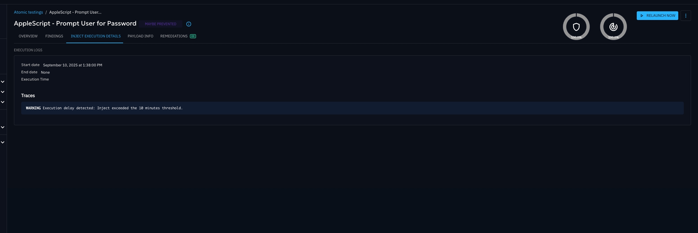

# OpenAEV Agent

## Introduction

The OpenAEV Agent is an application whose main role is to enroll an Asset on the OpenAEV platform,
to retrieve jobs or scripts to be executed and to transmit this information to Implants (subject to come)
for execution on the host Asset.

The Agent will not perform direct actions on the Asset to remain neutral for antivirus and ensure the full run of the simulation.

The OpenAEV Agent is compatible with different OS (Windows, Linux, macOS) and is developed in Rust.

## Installation

Depending on the OS, several installations are at your disposal, you can find them on OpenAEV by clicking the blue icon on the right top corner :

!!! note

    Since the release 1.14, several OpenAEV agents can be installed on a machine to try different configurations on Payload executions: 
    - Example 1: with the standard installation, you can install two agents on your machine with different privileges (one standard and one administrator). 
    - Example 2: with the advanced installation as system (installation before release 1.14), you have installed an agent with system user and privileges. It could be interesting to install an agent from the standard installation to compare the behavior like folders accesses, environment variables, privileges,...  
    **For more details, see the explanations below for each OS and each installation.** 

!!! warning

    The following documented antivirus exclusions are mandatory for OpenAEV to work properly. Please note that the AV exclusions are always only on the `runtimes` subfolder, which is important to ensure `payloads` (which land in another directory) will be detected / blocked if this is relevant.

### Windows

- Requirements:
  - Ensure access to the OpenAEV instance being used;
  - Ensure that the system environment variable "Path" contains the values "%SYSTEMROOT%\System32\" and "%SYSTEMROOT%\System32\WindowsPowerShell\v1.0\";
  - For "Advanced installation as User (service)", you need to enable the "Service Logon" policy for the user you want to run the service as, follow [this tutorial](https://learn.microsoft.com/en-us/system-center/scsm/enable-service-log-on-sm?view=sc-sm-2025) to do it;
- Compatibility → All major Windows versions

*[UserSanitized] in the table below means username without special character like "\", "/",...*

| Installation mode                             | Installation                                                                                                                                                                                                                 | Installation type                                                                                                                   | Execution agent and payload                                                                                    | Verification/Start/Stop agent                                                                                                                                                                                                                                                | Folder path                                                                                                                    | AV exclusions                                                                                                                                    | Uninstallation                                                                                       |
|:----------------------------------------------|:-----------------------------------------------------------------------------------------------------------------------------------------------------------------------------------------------------------------------------|:------------------------------------------------------------------------------------------------------------------------------------|:---------------------------------------------------------------------------------------------------------------|:-----------------------------------------------------------------------------------------------------------------------------------------------------------------------------------------------------------------------------------------------------------------------------|:-------------------------------------------------------------------------------------------------------------------------------|:-------------------------------------------------------------------------------------------------------------------------------------------------|:-----------------------------------------------------------------------------------------------------|
| **Standard installation (session)**           | Asset with GUI and terminal with standard privileges or admin privileges for the logged-in user                                                                                                                              | User session (standard privileges): start up app `WriteRegStr` OR User session (admin privileges): start up task `schtasks` | Background, only when user is logged in, with the user privilege from the powershell elevation and environment | `Get-Process openaev-agent \| Where-Object { $_.Path -eq "[FOLDER_PATH]\openaev-agent.exe" }` `Get-Process openaev-agent \| Where-Object { $_.Path -eq "[FOLDER_PATH]\openaev-agent.exe" } \| Stop-Process -Force` `Start-Process "[FOLDER_PATH]\openaev-agent.exe"` | `$HOME\.openaev\OAEVAgent-Session-[UserSanitized]` OR `$HOME\.openaev\OAEVAgent-Session-Administrator-[UserSanitized]` | `$HOME\.openaev\OAEVAgent-Session-[UserSanitized]\runtimes` OR `$HOME\.openaev\OAEVAgent-Session-Administrator-[UserSanitized]\runtimes` | Stop the agent in background and "uninstall.exe" from the path folder                                |
| **Advanced installation as User (service)**   | Enable the "Service Logon" policy (see above) Terminal with admin privileges, replace params [USER] and [PASSWORD] in the bash snippet and in the following commands by the username with domain and password wanted | Service: `sc` (with user and password in service conf)                                                                              | Background, as soon as the machine powers on, with the user privilege and environment                          | `Get-Service -Name "OAEVAgent-Service-[UserSanitized]"` `Start-Service -Name "OAEVAgent-Service-[UserSanitized]"` `Stop-Service -Name "OAEVAgent-Service-[UserSanitized]"`                                                                                           | `$HOME\.openaev\OAEVAgent-Service-[UserSanitized]`                                                                             | `$HOME\.openaev\OAEVAgent-Service-[UserSanitized]\runtimes`                                                                                      | "uninstall.exe" from the path folder Disable the "Service Logon" policy for the user (see above) |                             
| **Advanced installation as System (service)** | Terminal with admin privileges for the authority system user                                                                                                                                                                 | Service: `sc`                                                                                                                       | Background, as soon as the machine powers on, with the root privilege and environment                          | `Get-Service -Name "OAEVAgentService"` `Start-Service -Name "OAEVAgentService"` `Stop-Service -Name "OAEVAgentService"`                                                                                                                                              | `C:\Program Files (x86)\Filigran\OAEV Agent`                                                                                   | `C:\Program Files (x86)\Filigran\OAEV Agent\runtimes`                                                                                            | "uninstall.exe" from the path folder                                                                 |

!!! note

    If the installation fails, try using PowerShell 7 or higher.

### Linux

- Requirements :
    - systemd
    - curl
    - access to the OpenAEV instance used
- Compatibility → All systemd based linux distros

| Installation mode                             | Installation                                                                                                                                            | Installation type                                          | Execution agent and payload                                                           | Verification/Start/Stop agent                                                                                                                        | Folder path                                 | AV exclusions                                        | Uninstallation                                                                                                                                                                                                             |
|:----------------------------------------------|:--------------------------------------------------------------------------------------------------------------------------------------------------------|:-----------------------------------------------------------|:--------------------------------------------------------------------------------------|:-----------------------------------------------------------------------------------------------------------------------------------------------------|:--------------------------------------------|:-----------------------------------------------------|:---------------------------------------------------------------------------------------------------------------------------------------------------------------------------------------------------------------------------|
| **Standard installation (session)**           | Asset with GUI and terminal with standard privileges for the logged-in user                                                                             | User service: `systemctl --user`                           | Background, only when user is logged in, with the user privilege and environment      | `systemctl --user enable openaev-agent-session` `systemctl --user start openaev-agent-session` `systemctl --user stop openaev-agent-session` | `$HOME/.local/openaev-agent-session`        | `$HOME/.local/openaev-agent-session/runtimes `       | `systemctl --user stop openaev-agent-session & systemctl --user disable openaev-agent-session & systemctl --user daemon-reload & systemctl --user reset-failed & rm -rf $HOME/.local/openaev-agent-session`                |
| **Advanced installation as User (service)**   | Terminal with sudo privileges, replace params [USER] and [GROUP] in the bash snippet and in the following commands by the username and group wanted | Service: `systemctl` (with user and group in service conf) | Background, as soon as the machine powers on, with the user privilege and environment | `systemctl enable [USER]-openaev-agent` `systemctl start [USER]-openaev-agent` `systemctl stop [USER]-openaev-agent`                         | `$HOME/.local/openaev-agent-service-[USER]` | `$HOME/.local/openaev-agent-service-[USER]/runtimes` | `sudo systemctl stop [USER]-openaev-agent & sudo systemctl disable [USER]-openaev-agent & sudo systemctl daemon-reload & sudo systemctl reset-failed & sudo rm -rf $HOME/.local/openaev-agent-service-[USER]`              |                             
| **Advanced installation as System (service)** | Terminal with sudo privileges                                                                                                                           | Service: `systemctl`                                       | Background, as soon as the machine powers on, with the root privilege and environment | `systemctl enable openaev-agent` `systemctl start openaev-agent` `systemctl stop openaev-agent`                                              | `/opt/openaev-agent`                        | `/opt/openaev-agent/runtimes`                        | `sudo systemctl stop openaev-agent & sudo systemctl disable openaev-agent & sudo systemctl daemon-reload & sudo systemctl reset-failed & sudo rm -rf /opt/openaev-agent`                                                   |

!!! note

    If you want to allow your agent to launch commands payloads for a user without filling the sudo password, follow [this tutorial](https://gcore.com/learning/how-to-disable-password-for-sudo-command/)

### MacOS
  - Requirements :
    - launchd
    - curl
    - access to the OpenAEV instance used
  - Compatibility → All launchd based MacOS distros (10.4 Tiger or higher)

| Installation mode                             | Installation                                                                                                                                            | Installation type                                                          | Execution agent and payload                                                           | Verification/Start/Stop agent                                                                                                                                                                                                               | Folder path                                 | AV exclusions                                          | Uninstallation                                                                                       |
|:----------------------------------------------|:--------------------------------------------------------------------------------------------------------------------------------------------------------|:---------------------------------------------------------------------------|:--------------------------------------------------------------------------------------|:--------------------------------------------------------------------------------------------------------------------------------------------------------------------------------------------------------------------------------------------|:--------------------------------------------|:-------------------------------------------------------|:-----------------------------------------------------------------------------------------------------|
| **Standard installation (session)**           | Asset with GUI and terminal with standard privileges for the logged-in user                                                                             | User service: `launchctl user`                                             | Background, only when user is logged in, with the user privilege and environment      | `launchctl enable gui/$(id -u)/openaev-agent-session` `launchctl bootstrap gui/$(id -u) ~/Library/LaunchAgents/openaev-agent-session.plist` `launchctl bootout gui/$(id -u) ~/Library/LaunchAgents/openaev-agent-session.plist`     | `$HOME/.local/openaev-agent-session`        | `$HOME/.local/openaev-agent-session/runtimes`          | `launchctl remove openaev-agent-session & rm -rf $HOME/.local/openaev-agent-session`                 |
| **Advanced installation as User (service)**   | Terminal with sudo privileges, replace params [USER] and [GROUP] in the bash snippet and in the following commands by the username and group wanted | Service: `launchctl user` (as agent, with user and group in service plist) | Background, as soon as the machine powers on, with the user privilege and environment | `launchctl enable gui/[USER-ID]/[USER]-openaev-agent` `launchctl bootstrap gui/[USER-ID] /Library/LaunchAgents/[USER]-openaev-agent.plist` `launchctl bootout gui/[USER-ID] ~/Library/LaunchAgents/[USER]-openaev-agent.plist`      | `$HOME/.local/openaev-agent-service-[USER]` | `$HOME/.local/openaev-agent-service-[USER]/runtimes`   | `sudo launchctl remove [USER]-openaev-agent & sudo rm -rf $HOME/.local/openaev-agent-service-[USER]` |                             
| **Advanced installation as System (service)** | Terminal with sudo privileges                                                                                                                           | Service: `launchctl system`                                                | Background, as soon as the machine powers on, with the root privilege and environment | `launchctl enable system/openaev.agent` `launchctl bootstrap system /Library/LaunchDaemons/openaev-agent.plist` `launchctl bootout system/ ~/Library/LaunchDaemons/openaev-agent.plist`                                             | `/opt/openaev-agent`                        | `/opt/openaev-agent/runtimes`                          | `sudo launchctl remove openaev-agent & sudo rm -rf /opt/openaev-agent`                               |

!!! note

    If you want to allow your agent to launch commands payloads for a user without filling the sudo password, follow [this tutorial](https://gcore.com/learning/how-to-disable-password-for-sudo-command/)

The following flow diagram represents the Agent installation flow :

## Network Traffic

The installation creates two firewall rules.

Inbound rule

Outbound rule

## Features

The main features of the OpenAEV Agent are:

- Agent registration on the OpenAEV platform

  The Agent is installed on the Asset using an agent-installer.exe file and runs as a service.
  It communicates with the deployed OpenAEV instance in order to enroll the Asset. In some cases
  like unsecured certificates or environment with proxy, the agent can't communicate with OpenAEV.
  In order to fix those issues, look at "Network and security" chapter from [configuration](https://docs.openaev.io/latest/deployment/configuration)
  to add the required attributes.

  NB : An Asset can only have one OpenAEV agent installed thanks to a machine id calculated according
  to the operating system and its parameters. If you try to install again an OpenAEV agent on a platform, it will
  overwrite the actual one and you will always see one endpoint on the OpenAEV endpoint page.

- Auto upgrade the Agent (on start-up and registration)

- Retrieval of jobs to be executed

  The Agent retrieves jobs to be executed from the OpenAEV instance every 30 seconds.
  For the moment, jobs are Implant to spawn and launch on the Asset, waiting to execute payloads of your Simulation's Injects.
  Each job execution logs is kept in a dedicated directory in order to have a trace of what happened (pid, executable).

- Deleting executables and execution directories

  The Agent deletes Implants that have been running for a predefined time and cleans the execution directories.

- Health check

  The Agent pings the OpenAEV instance every 2 minutes to notify it of its healthy status.

- Cleanup

  The Agent ensures that the processes it has executed are correctly finished or deleted if necessary. 
  The maximum time in minutes that a process associated with an execution directory can remain active is 20 minutes.

  The Agent removes execution directories to avoid excessive disk space. 
  The maximum time in minutes that an execution directory can be kept before being deleted is 2 days.

## Troubleshooting

If you experience issues with your agent, the logs are available here (see the "Installation" section above to get the folder path) :

- Linux -> [FOLDER_PATH]/openaev-agent.log
- MacOS -> [FOLDER_PATH]/openaev-agent.log
- Windows -> [FOLDER_PATH]\openaev-agent.log

If you see an error related to an inject not being executed, verify whether it was properly run by the agent.

When the agent deploys an implant to execute your attack:
A new folder is created under the runtimes directory, named after the inject ID.

Inside this folder, you will find:

- The implant executable (.exe on Windows, corresponding binary on Linux/macOS).
- Additional logs specific to that execution.
