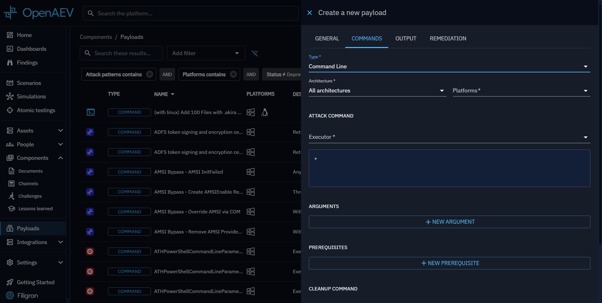
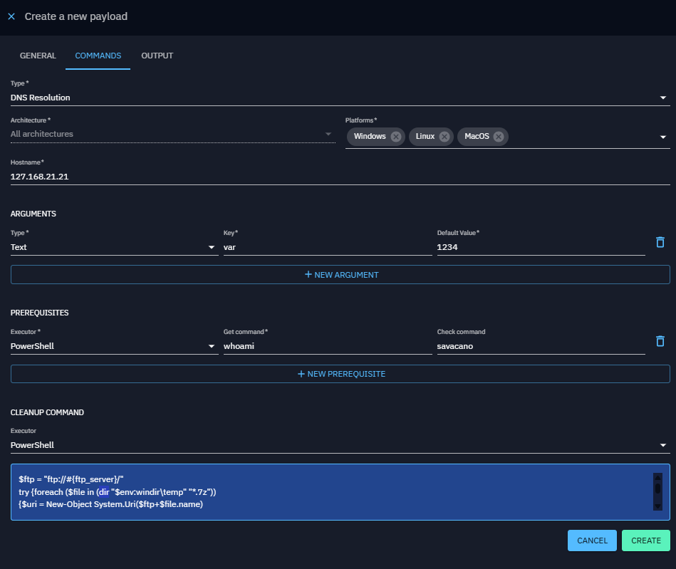
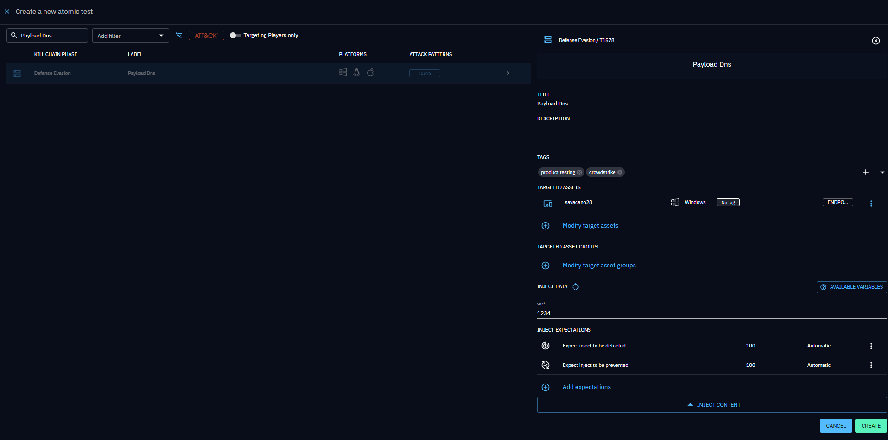

# Payloads

In OpenBAS, you can create custom payloads based on different types to create new injects.

Payloads enhance the platform, allowing you to further customize your scenarios.

## Create a Payload

To create a new payload, follow these steps:

1. Click the "+" button in the bottom right corner of the screen.

2. In the General Information tab, fill in the required details about the payload.

3. In the tab 2 **Commands** :

   3.1 Choose a payload type based on your needs:
  
      * Command Line: Executes a command using an executor (e.g., PowerShell, Bash, etc.).
      * Executable: Runs an executable file on an asset.
      * File Drop: Drops a file onto an asset.
      * DNS Resolution: Resolves a hostname into IP addresses.

   3.2 Provide additional execution details, such as arguments and prerequisites.

   3.3 Specify a cleanup executor and cleanup command to remove any remnants from execution on the asset.

4. In the tab 3 **Output Parsers** (optional) :

   4.1 Add [Output Parsers](#output-parsers) to process the output of your execution.

   4.2 Specify whether to generate [Findings](../findings.md) from the output.

!!! info "Payload Execution"

    Your payload can still be used even if no output parser is defined.

Once completed, your new payload will appear in the payload list.

### General Payload properties

| Property        | Description                     |
|-----------------|---------------------------------|
| Name            | Payload name                    |
| Description     | Payload description             |
| Attack patterns | Command-related attack patterns |
| Tags            | Tags                            |

#### Prerequisites in depth

| Property         | Description                                                         |
|------------------|---------------------------------------------------------------------|
| Platforms        | Compatible platforms (ex. Windows, Linux, MacOS)                    | 
| Arguments        | Arguments for the cleanup, prerequisites and potential command line |                                                                                                                                                                                                                                         |
| Prerequisites    | Prerequisites required to execute the command                       |                                                                                                                                                                                                                      |
| Cleanup executor | Executor for cleaning commands                                      |                                     |
| Cleanup command  | Cleanup command to remove or reset changes made                     |                    

### Additional Payload properties by type

#### Command Line

This payload type executes commands directly on the command line interface (CLI) of the target system
(e.g., Windows Command Prompt, PowerShell, Linux Shell).

Command Line payloads are used for remote command execution to simulate common attacker actions like privilege
escalation or data exfiltration.

| Property         | Description                                                                          |
|------------------|--------------------------------------------------------------------------------------|
| Architecture     | Architecture in which the command can be executed (x86_64, arm64, all architectures) |
| Command executor | Executor for command to execute                                                      |
| Command          | Command to execute                                                                   |

#### Executable

An Executable payload involves delivering a binary file (such as .exe on Windows or ELF on Linux) that the system runs
as an independent process.

Executables can perform a variety of functions, from establishing a backdoor to running complex scripts (mimic malware).

| Property        | Description                                                           |
|-----------------|-----------------------------------------------------------------------|
| Architecture    | Architecture in which the command can be executed (ex. x86_64, arm64) |
| Executable file | File to execute                                                       |

#### File Drop

File Drop payloads are designed to deliver files (e.g., scripts, documents, binaries) to the target system without
immediately executing them.

The goal is typically to simulate scenarios where attackers place files in specific locations for later use, either
manually or by another process.

| Property     | Description  |
|--------------|--------------|
| File to drop | File to drop |

#### DNS Resolution

DNS resolution payloads attempts to resolve hostnames to associated IP address(es).

The goal of DNS resolution is to test if specific hostnames resolve to IP addresses correctly, helping assess network
accessibility, detect issues, and simulate potential attacker behavior.

| Property  | Description              |
|-----------|--------------------------|
| Hostnames | Hostname list to resolve |

### Output Parsers

Output Parser are an option who allow trait the raw output from execution.

Here you could define rules that will let you extract data from the raw output and
linked to variables which can be used for other
injects [chaining injects](../injects.md/#conditional-execution-of-injects).

Currently, just the output mode **StdOut** and Parsing with **REGEX** are available to apply the Output Parsers.

In the case of this rule is compatible with a finding you have to check the option: Show in findings and your could find
the Fiindings in the Finding tab of Atomic Testing Detail View.

When you add a rule, you have to add details like:

| Property     | Description                                                                                                                                                                                                                                                                                                                                                                                                                 | Mandatory |
|--------------|-----------------------------------------------------------------------------------------------------------------------------------------------------------------------------------------------------------------------------------------------------------------------------------------------------------------------------------------------------------------------------------------------------------------------------|-----------|
| Name         | Name                                                                                                                                                                                                                                                                                                                                                                                                                        | Yes       |
| Key          | Key                                                                                                                                                                                                                                                                                                                                                                                                                         | Yes       |
| Type         | Type correspondent to data extracted, ex: Text, Number, Port, IPv4, IPv6, Port scan or Credentials.                                                                                                                                                                                                                                                                                                                         | Yes       |
| Tags         | Tags                                                                                                                                                                                                                                                                                                                                                                                                                        | No        |
| Regex        | Regex expression to extract data from raw output. This expression support groups, start of ligne ^                                                                                                                                                                                                                                                                                                                          | Yes       |
| Output Value | Depending of the type you will have a X number of sections to fill with the position of the group regex. 
For exemple, In the case of Port Scan, you will have: assetId, host, port, service, For credential, you will have: username and password, 
and for the rest is just one field.
Here is mandatory start the index of the group with $ in order to separate if this property could be found it in differents groups. | Yes |

### Payload execution workflow

## Use a Payload

After creation, a new inject type will automatically appear in the inject types list if the implant you're using
supports it (the OpenBAS Implant does).

