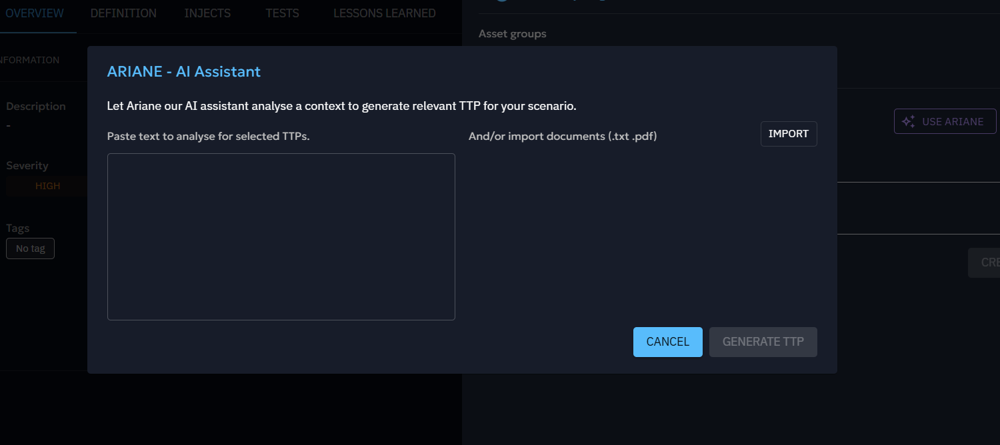
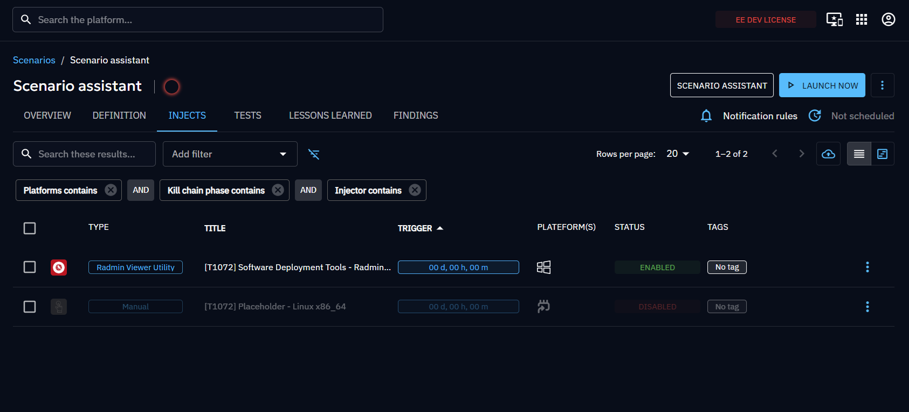

# Scenario

When clicking on Scenarios in the left menu, you access to the list of all Scenarios defined in the platform. Scenarios act as templates that translate threat contexts into meaningful events to simulate.

Scenarios can be grouped by defining categories, main focus, severity and tags. It is then possible to filter the Scenarios list based on these attributes. Quick filters are available by default at the top of the screen to filter Scenario on most used categories.

It is also possible to search Scenarios by their names using the search bar.

<!-- screenshot du screen de la liste de scenarios -->


## Create a scenario

To create a scenario, hit the + button on the bottom right of the screen and define general metadata that make sense for you.


Once done, the scenario is accessible in the list. Click on it to see its details and define them.

NB: The selected dashboard will appear in the Analysis tab, but only for the simulations related to this scenario.

## Import scenarios from XTM Hub

_Connect to the XTM Hub to download a ZIP file that can be easily imported into OpenAEV using the following process._

XTM Hub provides access to a library of pre-built OpenAEV scenarios that you can import directly into your platform to quickly get started with realistic attack simulations.

From the XTM Hub, you can effortlessly deploy your desired scenario with just a single click.

To get started, simply register your OpenAEV platform following the instructions in our [OpenAEV registration documentation](/administration/hub/).
Next, navigate to your preferred scenario and click the ```Deploy in OpenAEV``` button located in the top right corner.

If you have multiple OpenAEV platforms registered, choose the platform in which you wish to deploy the scenario.

You will then be redirected to the OpenAEV platform, where the process will continue automatically. 
Within a few seconds, you'll be taken to the scenarios list, where your newly created scenario will appear.


## Scenario overview

The overview provides comprehensive information for evaluating your security posture against the threat context over time. It displays the scenario's context along with the results of the simulations played from it. Additionally, the list of these simulations is shown, allowing easy access to their specific details and results.

If the scenario has never been simulated, the results' widget contains an example of how results will be displayed, and the list of simulations is replaced with an invitation to generate one.

<!-- screenshot de l'overview d'un scenario simulé plusieurs fois -->


## Defining a Scenario

To define the scenario, navigate to the "Definition" and "Injects" tabs.

In the "Definition" tab, you can add various elements to construct events:

- [Teams and Players](people.md) involved in the scenario,
- [Custom variables](components/variables.md) for simplifying injects' customization,
- Articles that you might use to simulate [media pressure](components/media_pressure.md),
- [Challenges](components/challenges.md) designed for including Capture The Flag elements in your scenario.

<!-- screenshot of the Definition screen with elements inside -->

Once you have added all the elements you need, you can go to the "Injects" tab to begin to create the chain of events that will shape your scenario.

By clicking on the + button at the bottom right of the screen, you enter the [inject creation workflow](inject-overview.md#inject-creation-process).

## Scenario Assistant

The Scenario Assistant is a powerful tool designed to streamline the process of creating injects.
Instead of manually creating each inject, the Scenario Assistant automates the process, ensuring injects are relevant, realistic, and tailored to your chosen targets and objectives.

!!! warning

    To use the Scenario Assistant, you must have attack patterns with associated payloads.

### How to Use the Scenario Assistant
- Open the Scenario Assistant
Click the Scenario Assistant button to open the scenario assistant drawer.
- Select Targets
Endpoints: Choose specific endpoints to target.
Asset Groups: Select an entire asset group.
- Choose TTPs
Select from a list of TTPs to define which adversary behaviors you'd like to cover.
- Specify Inject Quantities
For each selected TTP, define how many injects you’d like the assistant to create.
- Generate Injects
Click the Create injects button to let the system automatically generate injects according to your selections.


In the Enterprise Edition, you have the ability to select TTPs using Ariane AI.
This system can analyze text and files such as threat reports to accurately identify and extract relevant TTPs to cover for your simulations.



### What happens next?
The Scenario Assistant generates injects based on your selected TTPs, ensuring compatibility with the platform architectures of your chosen endpoints or asset groups.

When you select multiple assets with different architectures (for example, Linux x86_64 and Windows x86_64) along with a specific TTP (such as TTP 1072), the Scenario Assistant will:

- Attempt to find a universal payload that supports the chosen TTP and is compatible with all selected architectures.
- If no universal payload is available, it will look for individual payloads that match each asset’s specific platform architecture.
- For asset groups, the Scenario Assistant will try to find a payload that covers all asset platforms architectures within the group.
- If a perfect match cannot be found, it will prioritize payloads that are compatible with the largest subset of assets in the group.
- If no suitable payloads are found, the assistant will create an inject with a placeholder for the TTP and targets.



## Launching a simulation of the scenario

Once you've finished defining your scenario, it's time to simulate it and evaluate your security posture!

To do so, click the "Simulate now" button. You can choose to simulate this scenario as a one-time evaluation, scheduling it for a specific date and time. Additionally, you can set it to simulate recurrently to assess your posture over time. The results of each simulation will populate your scenario overview.

A visual indication, located to the right of the scenario's title, provides a quick way to know if the scenario is currently being simulated.


## Export your scenario

You can export your carefully crafted scenario as a JSON file by clicking the three-dots button at the top right of the scenario screen. This allows you to share it with others, or store it outside the platform.
