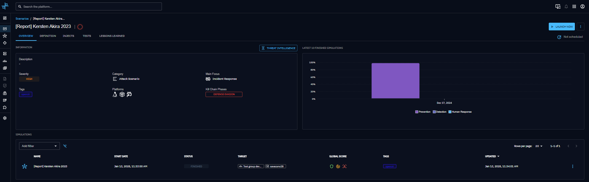
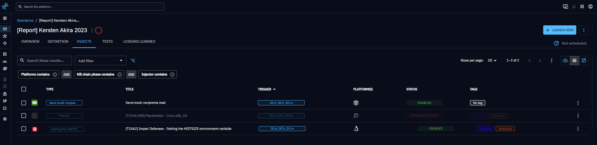
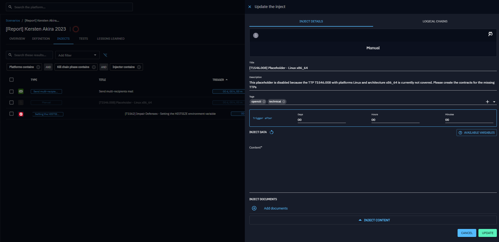
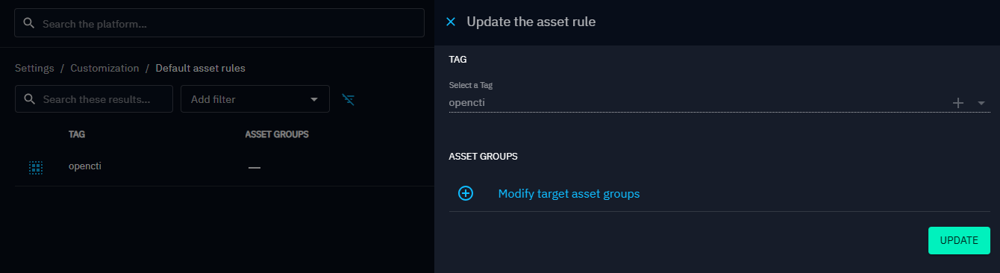

# Scenario Generation from OpenCTI Security Coverage

## Overview

OpenAEV can automatically generate scenarios from OpenCTI Security Coverage entities, transforming threat
intelligence, such as Attack Patterns, Vulnerabilities, Artifacts, and others, into actionable operational scenarios.

This integration enables organizations to track simulation results and security coverage directly within OpenCTI,
creating a complete feedback loop between threat intelligence and security validation.

This integration works across multiple OpenCTI entity types:

- Reports
- Incident Response
- Incidents
- Campaigns
- Intrusion Sets
- Groupings

## How It Works

When you click on the **Add Security Coverage** button in
OpenCTI ([see OpenCTI documentation](https://docs.opencti.io/latest/usage/security-coverage/)), OpenAEV receives a **STIX 2.1 bundle** representing the Security Coverage.

OpenAEV then:

1. Parses the STIX object
2. Builds a scenario in OpenAEV

> **Note:** At time of writing, the automated Security Coverage feature can assess coverage for the following entities:
> Attack Patterns

3. Extracts relevant **Attack Patterns references**
4. Resolves **targets** (e.g., Asset Groups) using **Custom Tag Rule** labeled `OpenCTI`, extracting the associated **platforms and architectures** to match compatible payloads.
5. Generates injects for each extracted entity
6. Schedules the scenario for execution

## STIX Fields Used for Scenario Creation

OpenAEV requires specific fields from the STIX object, divided into **Mandatory** (id, name, covered_ref) and **Optional** fields (e.g., description, labels, periodicity) for additional context.

### Mandatory Parameters

| STIX Field      | STIX Path     | Description                                                    | Used For                            |
|-----------------|---------------|----------------------------------------------------------------|-------------------------------------|
| **id**          | `id`          | Unique STIX identifier of the Security Coverage                | Mapping, de-duplication, externalId |
| **name**        | `name`        | Name of the Security Coverage                                  | Scenario name in OpenAEV            |
| **covered_ref** | `covered_ref` | Reference to the main entity (intrusion-set, malware, report…) | Build external link to OpenCTI      |

### Optional Parameters

| STIX Field                 | STIX Path                 | Description                                 | Used For                       | 
|----------------------------|---------------------------|---------------------------------------------|--------------------------------|
| **description**            | `description`             | Description of the Security Coverage        | Scenario description           |
| **labels**                 | `labels[]`                | Labels/tags from OpenCTI                    | Tags in scenario and tag rules |
| **periodicity**            | `periodicity`             | Scheduling frequency (e.g., `P1D`)          | Scenario scheduling            |
| **created_at** (extension) | `extensions.*.created_at` | Creation timestamp inside OpenCTI extension | Period start date              |

## How OpenAEV Builds the Scenario

After parsing and validating the **Security Coverage STIX** object, OpenAEV follows the process below:

- **Create or update an OpenAEV scenario**

- **Extract all references** related to Attack Patterns.

    - For each **Object Reference** identified:

        - If the referenced **Attack Pattern** exists in OpenAEV  
          (matched by **External ID** or **Name**) **and** a related [Payload](../payloads/payloads.md) exists that
          matches the **platforms and architectures** derived from the targets resolved via **Custom Tag Rule
          labeled `opencti`**.   
          => **Concrete Inject** is created.

        - If the Attack Pattern does **not** exist in OpenAEV, or no compatible payload exists for the resolved
          platforms/architectures.  
          => **Placeholder Inject** is created to highlight missing coverage.

> **Note**  
> To ensure meaningful inject generation:
>
> - Attack Patterns defined in **OpenCTI** (by External ID or Name) must be aligned with those configured in **OpenAEV
    **.
> - Targets are resolved via **Custom Tag Rule labeled `opencti`**, and the corresponding **platforms and architectures
    ** are extracted from these targets.
> - Payloads are matched against the Attack Patterns **and** must be compatible with the extracted platforms and
    architectures.
>
> In other words, inject creation only occurs when:
> 1. The Attack Pattern exists in OpenAEV, and
> 2. A payload exists that matches both the Attack Pattern **and** the platforms/architectures derived from the targets
     defined in the Custom Tag Rules.
>
> If either condition is not met, a **Placeholder Inject** is created to highlight missing coverage.

Inject creation depends on matching the **Object Reference** values between OpenCTI and OpenAEV, example:  

| OpenCTI Attack Pattern   (External ID or Name) | Matching Payload in OpenAEV   (Attack Pattern + Platform + Architecture) | Result                  |
|----------------------------------------------------|------------------------------------------------------------------------------|-------------------------|
| T1059.001                                          | Yes                                                                          | Concrete inject created |
| T1059.001                                          | No                                                                           | Placeholder inject      |

  

After injects are generated:

- Review and customize the **Scenario** to match your organization’s needs.
- Assign appropriate **Targets** to each inject.
- Optionally, configure default **Asset Groups** for scenarios created from OpenCTI using
  the [Default Asset Groups](../default_asset_rules.md) page.

- Finally, the **Scenario will execute** according to its configured schedule.

## Execution and Reporting Back to OpenCTI

Once the scenario is finalized and scheduled:

- OpenAEV executes the scenario according to the periodicity.
- After simulation, the results are compiled into new SROs.
- OpenAEV sends these results back to OpenCTI as part of
  automated [Enriched Security Posture Assessment](../xtm-suite-connector.md) in the same **STIX 2.1 bundle**
  representing the Security Coverage.
- OpenCTI displays the updated coverage assessment.

This creates a complete feedback loop between threat intelligence and security validation.

## What’s next?

The next step is to expand the integration between OpenCTI and OpenAEV by incorporating additional threat intelligence
data, such as Observables, Artifacts, Malware, and more.

