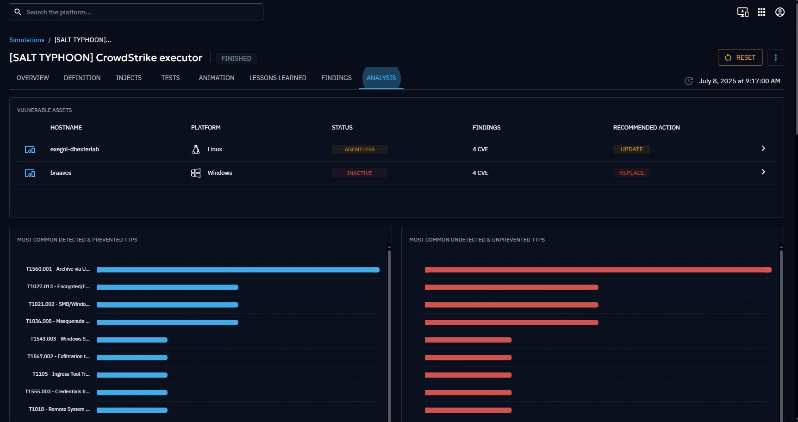

# Simulation

!!! tip "Under construction"

    We are doing our best to complete this page. If you want to participate, don't hesitate to join the [Filigran Community on Slack](https://community.filigran.io) or submit your pull request on the [Github doc repository](https://github.com/OpenAEV-Platform/docs).

When clicking on Simulations in the left menu, you access to the list of all Simulations ever launched in the platform. You can filter by tag (for example to only display simulation related to a specific threat actor) and sort them (chronologically, by status, etc.).

From this screen, you can easily see last global scores and access ongoing Simulations at platform level.

## Creating a Simulation

The best practice to create a Simulation is to do it from a [Scenario](scenario.md) in order to evaluate your security posture over time against a specific threat context.

But you can create directly a Simulation if you want, by hitting the + button on the bottom right of the screen. You will have similar definition options as in [Scenario](scenario.md) creation.

<!-- screenshot liste des simulations -->

## Simulation overview

The Overview regroups everything you need to know to follow your Simulation by its Results. Results are broken down into 3 main metrics:

- Prevention: the ability of your security posture to prevent the simulated scenario's events to happen
- Detection: the ability of your security posture to detect the simulated scenario's events
- Human response: the ability of your security teams to react as intended facing the simulated scenario
- Vulnerability: the ability of your security posture to detect common vulnerabilities and exposures (CVEs) when the simulated scenario's events happen

The top of the Simulation screen give you the ability to Start, stop and Reset the Simulation, delay the launch time.

<!-- to complete when Samuel finish the screen --> 

<!-- screenshot of the Overview of a Simulation having run -->

## Overriding the Scenario definition 

In a Simulation, you can see and modify all elements defining it: Teams and Players, Variables, Media pressure, Challenges, Injects. Modifying the Simulation definition allows you to customize it to adapt a singular play to some temporary changes. For example, change an email address into Variables to be used in email-related injects, change a playing team, etc.

<!-- A screen of definition of a Simulation with some explicitly named elements -->

## Animating a Simulation

The Animation screen of a Simulation is the place to follow the Simulation execution, especially if you are conducting simulation at strategical level (heavily relying on interactions with Teams and Players, manual validations of expectations) for training your organization on all aspects of a cyber crisis.

The Timeline screen is the overview of the Animation tab, to see ongoing injects.

The Mails screen is a way to manage email interaction with Players into the OpenAEV platform.

The Validation screen is the place to manually validate expectations of the Simulation to consolidate Results.

The Simulation logs is an interface for the animation team to collaborate during the Simulation.

<!-- screenshot of the Animation Timeline screen -->

## Lessons learned

In the Lesson Learned tab of a Simulation, you can manage the collection and concatenation of customizable surveys. It helps you in conducting the most underestimated part of a Breach and Attack simulation involving real people, by automating it and complete your Simulation's Results with qualitative feedback.

<!-- to be completed -->

## Analysis

NB: The Analysis tab is shown if you have selected a dashboard for your simulation (during creating or updating).
If you have selected a dynamic parameter "Simulation" for your dashboard and widgets, they will be calculated for this specific simulation.

The Analysis tab of a simulation is intended to enhance the data visualization and analytical capabilities of OpenAEV. 
By incorporating specific widgets, users can gain deeper insights into the effectiveness of their simulations and security posture. 
This enhancement will provide users with contextualized, actionable intelligence, enabling them to make informed decisions to improve their security strategies.

